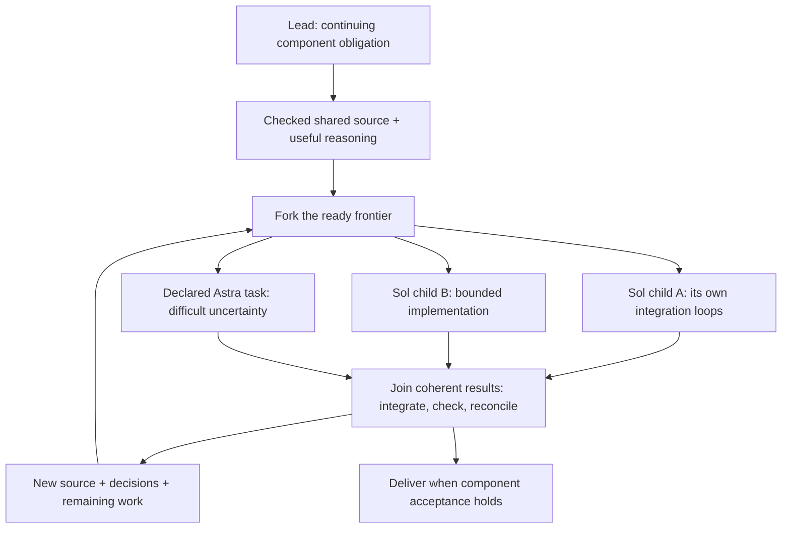

# Fork, integrate, continue

Think in terms of **recursive fork/join inside local integration loops**. A lead
owns an outcome, establishes a shared starting point, forks independent work,
integrates checked results, and uses that new source and understanding to open
the next useful work. Its children can do exactly the same. Going down the tree
divides responsibility; going around a loop advances the same responsibility.

The useful unit is an obligation paired with source and reasoning, not an empty
worker slot. Good architecture makes both implementation and reasoning parallel.

## The graphs answer different questions

| Structure | What it tells you | What an edge does not imply |
|---|---|---|
| Responsibility tree | Who owns an outcome and which child outcomes contribute to it. | One actor, one turn or one wave per responsibility. |
| Dependency graph | Which decisions or artifacts must be available before other work can proceed. | Every sibling must wait for every other sibling. |
| Git commit DAG | Where source came from and which histories were integrated. | The integrated behavior passed its acceptance checks. |
| Context ancestry | Which completed reasoning prefix a worker inherited. | Later parent discoveries or commits are shared automatically. |
| Runtime creation/supervision | Who created an actor and who owns its lifetime. | Context ancestry, source ancestry, or authority over other actors. |

The plan tree organizes responsibility. It need not mirror the physical actor
layout. Retained workers can serve later assignments; selected fresh contexts can
work against existing source; research and review need not create new writable
implementation branches. Normal Codex TUIs remain the way the human talks to them.

## A useful fork point pairs code with understanding

For a coding branch, choose both the exact source seed and the useful reasoning
context. The shared starting point includes interfaces, important semantics,
acceptance, known limits, and the reasons behind the consequential choices.

| Boundary | Source side | Reasoning side |
|---|---|---|
| Prepare | Check and commit the shared scaffold, or reuse an adequate existing one. | Resolve coupled choices and retain their reasons and limits. |
| Fork | Seed each child's worktree from the chosen source. | Inherit a useful completed boundary or select a focused context; add its own obligation. |
| Work | Children implement and check their artifacts, recursively where useful. | Children investigate independent questions and own their local decisions. |
| Integrate | Incorporate coherent candidates and check the resulting revision. | Reconcile findings; retain changed decisions, evidence and remaining gates. |
| Continue | Use the new integrated source for the next ready work. | Supply decision changes to new or retained workers and reuse useful expertise. |

A scaffold is architectural work that lets children proceed independently:
real types, minimum usable semantics and early consumer wiring. Resolve what must
agree across the branches. Leave independent choices to their owners. Fork after
that common ground is useful and before unrelated debugging fills its context.
There is no need to create an empty scaffold commit when the source already fits.

The two sides are paired semantically, not kept synchronized by magic. A commit
does not convey all its rationale; inherited reasoning does not change a worktree.
An accepted correction needs both its source and its decision delta. In particular,
a retained worker does not learn later parent work automatically.

This is also the useful interpretation of a future checkpointContext: save a
valuable completed reasoning fork point and select it later with compatible source
and intervening decisions. It is not implemented now. Retaining a transcript prefix
would not by itself establish provider cache residency.

## Join the results without collecting every transcript

Source is integrated; transcripts are not merged. A useful return carries the
artifact, decisive checks, changed decisions, remaining acceptance gaps and any
needed owner action. Keep detailed investigation with retained specialists and
precise evidence references. Bring up assumptions and counterevidence that affect
another branch; compactness must preserve what could change the parent's decision.

The lead does the engineering required to make its children's results compose.
Its parent can then reason about a component and its interfaces instead of every
leaf's implementation. Parent acceptance still checks the resulting wider
integration, especially interactions that children could not exercise locally.
It does not require recreating all the child's investigation and testing.

This is the practical fold in scaffold/fork/fold/repeat: accepted code and useful
knowledge move upward, while detailed debugging stays near its owner. Routine
known continuations can run through Haskell routes; wake a model for a decision
or substantive engineering. Targeted Astra work contributes difficult reasoning
to the same process without becoming a routine event relay.

## The ready frontier determines parallelism

The **ready frontier** is the set of independent obligations whose shared
prerequisites are established. Open a broad frontier when the architecture supports
it. Work that requires an unmade common decision belongs behind that decision;
work that does not depend on it can proceed now. An explicit release condition or
operator hold is also a prerequisite, not something a watch notice overrides.

A **join** is where an owner incorporates the results needed for a particular next
step. It need not wait for unrelated siblings. Fold coherent slices as they arrive,
retain the remaining handles, and open newly unblocked work. One child can be on
its third local wave while a sibling finishes its first.

Shared files and integration seams have one owner and a delivery time. Reserving
all shared UI wiring until after the consumers finish prevents them from testing
real behavior. Deliver a narrow usable seam early. Put a cross-branch question with
the owner of the shared contract; avoid circular requests between mutually waiting
workers or repeated relays through uninvolved ancestors.

Choose branches for independently checkable outcomes, not a target headcount or
mandatory procession of implementer/reviewer/integrator actors. A small leaf can
implement and check its task directly. A substantial lead owns real engineering,
useful recursive delegation, appropriate review, and integration.

## A node owns multiple local waves

A **local wave** advances one node from a useful source/decision state to the next.
Its **continuation** is the remaining obligation over that updated state, together
with pending work and useful retained contexts. Existing Tasks, decisions,
responses and watches carry this; these words do not introduce another registry.

The loop belongs at every substantial node, not just at the root. The parent
obligation stays open through scaffolds, partial integrations and successive child
waves. Completion of one child, model turn, plan document or local wave is not
completion of the encompassing feature. A source/context replacement or swarm
restart also preserves the remaining product obligation.

Plan the next frontier concretely, and later waves by the behavior and dependencies
they will unlock. Refine details when integrated discoveries make them useful.
A plan that stops at foundations has not explained how the feature will become
usable; a plan that dictates every distant leaf prevents useful adaptation.

## Worked example: a recipe workbench

The encompassing obligation is a real user flow: discover a recipe, select valid
parameters, preview editable Haskell, insert it safely, explicitly submit it, and
observe the intended result. A type definition or palette alone is partial work.

The first local frontier can establish recipe semantics, editor insertion rules
and a real integration seam, while independent terminal-regression work proceeds.
Once that shared source is checked, Sol leads own catalog generation, palette/editor
interaction and presentation. Graph exploration can advance on its own established
contract. Put difficult shared uncertainty in its declared Astra slot.

The catalog lead can itself fork parameter validation, escaping and representative
execution checks from a common generator contract. Integration may reveal that a
helper name captures the recipient binding. It repairs that invariant with its
retained implementer, checks the generator, and tells the interaction owner which
names the form must reject. The integration owner needs that changed contract and
its evidence, not the full debugging exchange.

After incorporating a usable generator and insertion path, the next local frontier
can exercise the real user flow and finish discovery/history behavior. A generated
snapshot string passing a golden test leaves execution unproven; closing that gap
requires the actual observation effect. The outer obligation remains open until
its agreed integrated acceptance is met, even if useful slices are already merged.
An explicit operator pause retains this work; it is an intentional suspension.

## The control structure in the live Haskell workbench

The existing `unfold` composes and admits branches and returns typed handles.
It does not recursively solve those branches or integrate their code. Bind the
handles, register result/question watches, then end the turn: newly admitted
children start after that tool block returns. On wake, inspect the retained result
and run the next useful continuation. Never wait for a just-admitted child inside
its admitting tool block.

See [operating.md](operating.md) for paired branches and [run.md](run.md) for exact
watch, decision and review/repair expressions. A join uses those real operations
and native Git; there is no new `join`, `fold` or workflow interpreter to invoke.
Binding a reusable Haskell composition launches nothing until its effect is run.
Use the short vocabulary to coordinate precisely, not to produce essays about the
model in each worker's response.

Human/Astra planning establishes the whole and reviews Sol's concrete execution
understanding before broad work. Later agreed local waves proceed without repeating
that interview. Human-requested RSI asks which fork point, dependency or integration
boundary caused friction and improves the owning prompts/helpers. Shared-definition
changes activate at an authorized swarm boundary; ordinary local waves continue
over the current frozen interface.
