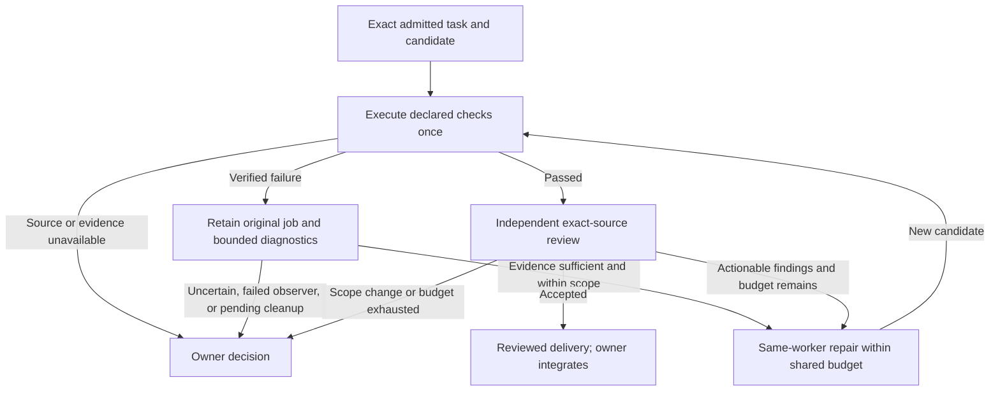

# Bounded continuations implementation handoff

2026-09-28. **In progress; not a release verdict.** The running wave22 source and
runtime remain frozen. This file will separate final verified revisions from drafts.

## Ownership and revisions

- Shared integration: branch `rsi/bounded-continuations`, worktree
  `/home/inanna/dev/rsi-continuations/shared`. Dependency actor, investigation,
  checked review, helper seed, role prompts and executable examples are composed
  here. It is not yet the published workspace pin.
- Dependency source branch: `rsi/dependency-continuations`, sibling worktree
  `dependencies`. Review included exact change evidence, batching, task binding,
  unavailable content, identity and drain behavior. Focused recipes in progress.
- Investigation source branch: `rsi/investigation-continuations`, sibling worktree
  `investigation`. Typed delivery, compiler evidence and lifecycle follow-up are integrated from
  `2b4924f535dea74546db658ecd576735bea7c86e`; final integrated execution remains pending.
- Harness runner: candidate `84633e4`, integrated as
  `8224d1a8dc7c33d07b2861ad8ef6e6bd6f428aa1` on harness master. Seventeen focused
  Python tests passed, plus shell syntax and diff checks. Compiler/metadata failure
  now retains evidence before test execution; successful binaries retain their
  original target-directory retention behavior.
- Core methodology: `3495d1f0c`, `8542d8ced` retain the evidence-sufficiency audit
  in `docs/rsi-loop.md` and the detailed audit beside this handoff.

## Accepted design

Declare local dependencies at actual Task admission; route only those recipients.
Keep original work history in the existing collector. Use actual bounded source
changes for semantic relevance, one packet for related consumers. Required owner
questions, failures, final results and uncertain routes remain observable.

Carry a failed original job into at most two diagnostics, then a typed continuation.
Compiler failures may justify repair without claiming tests ran. Check and review
repairs share the existing budget. New source must pass checks and independent
review. Default integration remains with the owner.

## Evidence format transition

New focused records carry before/after source observations and phase-specific
fields. The new consumer treats old records without those observations as
unverified source; it does not fabricate or backfill evidence. The producer retains
its previous source/status aliases for existing inspection tools. The live wave's
frozen source is not reloaded as part of this transition. Publish the matched
runner/workspace revisions together for the next wave.

## Review findings retained

See [Jev evidence audit](jev-evidence-audit.md) for each call's evidence contract.
Independent lifecycle review additionally found follower failure, refused report
delivery and terminal-investigator cleanup gaps. These are being repaired before
publication; a report or notification receipt must not imply process cleanup.

The recipe host lacks real model notification delivery. Deterministic routing
checks and actual Jev request/decoder probes establish different things; neither
will be presented as evidence that a live worker incorporated source.

## Remaining gates

1. Focused investigation failure/delivery checks on the integrated lifecycle candidate.
2. Dependency recipes and root-reviewed live semantic request/response probes.
3. Combined dependency → failed check → investigation → repair → independent
   review recipe, unknown/source-drift cases, and helper-seed compilation.
4. Exact final diff review, workspace publication/pin, byte-identical template sync,
   focused pin/catalog checks and matched incremental rebuild.
5. Final revisions, exact executed counts and limitations recorded here.

User reaffirmed: finish this batch and pause before launching any successor wave. Evaluate the exposed procedures in
all suitable component trees over three waves, with immediate repair of harm.

## Useful next design pass

- Audit all semantic clients using the new evidence contract, including legacy
  patterns beyond this batch. Distinguish information retrieval from judgment.
- Measure how often bounded source diffs are sufficient; do not assume the current
  small-patch limit covers large API changes. Large/omitted changes currently
  return to the owner.
- Check whether multiple uncertain consumer judgments should produce one owner
  decision packet rather than several notices.
- Improve recipe waits so a formatting mismatch cannot silently spend hundreds
  of notebook compilations. Typed Boolean projections fix this batch's instance;
  the general diagnostic contract deserves review.
- Track unsupported compiler `dataToTagLarge#` separately; removing unused equality
  instances avoids exposure here but is not an engine implementation.

- Consider a small owning primitive for attaching a new completion source to an
  existing record actor. Current authored continuations need a follower and a
  lifecycle observer for each late-discovered diagnostic. Investigate whether the
  existing runtime source owner can provide that behavior directly before adding
  more Haskell observer layers. This is a future design question, not implemented
  by the present batch.

## Latest verification candidate

Shared integration `be8b7ae` (plus prose-only `aee2455`) includes the lifecycle follow-up, corrected rank-two
notebook callback fixtures, typed progress observations and cleanup exit checks.
This is a candidate, not the published pin. The private integrated validation root
is `/tmp/rsi-continuations-integrated-wblqw9dh`; its `candidate-revision` names the
exact snapshot. The dependency lane released the sole compiler slot; integrated validation is running.
Its current log is `/tmp/rsi-continuations-integrated-replay.log`; the earlier
export log is `/tmp/rsi-continuations-integrated.log`. The first integrated attempt
found a cancellation-reason rendering type error, fixed before this candidate.

The dependency recipe has observed real `ChangedSource` evidence from admission
base to candidate: `contract.txt` and its exact added line. Its initial failures
also exposed two fixture errors (monomorphic notebook callback binding and display
prefix matching), plus an asynchronous observation race. Wait for a processing
marker, then assert the separate result; immediate snapshots are not delivery
barriers. Full recipe completion is recorded separately from those assertions.

## Decision boundaries for the next pass

A dependency collector runs alongside that flow: publications → exact bounded
source evidence → one semantic packet for declared consumers → direct notices
or an owner decision. A notice never establishes acknowledgment or incorporation.

The next planning pass should inspect whether these boundaries actually eliminate
model rounds, whether handbacks contain enough evidence for one owner decision,
and whether the authored actor/follower layers are proportionate to that benefit.
Do not infer operational value from the amount of helper code or recipe coverage.

## Live probe checkpoint

Eleven live Jev requests are retained in `live-probes.json`: 8,373 input tokens and
783 output tokens, no retries. Dependency export passed 13 construction assertions;
review export passed five. The six dependency responses have now replayed through
the actual Haskell decoder/policy, including honest doubts for ambiguous evidence
and one scope relationship. All five review responses also passed the actual Haskell replay. Integrated
lifecycle and combined-flow checks remain in progress. See the audit for raw-winner versus policy-handback distinctions.

## Final source-review limits

- The observer-loss fixture exercises early `ActorFinished`. Production also
  handles failed, cancelled and paused lifecycle events; those variants do not
  gain direct scenario coverage from this fixture. A pause stops automatic
  continuation and retains the pending job; it does not claim command termination.
- Some older recipe waits still use rendered readiness and up to 120 observations.
  This batch bounds the new problematic waits; a general typed wait contract is a
  follow-up, not claimed complete. FIFO-based diagnostic fixtures establish pending
  work explicitly but their release writers assume the pending reader survives.
- Dependency entries retain source evidence, typed decisions and send receipts;
  settled decisions currently retain a short reason, unlike ReviewFlow's model and
  probability explanation. Consider consistent judgment provenance in the next
  interface pass. Full synthetic responses are retained separately in this handoff.

## Behavior checkpoint

The four `BackgroundInvestigatorChecks.typedContinuation` assertions passed on
`8ab1602` after replacing a sleep-based closed-destination fixture with explicit
close-before-start ordering. This covers report delivery without duplicate owner
notice, no redelivery, retained refusal with fallback notice, and no retry. The
current behavior log is `/tmp/rsi-continuations-behavior.log`; observer loss and
combined-flow recipes remain in progress. Include
`DependencyRoutingChecks.composition` in the final focused follow-up: the combined
review recipe uses the lower-level attachment seam, so it does not replace an
execution check of the public admission wrapper.

The next follower-loss attempt exposed generated notebook type pinning of the
private `ProbeFollower` type. The test now keeps the handle inside one expression
instead of exporting implementation types. The underlying wrapper limitation is
not fixed by this batch. The remaining behavior log is
`/tmp/rsi-continuations-behavior-final.log`; the private test worker alone now uses
a 10240 MiB ceiling after measured memory headroom, still with one worker.

## Startup failure under investigation

`BackgroundInvestigatorChecks.followerLoss` passed all four assertions in
`/tmp/rsi-continuations-behavior-final.log` on `8aa9f4b`. The next recipe,
`pendingProbe`, failed during actor startup before its assertions:
`currentRequest site in Project.ReviewTools.tools: missing generated site-aware sibling`.
Compiler artifacts: `target/tidepool-test-runs/20260928T192055Z-3510518-exomonad-check/`.
A source-only investigation is checking site-rewrite/cache ownership; root is
repeating the remaining recipes without that predecessor in
`/tmp/rsi-continuations-behavior-remainder.log`. Do not misclassify this as a
continuation assertion failure or claim those unexecuted recipes passed.
