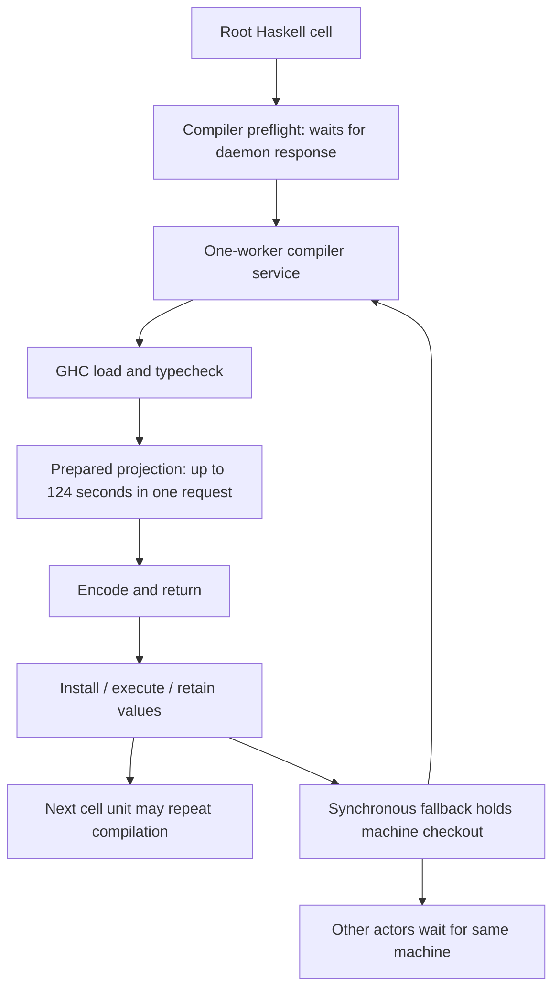

# Wave 12: Sol-root Haskell calls over 10 seconds

Run `7d0bd907-1640-49b1-a952-f98005ca6e2d`. Cutoff: 2026-09-26T02:33:13.588641Z. All 10 completed root `cell` timing records over 10 seconds through this cutoff. Active calls without a timing record are not counted. Durations are wall time, not CPU time.

## Per-call observations

| End UTC | Purpose | Total s | Compiler preflight s | Compiler response s | Checkout wait s | Checkout held s | Jev s |
|---|---|---:|---:|---:|---:|---:|---:|
| 02:09:08 | Admit initial three children | 24.1 | 0.0 | 6.8 | 0.0 | 0.3 | 0.3 |
| 02:10:09 | Admit acceptance replacement | 12.0 | 0.0 | 2.8 | 1.5 | 0.2 | 0.1 |
| 02:13:29 | Commission UI review | 11.6 | 0.4 | 4.1 | 0.0 | 0.4 | 0.1 |
| 02:19:45 | Send corrected acceptance assignment | 236.1 | 98.0 | 101.2 | 21.2 | 7.9 | 0.3 |
| 02:24:59 | Read server and review replies | 292.0 | 99.8 | 169.7 | 6.4 | 171.8 | 0.5 |
| 02:28:41 | Assign server repair | 191.9 | 0.0 | 150.5 | 29.8 | 8.0 | 0.2 |
| 02:29:37 | Assign UI repair | 42.8 | 0.0 | 26.9 | 9.4 | 2.9 | 0.2 |
| 02:31:31 | Commission design consultation | 102.3 | 19.1 | 69.8 | 0.4 | 1.2 | 0.1 |
| 02:32:06 | Read UI repair result | 17.2 | 0.0 | 12.6 | 2.2 | 1.0 | 0.1 |
| 02:33:13 | Read server repair result | 16.3 | 3.1 | 4.1 | 0.3 | 0.6 | 0.1 |

Compiler response includes worker service and transport/queue delay. Checkout hold overlaps compiler response in the synchronous fallback; these columns must **not** be added. `compile_ms` in the call summary counts only instrumented compile wrappers and misses compilation inside that checkout. Jev is subsecond in every listed call.

## Worker phases for the same request IDs

| End UTC | Worker service s | GHC load s | Typecheck s | Prepared projection s |
|---|---:|---:|---:|---:|
| 02:09:08 | 6.7 | 1.2 | 0.1 | 2.2 |
| 02:10:09 | 2.8 | 0.6 | 0.1 | 1.1 |
| 02:13:29 | 4.1 | 0.6 | 0.1 | 2.3 |
| 02:19:45 | 101.1 | 4.2 | 1.4 | 82.1 |
| 02:24:59 | 169.5 | 2.5 | 0.6 | 146.5 |
| 02:28:41 | 150.4 | 2.5 | 0.5 | 101.9 |
| 02:29:37 | 26.8 | 4.9 | 0.6 | 12.3 |
| 02:31:31 | 69.8 | 58.0 | 0.3 | 4.5 |
| 02:32:06 | 12.5 | 0.9 | 0.1 | 2.4 |
| 02:33:13 | 4.0 | 0.9 | 0.1 | 1.6 |

Worker phases are nested diagnostics, not additive with the preceding table. Full request IDs and timing rows are retained in the local audit JSON.

## Slow paths

## Confirmed findings

- The 292-second reply-reading cell contains a 165.4-second checkout hold. Its compiler request `9027a29c3c49901b` is inside the `resident_turn` checkout span: 130.8-second response, 124.3 seconds in prepared projection. This is a compiler-under-checkout path, not model inference.
- Request `d540b608fa3a94a6` took 74.9 seconds in the worker; prepared projection took 71.8 seconds while GHC load took 0.36 seconds. A separate root preflight waited 66.2 seconds while that service was active.
- Root request `83bfaf3494535fdf` has a different bottleneck: GHC load 56.5 seconds, prepared projection 1.15 seconds. Do not attribute every long request to one cause.
- Cells repeat several compile round trips. Early calls were 12–24 seconds; later calls of similar orchestration intent reached 43–292 seconds. This is a runtime/compiler issue to investigate, not a reason to tell models never to compose cells.
- The concurrent Astra import copied tens of GB. Host I/O pressure was elevated when inspected, but historical CPU/IO samples do not establish how much of each compiler phase it caused. Prepared projection timings alone do not distinguish computation, allocation/GC or scheduling pressure.

## Next engineering actions

1. Reproduce prepared projection on the retained exact program outside live load; instrument the owning projection traversal only where existing evidence is insufficient.
2. Remove or narrow the demonstrated synchronous compiler-under-checkout fallback, preserving generation and binding validation.
3. Inspect one-worker daemon admission/control response scheduling; preflight responsiveness must not be mistaken for GHC work.
4. Fix cancellable source import and managed root baselines independently; cancellation must not become a successful committed-source fallback.

Evidence: host and compiler JSONL under the run log directory; native root history thread `01a0db77-022a-7723-bd7d-9edf39931ea5`. No native conversation copied into this report.

## Compiler control-path audit

`daemon::serve` chooses `serve_single` for one worker. That function accepts a
connection, then synchronously services the full compiler transaction before
accepting another connection. PREFLIGHT and STOP use that same listener. Their
response time therefore includes a preceding compile/transaction; preflight is
not a measure of compiler setup. This directly matches 66–98 second waits in the
root trace while another compiler request was active.

Switching to the existing pooled loop alone is insufficient: its accept thread
blocks in a rendezvous `job_tx.send`, so a saturated worker pool can again stop
accepting control requests. More workers would also increase memory demand and
would not repair that ownership/control issue.

`CompilerEndpoint::bind_unscoped` preflights the daemon to obtain producer+epoch
identity. Scoped transactions reuse their binding, but separate compilation
phases can bind again. Artifact cache selection binds before computing the
endpoint-identity-dependent key, so a potential cache hit can still wait for a
busy compiler's preflight. Preserve epoch fencing; do not fix this by ignoring
identity changes or treating accepted work as safely retryable.

Candidate repair: keep bounded compiler service admission separate from prompt
control handling in the existing daemon owner, including at one worker. Add a
barrier-controlled test: hold an active compiler request, prove preflight and
stop acknowledgment respond while it is held, and preserve bounded queued work,
transaction exclusivity, acceptance/indeterminate boundaries and orderly drain.
The current report establishes the cause; it does not claim this repair has
been implemented or measured.
