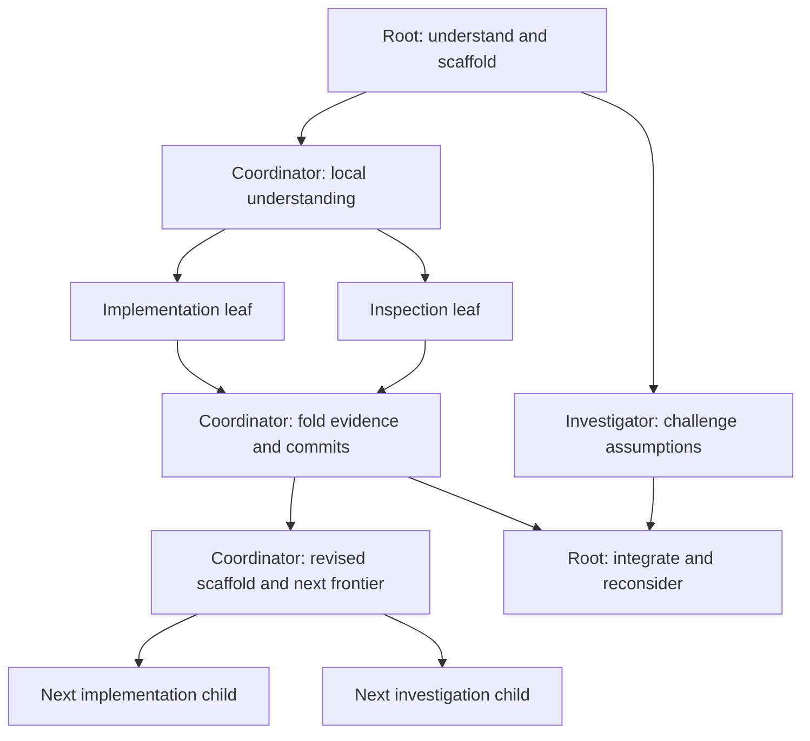

# Context trees and an emergent resident Haskell surface

Status: implementation active on the verified hardening baseline `b248fe5f`.
The execution ledger below supersedes aspirational scope elsewhere in this
review. Runtime truth and verification must be recorded before checking items.

## Execution ledger

Settled scope: recurring tree practice and emergent Haskell; writable interior
nodes; bounded waiting on deadlines; inspected-scope cleanup; exact group
observation; language evolution and useful orientation. Effort is limited to
low/medium/high with inherited defaults and explicit fork-time overrides.
General live effort adjustment, source extraction/export, and host-restart
reconstruction are deferred. Final efficacy acceptance is human-run in the
user's TUI repository, not an automated provider campaign.

- [x] Shared prompt and role deltas, mounted help, composed fingerprint checks.
- [ ] Execute authored help through the real parser/workbench.
- [x] Verify late request types, inherited closures, shadowing, opaque projection.
- [x] Exact fork-group observation replacing label-prefix campaign lookup.
- [ ] Actionable status, stale notices, failed-prefix recovery guidance.
- [x] Deadline terminality independent of target cancellation acknowledgement.
- [ ] Inspected-scope cleanup with typed stale-plan refusal and safe partial retry.
- [ ] Fork-time effort modifier, policy and observations; Codex support gated.
- [x] Copyable [Codex requirements](codex-live-effort-control-requirements.md).
- [ ] Focused checks and final integration verification recorded.
- [x] [Human acceptance guide](context-tree-human-acceptance.md) delivered; actual user campaign remains human-run.

### Current implementation evidence

- Baseline committed as `b248fe5f` at the user's request; prior canary/test
  results are recorded in the hardening ledger, not rerun for that checkpoint.
- Shared tree practice is composed for every role and included in prompt
  fingerprinting (catalog v4). Added mounted `tree`/`workbench` help; root and
  inspection guidance no longer contradict context inheritance or leaf grants.
- Deadline expiry now terminalizes owner observation and reevaluates watches
  before cancellation acknowledgement. Target custody remains live; accepted
  reply settlement wins the serialized race. Ordinary status retains failure
  causes rather than hiding them behind terminal counts.
- `just test tidepool-actor 'test(request::tests) | test(prompt_catalog)'`:
  20 passed, nextest `4688f7da-6b02-4837-a990-ba3d220a5fee`.
- Prompt composition/catalog checks: 3 passed, nextest
  `b6a81b5c-7cda-4af8-95c1-1c23d27e96f1`.
- The real recursive integration test now executes the authored workbench help.
  Its first run passed in 668.879 seconds (nextest
  `ce2361b4-6d83-4e00-bf02-44ccc581ab14`).
  The late-refinement fixture then passed with function-valued input and
  captured-versus-shadowed bindings (707.855 seconds; three tests including
  public surface checks, nextest `bfb011ef-f4fd-4e2a-96a2-9169c507f337`).
  Separate input/result declaration generations, both sets of type dependencies,
  exact group observation, stale cleanup refusal after a retained follow-up,
  recursive cleanup, and idempotent cleanup retry subsequently passed in
  784.195 seconds (three tests, nextest
  `e5315657-d490-4859-94ff-317d15f02b65`).
- Request/lineage admission and cleanup checks: 30 passed, nextest
  `23e8206a-7c7b-4400-a66c-50c5b6b626d7`. Generated protocol freshness/schema
  checks: 8 passed; focused cleanup/inspection ABI pins: 2 passed.
- Public Haskell surface: 2 passed with cleanup planning/group observation
  requiring only `AgentInspection` and execution requiring only `AgentControl`
  (nextest `8ea0883f-dd7b-4b5f-9ea7-e05bfe396814`). Duplicate/stale activation
  rejection passed (nextest `208b41ed-70a7-4d4f-9461-4be167aee5ab`); failed-unit
  operation containment and prompt catalog passed (2 tests, nextest
  `776d9e05-b93b-440c-88b7-168e2ae60022`).
- `just fixtures-check`: 217 passed; fixture fingerprint and semantic suite
  current (nextest `b1272ba4-5757-4af5-889e-88a06df9e3c4`).
- `cargo clippy -p tidepool-actor -p tidepool-protocol --all-targets -- -D warnings`
  passed in the Nix environment. Formatting uses workspace Cargo configuration.
- The integration run executing refinement and cleanup help directly and
  checking the revised status/lineage display passed: 3 tests, 889.297 seconds,
  nextest `6d24f460-2ea9-4d39-a555-3bd4ea26764c`. Strict host-crate lint also
  passed (`cargo clippy -p tidepool --all-targets -- -D warnings` in Nix).
  Fork effort, remaining authored examples, and final integration review remain
  unfinished. Prefer minimal deterministic scenarios for subsequent targeted
  changes and a minimal live canary for the provider boundary; do not introduce
  additional test checkpoint/receipt infrastructure in this wave.
- Fork-effort plumbing now accepts `withEffort Low/Medium/High` on a branch,
  carries the optional value through the existing launch boundary, and leaves
  omitted fork effort unset instead of replacing it with the root's project
  default. This is requested configuration, not proof of first inference or
  cache reuse. Provider observation, policy completion, revision pinning, and
  destination-owned unresolved-call verification remain pending.
- Launch capture uses `ActorStartRequest` and `CapturedChildLaunch` named
  fields instead of long positional arguments and a six-element return tuple.
  The descriptor is the single owner of the captured fork-group identity.
- Effort slice checks: public Haskell surface 2 passed (nextest
  `48425f20-8b71-483f-9af5-af0e1d586bda`); host inheritance/override selection
  1 passed (`3a7770eb-c3b6-4105-a149-eecc5d830976`); protocol ABI/freshness
  11 passed. Strict actor/host lint passed for all targets. The smaller resident
  actor launch/policy/terminal-reply scenario passed in 13.897 seconds
  (`b3aa20d7-bb2b-4103-bd5a-018fd42d5c1d`).
  Fixture compatibility also passed: 217 tests, nextest
  `37a3d506-73dc-41b7-ae7f-f5a57f880e1e`.

After the implementation wave, deliver a short report on other useful Tidepool
applications, including resident Haskell editing helpers that emerge during a
campaign. This is an ideas deliverable only; no editing DSL implementation is
authorized in this wave.

## 1. Read this first

The core product decision is:

> Teach every actor the recurring scaffold → unfold → fold → refine structure.
> Let the model discover the task-specific Haskell used to inhabit that
> structure.

Shoal should be an environment an LLM can productively inhabit for hours or
days: developing understanding, inventing useful abstractions, forking that
understanding into persistent children, integrating evidence and Git commits,
and repeating the process at every level of the tree.

Exact context inheritance is the central advantage. A parent can spend
substantial effort resolving ambiguity and developing a useful working
vocabulary. Children inherit the conversation that motivated that vocabulary,
its Haskell definitions and live bindings, and a deliberate worktree seed.
They can continue implementation without repeated lossy restatement of the
plan. Their descendants can inherit the newer understanding developed locally.

The design inspiration is the user's Exomonad work: a hylomorphism over model
contexts and Git worktrees, extended so that each retained node participates
in multiple local scaffold/fork/fold cycles. This document uses that supplied
description; it does not claim an audit of Exomonad's implementation.

### Decision boundary

| Commit to in the product | Leave to models and campaigns |
|---|---|
| Persistent nodes in a recursive tree of work | Tree shape, decomposition, number of children, and when to remain a leaf |
| Repeated local scaffold → unfold → fold → refine cycles | Task-specific phases, iteration policy, stopping criteria, and semantic budgets |
| Exact accumulated context at each fork | What reasoning, definitions, and scaffolding to develop before forking |
| Typed requests, replies, responses, and readiness | Domain types, result structures, review methods, and acceptance functions |
| Ordinary resident Haskell as direct tool input | Helpers, closures, lenses, local DSLs, and eventual library extraction |
| Worktree evidence and explicit Git integration | Commit strategy and the appropriate ordinary Git workflow |
| Separate context, authority, and inference effort | Which supported effort setting is useful at a particular node or moment |
| Observable failure, retention, and recovery limits | Whether retained expertise or a new fork is the best next step |

No universal `Campaign`, `Wave`, `ReviewReport`, `perform` dispatcher, workflow
AST, progress schema, or budget DSL is authorized by this plan. Example names
below are disposable campaign code, not a proposed library.

### How to execute this plan

Read sections 1–3 and the ordered delivery plan in section 15. Then read the
specific design section linked by the current step. Complete one checked slice
at a time. The detailed material is reference for those slices, not a second
competing checklist.

Reading paths:

- Product vision: [the recurring tree](#4-the-recurring-tree-structure) and
  [effort changes](#5-effort-changes-and-context-reuse).
- Model experience: [resident Haskell](#6-the-resident-haskell-experience),
  [proposed prompts](#7-prompt-architecture-and-proposed-shared-passage), and
  [the worked interaction](#8-worked-resident-interaction).
- Delivery: [prioritized backlog](#10-prioritized-ux-backlog),
  [acceptance](#14-acceptance-at-stable-semantic-boundaries), and
  [the ordered checklist](#15-ordered-delivery-plan).
- Evaluation: [efficacy measures](#16-evaluation-measure-model-efficacy-and-delight)
  and [the durable core](#17-minimal-durable-core-and-completion-criteria).

Runtime correctness work remains with its existing owners. Consult the
[mechanism index](../../CLAUDE.md) and nearest contributor guide before edits.
This plan primarily owns model-visible behavior, prompts, teaching, and
efficacy acceptance. It does not reopen the actor architecture.

## 2. Relationship to existing plans and evidence

- [Cache-preserving context unfold](cache-preserving-context-unfold.md) owns
  the accepted fork construction and typed fold contract.
- [Persistent applications, typed replies, and watches](persistent-applications-replies-and-watches.md)
  owns the request/application distinction and reactivation model.
- [Live context-unfold dogfood follow-ups](live-context-unfold-dogfood-followups.md)
  owns the existing hardening work and its explicitly gated recovery phases.
- This document adds the shared iterative tree practice, the emphasis on
  emergent Haskell, effort-aware context reuse, and an efficacy-oriented
  delivery and evaluation plan.

The review read the requested Shoal prompts, actor Haskell modules, request
and resident actor implementation, actor-context/inspection schema, relevant
tests, and `/home/inanna/dev/shoal-console/SHOAL.md`. The notebook is firsthand
operational evidence containing multiple historical API generations. It is
not current API guidance and is not the `Tidepool.Actors.Shoal` facade.

The repository had uncommitted hardening changes during the review and
continued to change during this discussion. Findings in section 10 are review
observations to recheck before implementation, not a claim that HEAD or a
later working tree still contains every issue.

The user described a separate Codex fork that supports direct, bash-style
Haskell tool input. The reviewing assistant was not running inside that fork.
Provider behavior and the actual model experience require acceptance in that
environment, not inference from this review session.

No runtime tests or provider canary were run for the review. Source inspection
and `git diff --check` were performed. Writing this plan does not upgrade that
evidence into behavioral verification.

## 3. Product verdict and foundations to preserve

The intended environment would be highly attractive to a root LLM. It lets
the model use language construction as part of solving the task and lets
expensive understanding benefit many descendants. Its remaining risk is the
amount of orchestration repair, rediscovery, and uncertainty a model must
perform during ordinary use.

Preserve these five strengths:

1. **Exact context inheritance.** Forking should continue accumulated
   understanding without requiring a fresh task summary at each edge.
2. **An open-ended resident language.** User-defined sums, records, functions,
   closures, lenses, and heterogeneous values remain ordinary Haskell.
3. **Persistent actors.** A settled request does not discard the specialist,
   its context, or its worktree. Follow-ups benefit from its experience.
4. **Typed evidence through ordinary folds.** Domain results remain
   user-defined and are accompanied by execution and worktree evidence.
5. **Natural model-turn boundaries.** Ending the response ends the current
   turn. Explicit readiness subscriptions make future developments
   reactivating without a Haskell turn-completion operation.

The central design test is:

> Give the model an unfamiliar task. Does it invent a useful pattern we did
> not anticipate, exploit that pattern across its context tree, and revise it
> when evidence changes?

Completing a canned orchestration exercise is necessary evidence of usability,
but insufficient evidence of this product goal.

## 4. The recurring tree structure

### 4.1 A persistent node owns a local learning and integration cycle

Each coordinating actor repeatedly:

1. Develops its current understanding of the assignment.
2. Establishes useful shared definitions and, when source work requires it,
   a committed scaffold in its owned worktree.
3. Describes an independent frontier through applicative `unfold`.
4. Lets narrower children implement, investigate, or recursively coordinate.
5. Observes typed responses and worktree evidence.
6. Reviews and integrates appropriate Git contributions.
7. Updates its understanding, vocabulary, and decomposition.
8. Starts another local frontier, requests retained follow-ups, or settles
   its parent-facing request.

Interior nodes do substantive work. They can resolve ambiguity, establish
interfaces, write shared implementation, reconcile evidence, and integrate
commits. A leaf may simply implement a bounded assignment and reply. The
method must not force a trivial task to manufacture children or empty commits.



The diagram shows the progress of work; it does not mint a new runtime node
for every box. The coordinator and root remain the same persistent actors
through their local cycles. Child batches need not align with a global phase
barrier. A root can integrate one subtree while another continues its own
investigation.

The hylomorphism analogy explains expansion and evidence aggregation. Shoal
adds persistent, revisitable nodes and repeated local expansion after a fold.
Do not turn the analogy into a mandatory recursion-scheme API or scheduler AST.

### 4.2 Three complementary starting points at a fork

| Inherited material | What it contributes |
|---|---|
| Accumulated model context through the fork call | Intent, reasoning, constraints, examples, and the motivation for the decomposition |
| Persistent Haskell declarations and binding view | A precise working vocabulary, typed inputs, helpers, and live semantic values |
| Deliberate Git/worktree seed | Concrete interfaces, source, tests, and the implementation substrate |

A scaffold commit makes the code starting point concrete. Haskell makes useful
distinctions executable. The context explains why those choices were made.
Their agreement is a more useful acceptance target than a suggestive actor
label or identical visible filesystem paths.

All children see the complete fork call, including sibling plans, and receive
a small branch selector plus authoritative role/resource differences. The
parent-only tool result is outside the inherited prefix. Exact context means
the supported accumulated conversation; do not claim transfer of provider
internals that the backend does not expose.

### 4.3 Fold both implementation and understanding

Git commits return implementation and preserve branch provenance. Typed
responses return findings, qualifications, counterexamples, and decision
evidence. The parent uses both to decide what to integrate and what to change
about the next frontier.

Do not automatically merge model conversations. A parent selects the reasoning
deltas that matter and develops its own updated understanding. The next
children then inherit that understanding exactly.

### 4.4 Retained follow-up versus a new fork

| Prefer a retained actor when | Prefer a new unfold when |
|---|---|
| Its specialized implementation or investigation history is valuable | The parent's newly integrated understanding is the important starting point |
| The change is a focused refinement of work it already understands | A new independent frontier has become visible |
| It can benefit from a small typed evidence/decision delta | The desired authority or worktree seed differs materially |

A retained actor remembers its own history. It does not automatically inherit
everything the parent learned after the original fork. Follow-up requests must
carry the relevant new evidence and decisions. This choice belongs to the
model; do not impose automatic replacement or automatic reuse.

## 5. Effort changes and context reuse

The user reports that Astra in the target Codex fork supports a configuration
update such as:

```json
{
  "type": "configuration_update",
  "reasoning": {
    "effort": "high"
  }
}
```

This is a supplied provider capability to validate in the target environment.
It is not a new Haskell call, a request to add JSON ceremony to orchestration,
or a capability verified by this review.

### Desired use

A high-effort parent can develop precise concepts, useful predicates, examples,
and acceptance expectations. Lower-effort children inherit the full context
behind those tools and perform implementation in isolated worktrees. A child
can raise effort when it encounters a difficult judgment, then continue in the
same context. A parent can also lower effort for a routine integration step.

Effort follows the uncertainty and importance of the current work. Do not
freeze a rule that roots always use high effort or leaves always use low
effort. This is a strong default opportunity, not a new hierarchy of rights.

### Required UX contract

- Effort changes use the existing provider configuration owner.
- A change does not implicitly replace the actor, worktree, Haskell scope,
  conversation, or static effect list.
- Effort changes do not grant new runtime authority.
- Avoid rewriting a stable prompt to express a configuration-only change.
- Observe the requested setting, applied setting when known, and the boundary
  at which it became effective. Preserve `Unknown` where the provider gives
  insufficient evidence.
- Associate cache samples with the actual provider response and context edge.
- Prove cache behavior in a live canary; do not extrapolate it to untested
  providers or unrelated model changes.

The payoff is larger than reducing effort on easy work: high-effort nodes can
discover abstractions that make lower-effort descendants more capable.

## 6. The resident Haskell experience

The intended progression is:

> Explore → notice a useful distinction → express it → inspect it → use it →
> fork it → revise it.

### Cheap experimentation

Expressions, declarations, type inspection, helper definitions, and small
effectful actions should be inexpensive enough that the model explores them
spontaneously. Type errors should preserve useful prior work and identify the
submitted source location. Exploratory warnings should teach without making
normal interactive code unusable.

The model should be able to start with a tuple or one local function. It should
introduce richer types only after discovering that the distinctions help.
Prompts must not reward elaborate scaffolding for its own sake.

### Legible evolution

Shadowing a definition, introducing a revised type, or changing a helper should
have comprehensible consequences. Earlier closures and children must retain
their actual inherited definitions. Later forks inherit the current view.
Explain any required naming/versioning constraints through ordinary compiler
diagnostics and inspection, rather than silently retargeting live values.

Late-added input and result types are particularly important for retained
follow-ups. The model should not have to predict the entire campaign's schema
before its first fork. Acceptance must cover new types introduced after a
worker was created.

### Useful inspection of arbitrary values

An opaque function or handle is a normal value. Lack of `Show` must not push
the model into replacing it with text or JSON. Show its type and binding
identity where known, then make writing a useful projection straightforward.
Observation must not replay an effect or evaluate an expression twice merely
to render it.

Keep `:type`, `:info`, `:bindings`, `:browse`, and import inspection consistent
with the mounted environment. An additional source-inspection convenience
should be added only if normal discovery proves insufficient; this document
does not claim a currently mounted `:source` command.

### Immediate reuse and composition

Locally discovered helpers should work in branch inputs, typed folds, and
later requests. Preserve `Member Effect effects` polymorphism and ordinary
typeclass composition. Functions, closures, sums, and heterogeneous structures
must not acquire `ToJSON`, `Checkpointable`, or equivalent persistence
constraints merely because they cross an actor boundary within the supported
live machine.

`Await` is the current compositional dependency description. `Watch` retains
that description as an explicit subscription. Teach composition before
registration and reuse of response handles. Do not add another waiting layer
just to make every handle support the same typeclass instances.

### Selective preservation

Useful definitions may remain local, flow into descendants, or eventually
become repository Haskell. Promote them after demonstrated usefulness. Support
deliberately preserving selected declaration source and rationale through
existing source and Git mechanisms; do not serialize the arbitrary heap.

Context retention does not eliminate context growth. Expose useful pressure
and loss/recovery boundaries without repeatedly injecting a runtime manual.
If a provider compacts or otherwise changes a context boundary, distinguish
that event from exact prefix reuse where the information is available.

## 7. Prompt architecture and proposed shared passage

### 7.1 Stable shared practice

The shared prompt should teach the recurring tree method to roots,
coordinators, and leaves. A role delta determines which parts an actor can
perform. Keep explanatory language plain: use “scaffold → unfold → fold →
refine” in ordinary guidance and explain “hylomorphism” in supporting docs.

Proposed shared passage:

> You are a persistent node in a tree of work. Develop your assignment through
> repeated local cycles of scaffolding, unfolding, folding, and refinement.
>
> Establish enough shared understanding—and, when useful, a committed scaffold
> in your worktree—to give children a coherent starting point. Express useful
> task distinctions through ordinary Haskell types, values, and helpers.
>
> When independent branches benefit from your accumulated understanding,
> describe them together with an applicative `unfold`. Children inherit the
> exact context through that call and the existing Haskell environment, then
> continue their selected assignments under their effective authority.
>
> Use typed responses and watches to collect their evidence. Inspect and
> integrate their Git contributions into your worktree where authorized. Fold
> their findings into your understanding, reconsider the decomposition, and
> establish the next frontier.
>
> Repeat this cycle as often as the assignment needs. Interior nodes
> participate in implementation, judgment, and integration; children may
> recursively coordinate their own subtrees when their roles permit it. Local
> cycles need not wait for a tree-wide phase transition.
>
> Retain useful actors. Request follow-ups when their specialized experience
> is valuable; unfold new children when your updated context is the better
> starting point. Send retained actors the new evidence and decisions they
> need for the follow-up.
>
> Choose your own task-specific representations, helpers, decomposition,
> acceptance criteria, and stopping conditions. Introduce abstractions when
> they make the work easier. A small assignment may remain a leaf.
>
> Ending a model response ends only the current turn. Register watches for
> developments that should reactivate you. A reply settles one request and
> leaves the actor available for later work.

This is proposed prompt content, not a requirement to duplicate the whole
passage at every fork. Extend the existing prompt catalog, keep the stable
prefix cacheable, and append only the effective role and activation changes
needed by the child.

### 7.2 Four layers, each with one job

| Layer | Content |
|---|---|
| Stable shared prelude | Persistent tree method, resident language, natural turn boundary, context/authority distinction, and discovery |
| Project guidance | Current repository instructions and task facts, without rewriting the shared prelude per activation |
| Authoritative role delta | Selected branch, effective available effects, native tools, worktree access, and descendant limits |
| Activation facts | Why this actor resumed and the actual mounted request or event state |

Fork role guidance must clearly supersede inherited parent-role instructions.
Inherited capabilities in the conversation are knowledge, not grants.

An inspection leaf must be told to inspect existing evidence and report
validation needs to its supervisor. It cannot run builds, tests, formatters,
generators, installers, or artifact-producing commands, including redirected
builds elsewhere. Do not simultaneously tell it to spawn a validation actor
when its role cannot do so.

A coding leaf implements in its bound worktree. A coordinator may recursively
unfold and integrate where authorized. An integration actor can use ordinary
Git for complex history. Effort is a separate provider choice and does not
upgrade any of these roles.

### 7.3 Tool input and discovery

The hosted tool accepts direct GHCi-style source. Teach the actual input-unit
rules once, close to the tool: one nonblank line per unit outside `:{`/`:}`,
multiline bodies inside those delimiters, `do` for effect sequences, and one
outer tuple or record binding when several results must persist together.

Make examples valid when copied into the tool. Distinguish separate hosted
calls visibly. `unfold` must be in the final executable unit of its call;
register the watch in a later call. Do not force models to discover this by
partially executing an otherwise plausible script.

Use `:doc topics` and a short productive example for initial discovery. Keep
the full export listing available through `:browse` and `:browse!`. Every
displayed name should resolve through normal inspection.

Hosted dynamic-tool descriptions must remain within the provider's
1024-character limit. Put the expanded method and examples in the prelude and
on-demand docs, not an oversized tool description. Verify the composed prompt
identity, including tool instructions, when measuring cache behavior.

### 7.4 Prompt restraint

- Do not mandate a fixed sequence of survey, implementation, review, and
  integration phases across the entire tree.
- Do not require a campaign record or report schema before productive work.
- Do not require delegation when root judgment is the essential input.
- Do not repeatedly summarize context already inherited exactly.
- Do not teach role changes through persuasive prompt text.
- Do not load historical notebook APIs as current operating instructions.
- Keep the canonical actor-relative workspace path
  `/tmp/tidepool-actor-workspace`; ordinary prompts need not narrate backing
  path relocation.

## 8. Worked resident interaction

This is a sketch of what a model might invent for one campaign. It is not a
module to ship as Shoal's campaign API. The blocks illustrate distinct hosted
calls and actor locations; they are not a single executable transcript.
Acceptance fixtures must supply the real outcomes, exercise the failure
branches, and compile through the actual tool parser.

### 8.1 Begin small and make the distinctions useful

After repository exploration, a model can start with ordinary values:

```haskell
let priorities = ["preserve reply settlement", "make refinement observable"]
let firstConcern = take 1 priorities
```

It should not need a campaign schema to do this. When the task has developed
enough structure, it may define:

```haskell
:{
data Requirement
  = Preserve Text
  | Establish Text
  | Verify Text
  deriving (Show, Eq)

data Finding = Finding
  { findingProblem :: Text
  , findingEvidence :: [Text]
  } deriving (Show, Eq)

data Plan = Plan
  { objective :: Text
  , requirements :: [Requirement]
  , selectFindings :: [Finding] -> [Finding]
  }

data Patch = Patch
  { patchSummary :: Text
  , checksRun :: [Text]
  , openQuestions :: [Text]
  } deriving (Show, Eq)

data Survey = Survey
  { relevantFacts :: [Text]
  , suspectedProblems :: [Finding]
  } deriving (Show, Eq)

data Frontier f = Frontier
  { implementation :: f Patch
  , investigation :: f Survey
  }

worthReviewing :: Patch -> Bool
worthReviewing = null . openQuestions

must :: Show e => Either e a -> a
must = either (error . show) id

campaignPlan :: Plan
campaignPlan = Plan
  "Make retained refinement reliable"
  [ Preserve "Accepted replies settle exactly once"
  , Establish "A retained worker can revise its earlier candidate"
  , Verify "Reviews identify the exact candidate examined"
  ]
  (filter (not . null . findingEvidence))

campaignRevision :: Int
campaignRevision = 1
:}
```

`Plan` deliberately contains a function. The lack of a `Show Plan` instance
must not make it unusable as an input. The model can inspect `objective
campaignPlan`, its requirements, or the result of applying its function.

`Frontier` preserves heterogeneous structure: implementation returns `Patch`
and investigation returns `Survey`. There is no need to flatten both into a
homogeneous framework report. A different campaign could use a tuple, GADT,
recursive data type, existential package, or a much smaller helper.

The `must` helper above is campaign-local convenience for known literal
validation results. It is not a new public API. Validate labels before
effectful work; do not teach partial projections as an effect rollback
strategy. A better literal-label idiom can replace this boilerplate if live
use establishes its value.

Accepted declaration source can preserve the understood plan through the
supported source recovery path. Deliberately saving source and rationale in
an authorized worktree and committing them to Git is a separate, useful
checkpoint. Neither implies persistence of arbitrary live values.

### 8.2 Fork one complete frontier

At the root:

```haskell
:{
team <- unfold
  (batch
    (must $ campaignLabel "retained-refinement")
    (must $ forkGroupLabel "first-pass")) $
  Frontier
    <$> child
      (withBranchGuidance
        [fmt|Continue campaign revision {campaignRevision:d}; own implementation.|]
        (scaffolding @Patch
          (must $ branchLabel "implementation")
          projectHead
          campaignPlan))
    <*> child
      (researching @Survey
        (must $ branchLabel "failure-analysis")
        projectHead
        campaignPlan)
:}
```

This is the final executable unit of that hosted call. Both children inherit
the complete context through the call. The runtime returns retained typed
handles after admission, not answers. Effective roles and worktree custody
remain separate from inherited context and provider effort.

`projectHead` is appropriate only when the selected project starting point is
the intended seed. Dirty-source refusal should be understandable before the
model reaches for an arbitrary physical path or Git workaround. Deliberate
dirty snapshots remain an explicit choice, not a hidden default.

### 8.3 Recursively develop a subtree

The retained implementation coordinator may prepare shared source, commit its
scaffold, and discover a smaller local frontier. In that actor:

```haskell
:{
leaves <- unfold (subgroup $ must $ forkGroupLabel "leaves") $
  Frontier
    <$> child
      (coding @Patch
        (must $ branchLabel "request-path")
        boundHead
        sessionInput)
    <*> child
      (researching @Survey
        (must $ branchLabel "counterexamples")
        boundHead
        sessionInput)
:}
```

These children inherit the coordinator's local reasoning and current Haskell
view, not merely the root's earlier approximation. Their actor paths and Git
branches should expose their hierarchical relationship without making the
model manufacture IDs or backing paths.

This example uses default roles. Custom effect subsets remain supported, but
ordinary examples need not enumerate a large capability taxonomy. Inspection
and coding can share a small Haskell effect list while differing in native
authority; their role delta must make that distinction explicit.

### 8.4 Watch a heterogeneous fold and end the response naturally

In a later root call:

```haskell
:{
joined <- watch (must $ watchLabel "first-pass-settled") $
  Frontier
    <$> awaitSettledFork (implementation team)
    <*> awaitSettledFork (investigation team)
:}
```

The root ends its response. On reactivation:

```haskell
observed <- pollWatch joined
```

The type is `WatchState (Frontier Settlement)`. Successful values and failures
remain at their original positions. The model can write its own projection to
decide what matters:

```haskell
:{
candidateForReview
  :: WatchState (Frontier Settlement)
  -> Maybe (ResponseResult Patch)
candidateForReview state = case state of
  WatchReady (Frontier (ReplyAvailable result) _)
    | worthReviewing (responseValue result) -> Just result
  _ -> Nothing
:}
```

This helper intentionally answers only whether a candidate is worth reviewing.
It does not claim that a failed survey is harmless or authorize integration.
The model can inspect the other result and choose a different policy.

The coordinator similarly watches its leaves, integrates appropriate results,
and eventually calls `respond` with its assembled `Patch`. A watch wake must
not lose the original request obligation. The docs and tests must establish
which request bindings remain available in that state.

`awaitSettledFork` is the preferred introductory coding-campaign idiom because
partial failure is often useful evidence. Keep `awaitFork` for a fold that
requires successful dependencies. Polling remains repeatable and does not
consume a result or watch.

### 8.5 Evolve the vocabulary after the initial fork

Only when candidate review becomes useful, the root may add:

```haskell
:{
data Review
  = Accept GitOid
  | Revise GitOid [Finding]
  | Inconclusive [Finding]
  deriving (Show, Eq)

data Refinement = Refinement
  { previousCandidate :: ResponseResult Patch
  , acceptedFindings :: [Finding]
  } deriving (Show, Eq)
:}
```

In the following successful-path snippets, `candidate` is an explicitly
selected `ResponseResult Patch`, and `findings` is the accepted subset from a
review. They are example campaign bindings, not preinstalled Shoal names.

```haskell
reviewResponse <- request @Review (forkedActor $ investigation team) (must $ requestLabel "candidate-review") candidate
reviewWatch <- watch (must $ watchLabel "candidate-reviewed") (awaitSettled reviewResponse)
```

The retained investigator receives the exact candidate evidence. Its original
worktree alone would not establish that it reviewed the implementer's eventual
patch. It inspects the supplied commit through authorized operations and
returns the head it examined.

The ability to use a newly introduced result type with a retained actor is an
acceptance requirement; it must be proven rather than assumed from the happy
path with types declared before the first fork.

When refinement is warranted:

```haskell
:{
revisionResponse <- requestWith @Patch
  (forkedActor $ implementation team) $
  withRequestGuidance
    "Apply the accepted findings; preserve the earlier decisions." $
  requestOptions
    (must $ requestLabel "accepted-refinement")
    (Refinement candidate findings)
:}

revisionWatch <- watch (must $ watchLabel "revision-settled") (awaitSettled revisionResponse)
```

The coordinator can consult its retained descendants or unfold a new frontier
from its updated context. This choice does not need a framework-level
refinement operation.

### 8.6 Integrate exact evidence, then retain or clean up deliberately

The model checks that the reviewed head and selected candidate agree and
inspects the relevant verification and working-state evidence. Here
`acceptedCandidate` is that selected `ResponseResult Patch` and `target` is an
authorized, validated integration target:

```haskell
:{
integrationResult <- case responseWorktree acceptedCandidate of
  WorktreeObserved receipt _ submission ->
    Just <$> tryMerge
      (MergeRequest
        { mergeSourceHead = headOid (submittedHead submission)
        , mergeSourceBranch = Just (branch receipt)
        , mergeTargetWorktree = worktreeId target
        , mergeMessage = "Integrate reviewed refinement"
        })
  _ -> pure Nothing
:}
```

A conservative refusal or `ManualGitRequired` directs the authorized actor to
ordinary Git. An unavailable worktree observation is useful typed failure,
not evidence that integration is safe. A claim that checks ran is still a
claim unless backed by the campaign's chosen verification evidence.

After verified integration, retaining the actors may remain the best choice.
When their contexts are no longer valuable:

```haskell
cleanupPlan <- planCleanup (forkGroupHandle $ implementation team)
cleanupPlan
```

After inspecting the plan, in a separate call:

```haskell
cleanupReceipt <- executeCleanup cleanupPlan
```

The desired execution contract is discussed in section 10: an inspected plan
must not silently expand into a different set of contexts. Cleanup preserves
Git history and valuable worktrees; it is not a general deletion mechanism.

## 9. Product opportunities enabled by the core

These are examples of emergent use, not a list of new effects to implement.

### Counterfactual development

Fork the same accumulated understanding into different design assumptions.
Have children implement bounded probes or produce counterexamples. Compare
their typed evidence before committing to a design. Shared context removes
retransmission loss, but also shares initial framing; assignments should vary
the assumption or standard of evidence deliberately. Exact siblings are not
automatically independent reviewers.

### Persistent adversaries and specialists

Retain an actor that understands a subsystem's recurring failure modes. Its
later review can draw on earlier revisions. Keep it useful through focused
evidence deltas, not repeated full explanations. Explicitly decide when fresh
parent understanding is more valuable than that local specialization.

### Recursive abstraction discovery

A coordinator can invent a local vocabulary, pass it and its motivation to
descendants, test its usefulness through implementation, and return evidence
that helps the parent invent a better abstraction. The campaign improves its
software and its methods of working at the same time.

### Executable judgment

Task-specific equivalence relations, evidence filters, candidate scoring
functions, counterexample generators, lenses, and integration predicates can
remain ordinary local Haskell. A model can inspect and revise them as its
understanding develops. Avoid a universal correctness score or fixed evidence
ladder that would constrain those discoveries.

### Selective attention

Compose watches around useful decision points. A root can react to evidence
that changes the next decision while other subtrees continue. Per-branch
watches and a later aggregate are sufficient for many cases. Add first-ready,
progress, or more elaborate subscription composition only after a real
campaign demonstrates a missing expressible behavior.

### Discovered libraries

Let useful definitions earn promotion from local workbench code into
repository modules. Preserve the ability to discard an experiment. A helper
used only by its new test is not enough evidence for public surface.

## 10. Prioritized UX backlog

The entries below preserve the concrete findings from the review. Recheck
their current status before editing; the working tree contains active fixes.
“Blocking” is scoped to presenting the affected workflow as supported in a
human canary, not a reason to postpone all product experimentation until
every later extension exists.

### Blocking before the affected human-test workflow

| Finding | User-visible consequence | Required result |
|---|---|---|
| Request help omitted the required label; multiline examples omitted tool delimiters; plan examples used invalid slash-containing request/watch labels | The model copies plausible documentation and immediately repairs orchestration | Every introductory example works through the actual mounted parser, including valid labels and explicit hosted-call boundaries |
| Deadline expiry requested cancellation and waited for target acknowledgement before terminal failure | The parent can remain asleep on an expired request when a child cannot cooperate | Define whether the deadline bounds waiting, reply acceptance, or execution; give the parent a bounded wait and typed outcome without depending on a cooperative child |
| `executeCleanup` discarded the inspected plan except for its group ID and derived a fresh plan | The actor can retire contexts beyond what the model thought it reviewed | Execute the inspected scope with revalidated preconditions, or expose a clearly named replanning operation; choose one contract |

Relevant owners include [request help](../../prompts/shoal/docs/request.md),
[deadline transitions](../../tidepool-actor/src/request.rs), and
[cleanup facade](../../haskell/actors/Tidepool/Actors/Unfold.hs).

### Important follow-ups

| Finding or gap | Recommendation |
|---|---|
| Introductory folds require all dependencies to succeed | Teach `awaitSettledFork` first for campaigns that need useful partial evidence; retain success-required composition |
| Request scope across a child watch wake is underexplained | Show and test a coordinator leaving its parent reply pending, waking on leaves, and replying through the original authority |
| Retained refinements underexplain later context divergence | State what the actor remembers and supply the new candidate/decision delta explicitly |
| Campaign observation ignored the group ID and filtered actor labels by prefix | Project the exact group and descendant relationship; reused names must not mix separate campaigns |
| Default status is dense while some terminal failures are reduced to counts | Lead with actionable failures, pending obligations, useful binding names, and concise current state; keep history expandable |
| A successful effect followed by failed binding installation can leave an awkward recovery gap | Report the committed prefix and concrete next query, including recoverable binding-to-handle associations where supported |
| Inspection leaf guidance both asks for delegation and prohibits spawning | Tell leaves to report validation needs to their supervisor; distinguish a coordinating inspection role |
| Broad discovery exposes too much before a useful example | Improve `:doc` entry points and retain full `:browse`; avoid another mandatory tutorial or schema |
| Multiple label constructors create disproportionate boilerplate | Establish one concise literal-label idiom; keep actor paths and Git identities distinct underneath |
| Observations expose many raw identity fields without a clear ordinary path through them | Use opaque handles and readable paths first; retain exact IDs and correlations for inspection |
| Some failure payloads remain mostly text | Preserve typed distinctions wherever authored recovery branches on the cause; detailed diagnostics may remain text |
| Lifecycle, request, cache, and worktree truth can be scattered across views | Make the ordinary next decision possible from consistent owner projections, not pane archaeology |
| Retained context can keep growing through days of work | Expose useful pressure and support selective source preservation; keep generic heap serialization out of the ordinary API |
| Example review actors start alongside implementers from the same initial source | Pass exact candidate evidence before treating the resulting review as approval of the implementation |

`Await` composition and `Watch` retention should be explained precisely.
Existing watches are not currently interchangeable with pure `Await` values.
First teach the existing model; add a new combinator only for a demonstrated
consumer, not to pursue superficial algebraic symmetry.

### Attractive later extensions

- More concise inspection of selected bindings or handles, if ordinary
  projections remain cumbersome in real campaigns.
- Optional source extraction for definitions that have earned preservation,
  using the existing workbench/source owner.
- More expressive progress or first-ready composition after a concrete
  campaign demonstrates a gap.
- Provider-supported context-pressure and compaction observations.
- Measured effort adaptation integrated with existing configuration policy.

These extensions must not become prerequisites for useful resident Haskell.

## 11. Observability, names, and trust at the prompt

### 11.1 What ordinary orientation should provide

On waking, the model should be able to answer:

- Why am I active now?
- Which request, if any, do I still owe?
- What became actionable and which typed handle should I inspect?
- What is still pending, failed, or blocked on cleanup?
- Which workspace, role, and effort setting apply to me?

Show readable actor paths, relevant labels, and binding names when the runtime
knows the association. Avoid dumping every historical response and full
provider identifier into each activation. Failed work remains actionable even
when its runtime state is terminal, so default filtering must not hide it
merely to shorten the display.

### 11.2 Distinguish the relations without teaching every ID first

| Name | Meaning |
|---|---|
| Actor path | Readable hierarchical name for a node |
| Exact actor identity | Incarnation-specific handle; never silently retargeted |
| Supervisor ancestry | Who owns lifecycle/control relationships |
| Context ancestry | Whose accumulated understanding was forked |
| Provider thread and parent | Backend conversation lineage |
| Haskell lexical scope | This actor's declaration/binding scope, distinct from shared context |
| Fork group | Exact admission identity for one frontier |
| Campaign | The model's ongoing work, observed through relevant groups and descendants; not a new scheduler |
| Git branch prefix | A readable repository namespace, not actor authority |
| Worktree | The concrete isolated checkout and its observed state |

Keep the canonical actor-relative workspace alias stable. Identical visible
paths do not establish identical worktrees, and differing lexical scopes do
not disprove shared model context.

The existing “Haskell snapshot” → “Haskell scope” rename is directionally
correct. Prove shared understanding through inherited declarations and
bindings, fork/context/provider lineage, prefix-boundary identity, and usage
metrics. Do not substitute equality of scope IDs for that evidence.

### 11.3 Cache evidence

A useful cache observation associates:

- The exact actor and relevant activation/provider response.
- Provider parent and retained conversation identity.
- Known fork-prefix or context-boundary identity.
- Prompt/profile identity and applicable configuration changes.
- Cached and uncached input tokens with explicit measurement scope.
- Observation time, relevant watermark, and `Unknown` for missing data.
- Latency where actually measurable.

Cache percentage alone cannot prove exact inheritance or economical work.
Record absolute uncached input, output/reasoning cost where exposed, latency,
and useful outcomes. Do not claim shared-prefix token count, cumulative cost,
or a cause for a miss when the provider has not supplied enough evidence.

### 11.4 Diagnostic and failure journeys

| Situation | Expected model experience |
|---|---|
| Failed Haskell input unit | See committed earlier units/effects, installed bindings, the rejected unit, and the unexecuted suffix; correct only what needs correcting |
| Expired request | Observe the promised deadline state and stop waiting without guessing whether cancellation has been acknowledged |
| Stopped actor | Keep earlier evidence and worktree history available; receive a clear later-request refusal or unavailable result |
| Stale watch notification | Recognize it as a past event and poll current state without consuming the handle or repeating completed work |
| Dirty worktree | See the relevant dirt and source choice; choose commit, deliberate snapshot, or another seed |
| Ambiguous merge | Receive source/target evidence and an explicit ordinary-Git handoff |
| Lost Haskell machine | See source replay and semantic losses precisely; use fresh handles and never replay effects just to reconstruct bindings |

Nested bridge failures should retain matched outer constructor and field
context. Compact diagnostics should explain the submitted operation and
useful recovery boundary; deep constructor details belong in expanded views.
Retained dead tmux panes and captured launch errors are useful operator
diagnostics, but must not become required sources of runtime authority.

## 12. Lifecycle and recovery promises to preserve

The implementation belongs to the existing runtime owners. The prompt-facing
contract must stay small and trustworthy:

- The permanent root becomes idle when the model response ends. Only its
  supervisor intentionally terminates it.
- A child request may remain pending across multiple model turns. Ending a
  response does not abandon the request or require `retainReply` ceremony.
- `Reply a` authorizes settlement of one request with one `a`. A rejected
  attempt may return typed data; accepted settlement is terminal and exactly
  once. Do not reopen it after a downstream failure.
- A ready response is pollable. Explicit watches determine which readiness
  transitions request an inference turn.
- Polling does not consume readiness. Several views can inspect the same
  settled evidence while its custody remains live.
- Publication and idle transitions must not strand a registered watch. A
  notification about readiness must follow authoritative readiness.
- Retention is the default. Stop, forget, cleanup, and deletion are different
  operations; ordinary campaign cleanup must preserve Git and worktrees.
- Exact handles are never silently redirected to successor incarnations.

### Durability must name its failure domain

| Event | Promise to explain |
|---|---|
| Model response ends | Resident declarations, bindings, handles, and pending work remain |
| Ordinary diagnostic/type error | Preserve previous accepted state; report the local error |
| Effectful unit rejects | Preserve completed effects and earlier units; do not pretend the unit was a transaction |
| Exact hosted-call transport retry while the owner lives | Return the retained call outcome under the actual retry contract |
| Identical source submitted as a new hosted call | New intent; no label-based or source-based universal deduplication |
| External application fails | State what remains alive and whether supported reattachment is available |
| Resident machine is lost | Old live values and exact capabilities are lost/stale; replay only supported accepted source into successors |
| Host restarts | Claim only the recovery phase actually implemented and tested |

The hardening plan explicitly gates external child reattachment, independent
child-machine successor recovery, and host-restart reconstruction. Keep those
gates. A stored receipt may establish that an effect happened; it cannot
recreate an arbitrary function, result cell, or watch projection.

Do not add a composition-root shadow journal to imply crash-proof exactly-once
execution. Do not serialize actor tasks or impose a codec on every Haskell
value. Source preservation, operational history, and Git are complementary
recovery resources with different guarantees.

## 13. Recommended public-surface changes and deletions

### Make existing primitives easier to use

1. Keep refinement as `request`/`requestWith` to a retained actor. Delete any
   proposed generic refinement layer that adds no distinct capability.
2. Promote `awaitSettledFork` in campaign guidance while retaining
   success-required `awaitFork`. The model decides how to fold failures.
3. Make `planCleanup` available under inspection authority. Planning is
   observation; execution requires control. Keep one runtime owner for both
   Haskell and supervisor entrypoints.
4. Give cleanup execution a truthful relationship to the inspected plan.
   Recheck preconditions without silently changing its scope.
5. Make `observeCampaign` project exact group ancestry and useful action state.
   Do not use human-label prefix matching as campaign identity.
6. Keep configuration changes, including effort, with the provider owner and
   expose them through observations. Do not encode effort as an effect-row
   permission or introduce a Haskell orchestration schema for provider JSON.
7. Improve binding, value, and error inspection through existing workbench
   discovery. Preserve useful source coordinates and completed-effect prefixes.
8. Teach exact candidate review and conservative integration with existing
   worktree evidence. Keep ordinary Git salient and available where authorized.

### Keep the ordinary capability model small

`Replies`, `Watches`, actor context, forks, inspection/control, and the needed
worktree boundaries already describe useful distinctions. Role constructors
should provide coherent defaults. Custom effect lists remain possible without
forcing every model to learn the full taxonomy before its first fork.

Static effect membership expresses available operations. Runtime grants and
process/worktree policy authorize concrete resources. Context inheritance
does not confer those grants, and a prompt cannot upgrade them. An inspection
actor needing validation asks its supervisor for build-capable work.

### Avoid additional layers

Do not introduce:

- A built-in campaign data model or mandatory worker report.
- A global survey/implementation/review state machine.
- A new scheduler for Haskell-authored tree phases.
- Generic turn-ending operations such as `complete`, `yield`, or `park`.
- A JSON-shaped split policy when `Unfold`, `Await`, several watches, and
  ordinary Haskell express the actual use.
- A second actor, worktree, cache, lifecycle, path, or cleanup registry.
- A universal Git transplantation API duplicating familiar Git operations.
- A general serialization constraint on live semantic values.
- Compatibility adapters preserving obsolete internal completion or
  reserve/submit surfaces in the ordinary facade.

An extension is justified by a production consumer and a real missing
permission or semantic boundary. Prefer replacing a misleading API to adding
another synonymous wrapper.

## 14. Acceptance at stable semantic boundaries

### 14.1 Executable guidance

Extract the actual mounted examples and pass them through the same raw input
parser and workbench as the model. Do not prove copyability by manually
splitting a large fixture into preaccepted input units.

Cover valid labels, multiline declaration groups, effectful `do`, outer tuple
and record bindings, `[fmt|...|]`, `@Result` applications, final-unit unfold,
separate-call watch registration, and repeated polling. A negative case should
show a precise diagnostic and a preserved earlier prefix.

Prompt tests should assert small required contracts and actual role facts.
Preserve byte-identity tests where the bytes themselves form a cache contract.
Do not golden-test every line of a generated prompt or status transcript.

### 14.2 Expressiveness and inheritance

The vertical suite must prove:

- A user-defined nested sum/record settles correctly on the first attempt.
- An input contains a function or closure that a child applies successfully.
- A heterogeneous applicative frontier returns the original typed shape.
- A child inherits useful declarations and bindings from the exact fork point.
- A coordinator introduces a new local helper, then grandchildren use it.
- A retained actor accepts a later request whose domain types were introduced
  after the original fork, with no forced schema predeclaration.
- Parent shadowing does not silently change earlier child definitions or
  captured values; later forks see the newer view.
- A non-renderable value remains useful through an authored projection.
- Custom narrowed effects compile where allowed and refuse where disallowed;
  native inspection policy prevents builds and artifact-producing commands.

Use at least one fixture that cannot be reduced to homogeneous JSON payloads.
Compile-time success alone is insufficient for live-value and first-settlement
behavior.

### 14.3 Requests, watches, and failure recovery

| Test | Required observation |
|---|---|
| Response ready before watch registration | Registration still yields the correct terminal watch and one transition |
| Settlement between poll and model-idle transition | The registered owner is eventually reactivated; no lost wake |
| Several watches settle during an active response | Pending facts survive and reach a later activation without overlapping model turns |
| One branch fails and another succeeds | A settlement-preserving fold retains both typed positions |
| Delayed notice after later observation/cleanup | The model can recognize historical delivery and query current state |
| Coordinator waits on leaves across a model response | The original parent reply remains attributable and can settle once |
| Deadline target never acknowledges | The parent receives the documented bounded-wait outcome |
| Failed diagnostic followed by valid diagnostics | Later observations execute |
| Failed effectful unit after committed work | Receipts identify committed effects, installed bindings, and unexecuted suffix |
| Exact call retried after transport uncertainty | A committed effect is not repeated while the promised owner scope lives |
| Same source submitted with new call identity | New intent is distinguishable from transport retry |
| Post-acceptance reply fault | Terminal unavailable settlement; accepted authority never reopens |

### 14.4 Evidence, cleanup, and recovery

- Review records the exact candidate head; a later revision cannot reuse old
  approval silently.
- Dirty source admission, snapshot choice, dirty candidate evidence, and
  in-progress Git operations are distinguishable.
- Conservative merge results distinguish successful outcomes and manual-Git
  requirements; conflict handling preserves the promised source/target state.
- Two groups reuse readable names without mixing campaign membership.
- Cleanup is planned, state changes, and execution either respects the
  inspected scope or refuses with a precise reason.
- An interrupted cleanup exposes its completed prefix and can resume through
  the supported owner/supervisor path without deleting Git or worktrees.
- Stopping a leaf leaves the root and siblings usable and its earlier work
  inspectable under the supported retention contract.
- Source-only successor recovery reports replayed declarations and lost live
  state explicitly; no effectful unit is replayed.
- External application and host restart tests are separated according to the
  gated recovery phases. Do not demand an unimplemented phase from the live
  process canary or claim it from a declaration-manifest test.

### 14.5 Cache and effort canary

In the actual target Codex fork:

1. Develop a substantial parent context and some useful declarations.
2. Fork multiple children from the same complete call and deliberate Git seed.
3. Prove inherited declaration behavior, provider/context lineage, and the
   exclusion of the parent-only tool result.
4. Run lower-effort implementation in a child and a higher-effort decision in
   a parent or investigator.
5. Change effort on a retained context through the supported configuration
   path. Observe when the change applies.
6. Record cache samples before and after, with exact response attribution and
   known prompt/context boundaries. Preserve unknown facts explicitly.
7. Repeat for a recursive fork from the coordinator's newer context.
8. Exercise a deliberately changed prompt/profile boundary where supported
   and show that it is distinguished from configuration-only effort change.

Retain the prior plan's 95% cached-input-share target for representative
eligible samples if it remains appropriate to the actual provider contract.
Treat it as live evidence, not a deterministic unit-test constant. A high
ratio without lineage and correct inherited behavior does not pass this gate.

### 14.6 Generated-protocol tests

Removing the three whole-generated-source goldens is the right direction if
the remaining checks cover the meaningful contracts independently:

| Contract | Appropriate evidence |
|---|---|
| Constructor defining namespace and extracted representation | Focused ABI pins plus actual Haskell decoding/vertical use |
| Constructor arity, field order, and relevant effect ordering | Independent literal/structural pins and bridge round trips |
| Checked-in generated artifacts match the schema | Generated-file freshness tests |
| Mounted Haskell is usable | Compilation and live behavior through the real surface |
| Cache-sensitive bytes remain stable | Targeted byte identity or explicit fingerprint/version assertions |
| Nested decoding preserves useful error context | A failing nested value retains its outer constructor and field path |

Freshness alone can agree with a wrong generator. Compilation alone can miss
wire-order drift. Whole-file snapshots can preserve thousands of irrelevant
strings while failing to exercise model behavior. Keep the independent seams
that correspond to actual invariants.

The uncommitted dimensional-time fixes must preserve the defining
`Tidepool.Duration` namespace and the actual extracted representation. Do not
assume a source newtype is materialized as an extra runtime constructor.
Exercise request and unfold-branch deadlines vertically, including zero,
ordinary seconds/minutes, and checked overflow.

Host launch diagnostics and the 1024-character tool-description limit deserve
focused boundary checks. They do not require a golden of the entire protocol.

## 15. Ordered delivery plan

This is the only execution checklist for this document. Runtime blockers
discovered here should link to their owning hardening work rather than spawn
a second architectural program. Each slice ends with its focused evidence;
run the broad boundary gate once at the integration point.

Use the existing implementation homes:

| Concern | Starting point |
|---|---|
| Shared/role prompt composition | [Shoal prompt catalog](../../tidepool/src/actor_host/prompt_catalog.rs), [root prompt](../../prompts/shoal/root.md), and adjacent role prompts |
| Hosted tool instructions and topic docs | [Actor prompt catalog](../../tidepool-actor/src/prompt_catalog.rs) and [Shoal help](../../prompts/shoal/docs/unfold.md) |
| Raw input parsing and workbench receipts | [Runtime workbench](../../tidepool-runtime/src/session/workbench.rs) and [actor workbench](../../tidepool-actor/src/resident_workbench.rs) |
| Public fork/role vocabulary | [Unfold](../../haskell/actors/Tidepool/Actors/Unfold.hs), [Role](../../haskell/actors/Tidepool/Actors/Role.hs), and [Shoal facade](../../haskell/actors/Tidepool/Actors/Shoal.hs) |
| Request/watch semantics and cleanup projection | [Request owner](../../tidepool-actor/src/request.rs) and [resident actor](../../tidepool-actor/src/resident_actor.rs) |
| Provider composition, observations, and live acceptance | [Actor host](../../tidepool/src/actor_host.rs) and [runtime observations](../../tidepool-actor/src/runtime_observation.rs) |
| Worktree/Git behavior | [Worktree facade](../../haskell/actors/Tidepool/Actors/Worktree.hs) and [canonical merge owner](../../tidepool-worktree/src/merge.rs) |
| Protocol freshness and compatibility | [Freshness tests](../../tidepool-protocol/tests/generated_files_are_current.rs) and [focused protocol pins](../../tidepool-mcp/tests/protocol_goldens.rs) |

This is a navigation map, not permission to move responsibilities into prompt
composition or add another owner. Consult the nearest subsystem guide before
editing each target.

### Slice 0 — reconcile the current baseline

- [ ] Recheck section 10 against the latest working tree and mark which issues
  are already fixed, still present, or unverified.
- [ ] Link existing tests to the relevant acceptance rows before adding tests.
- [ ] Reconcile the old hardening plan's opening status ledger with its later
  acceptance text, especially recovery and Haskell scope terminology.
- [ ] Record the target Codex fork/provider revision and the supplied effort
  configuration contract for the live canary.

Exit: one unambiguous current backlog, with no instructions to reimplement
landed work or treat gated recovery as a completed promise.

### Slice 1 — teach the shared tree practice

- [ ] Extend the existing prompt catalog with the section 7 shared practice.
- [ ] Keep role/activation deltas concise and authoritative over inherited
  role text.
- [ ] Teach retained follow-up versus a new context fork.
- [ ] Make inspection leaves' validation instructions match their authority.
- [ ] Preserve the direct Haskell tool and provider description limit.
- [ ] Version/fingerprint the actual composed prompt deliberately.

Exit: root, coordinator, coding, inspection, and integration prompts all
describe compatible participation in the same recurring tree method, with no
mandatory campaign schema or turn-ending operation.

### Slice 2 — make the first productive path copyable

- [ ] Correct request signatures, label examples, multiline delimiters, and
  hosted-call boundaries in mounted help.
- [ ] Teach heterogeneous `Settlement` folds and repeatable polling.
- [ ] Add one complete recursive pending-reply/watch/reactivation example.
- [ ] Run examples through the actual tool parser and workbench.
- [ ] Keep sample domain types local to docs/fixtures; do not export them.

Exit: a fresh model can define a helper, unfold, watch, wake, and request a
retained refinement using only current mounted guidance.

### Slice 3 — support exploration and evolution

- [ ] Exercise function-valued inputs, opaque projections, rich result types,
  and heterogeneous shapes through existing language support.
- [ ] Prove late-added types work with retained follow-ups, or identify the
  exact current limitation and fix its owner.
- [ ] Verify understandable shadowing and fork-time binding behavior.
- [ ] Improve only the discovery/error seams shown to obstruct those tasks.
- [ ] Choose a concise label idiom from actual use if boilerplate remains a
  material cost; do not introduce a new taxonomy preemptively.

Exit: the model can revise its working vocabulary after the first fork and
use that vocabulary productively without flattening live values.

### Slice 4 — close the model-visible trust gaps

- [ ] Resolve the promised deadline/bounded-wait behavior.
- [ ] Make exact campaign observation and reviewed cleanup semantics honest.
- [ ] Keep actionable failures visible in ordinary status.
- [ ] Improve completed-prefix and handle-recovery guidance where needed.
- [ ] Exercise the failure journeys from sections 11–14 at existing owner
  seams, including cleanup from the supported supervisor path.

Exit: an expired request, stopped actor, stale notice, dirty worktree, failed
unit, and ambiguous merge each lead to a clear next decision.

### Slice 5 — prove effort-aware exact context reuse

- [ ] Execute the live provider/effort canary from section 14.5.
- [ ] Record exact lineage, inherited declarations, scope distinctions,
  configuration application, cache usage, and latency evidence.
- [ ] Refuse to infer provider facts from labels, workspace aliases, or
  overwritten latest-token counters.

Exit: a high-effort parent, lower-effort implementation children, and a
mid-context effort change demonstrate the supplied capability under the real
target harness, with observable limits.

### Slice 6 — run an emergent multi-cycle campaign

- [ ] Give the root a real task and contributor guidance without a supplied
  campaign Haskell module or prescribed decomposition.
- [ ] Have it develop useful types/helpers, establish a scaffold, and unfold.
- [ ] Exercise at least one coordinator that runs multiple local frontiers
  with a Git fold and revised scaffold between them.
- [ ] Retain actors for candidate-specific review and a focused refinement.
- [ ] Permit each node to choose its local method and appropriate effort.
- [ ] Finish integration and deliberate cleanup while retaining Git evidence.
- [ ] Record both successful invented patterns and friction that caused the
  model to abandon Haskell or restate inherited context.

Exit: the model completes useful work and develops at least one helpful
task-specific pattern that the harness did not prescribe. Fail the efficacy
gate if orchestration repair or canned structure dominates the campaign.

### Slice 7 — consolidate and retire scaffolding

- [ ] Run formatting and `git diff --check` for changed files.
- [ ] Compile every changed build/test target and run its focused checks in
  the repository toolchain environment.
- [ ] Run `just fixtures-check` if extractor translation or serialization
  changed, and the relevant broad boundary check at final integration.
- [ ] Preserve an explicit record of checks run, targets only compiled, and
  unverified provider/recovery boundaries.
- [ ] Move stable contracts into the prompt catalog, executable help, public
  module docs, and owning charters/glossary.
- [ ] Remove obsolete guidance and retire this plan under
  [the plans policy](../README.md) after its work is complete.

Exit: one coherent mounted surface, one current set of contracts, and retained
evidence of efficacy without a new framework of campaign-specific helpers.

## 16. Evaluation: measure model efficacy and delight

Correctness is necessary. The distinguishing product question is whether the
environment makes the model more capable at a task and pleasant to keep using.

| Measure | What it reveals |
|---|---|
| Time/calls to first useful effect and delegation | Whether initial discovery is lightweight |
| Calls spent repairing orchestration | Syntax, signature, binding, and lifecycle friction |
| Shared-plan text repeated at fork edges | Whether exact inheritance is actually being used |
| Wake-to-next-useful-decision time/calls | Whether orientation and evidence are actionable |
| Useful accepted implementation per inference cost | Whether effort allocation and caching improve outcomes |
| Absolute uncached input and observed output/reasoning cost | Costs that cache percentage alone obscures |
| Unnecessary wakeups and repeated polling | Whether attention is well allocated |
| Retained actor reuse with useful new results | Whether specialist context remains valuable |
| Useful local definitions reused or revised | Whether Haskell supports emergent methods |
| Abstractions abandoned because of tool limitations | Where the language promise is failing |
| Operator intervention and recovery archaeology | Whether long-running work remains inhabitable |

Observe spontaneous behaviors such as a task-specific equivalence relation,
an evidence filter, a counterexample generator, a scoring function, a lens,
or a heterogeneous result structure. Do not grade models on producing the
same abstraction as the example. A small effective tuple may outperform a
large campaign DSL.

Use comparable tasks and record model/provider configuration before drawing
economic conclusions. A high cache ratio with poor decomposition or expensive
repeated output can still be an ineffective campaign.

Qualitative questions after the canary:

- Did the root spend most of its reasoning on the repository/task?
- Did useful abstractions arise when needed, rather than at mandatory setup?
- Did children act from inherited understanding with minimal selector text?
- Did the coordinator's second frontier benefit from its first fold?
- Did effort changes help at real judgment points?
- Could a model recover locally without guessing whether effects happened?
- Would retaining these actors be useful for another day of work?

## 17. Minimal durable core and completion criteria

Commit to:

1. A persistent, expressive Haskell workbench with reliable discovery and
   local failure.
2. A shared scaffold → unfold → fold → refine practice taught in prompts.
3. Exact context forks returning retained, independently authorized actors.
4. Typed request/reply settlement and non-consuming response observation.
5. Applicative readiness descriptions and explicit reactivation watches.
6. Worktree evidence, conservative integration, and ordinary Git.
7. Observable lineage, effort, cache boundaries, failure, and deliberate
   retirement.
8. Honest source recovery without pretending arbitrary live values survived.

Leave campaign types, helpers, phase names, policies, review methods, budget
semantics, and decomposition to the model. Keep the stable vocabulary small
while allowing the model's working vocabulary to grow with its understanding.

Reject a completed implementation if ordinary use routinely requires the
model to:

- Restate shared context at each fork.
- Predeclare every later input/result schema.
- Replace functions or rich values with JSON-shaped representations.
- Parse notification prose to decide authority or recover an identity.
- Guess a time unit or whether an expired request will wake it.
- Choose physical checkout/build-cache paths.
- Run validation from an inspection role to discover its restrictions.
- Recreate a specialist merely to ask a focused follow-up.
- Wonder whether a successful effect ran after a tool error.
- Infer cache reuse from equal Haskell scope IDs or identical workspace paths.
- Retire useful contexts merely because a request settled.
- Call a Haskell function whose purpose is ending the model response.

The desired outcome is a root that grows useful Haskell and a tree of
understanding together: investing effort in shared reasoning, distributing
well-understood work, integrating exact evidence, and discovering better ways
to work as the campaign proceeds.
