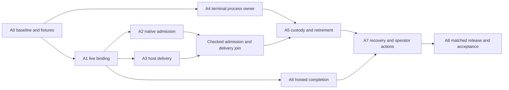

# Implementation sequence and complete acceptance

Status: partial implementation. The supervisor/resource slice is tracked in
[command-resource acceptance](../next/command-resource-acceptance.md).
This checklist executes the contracts in [README.md](README.md) and files 01–05;
checked implementation items do not imply complete A0–A8 acceptance.

Use the [current-state review](current-state-review.md) to distinguish main,
retained swarm candidates and missing acceptance before assigning implementation.

## Delivery approach

The operator selected parallel dogfooding with frozen running tools. Use
[the current execution allocation](../parallel-dogfood/next-wave/applications.md)
for recursive worker scheduling. Preserve unrelated work in both repositories;
new implementations do not replace this wave's executing harness. Follow current
contributor guidance, including focused Nix-backed Tidepool checks and the Codex fork's change-size and test rules.

Each slice must land with its production consumer, failure paths and affected
target compilation. Split substantial slices into reviewable commits, especially
in Codex, whose guidance asks for small changes. Shared type scaffolding is useful
only when the next consumer is named and implemented; no slice is complete while
its new mechanism is unused or merely testable in isolation.

The dependency joins below constrain acceptance, not a globally sequential worker
schedule. Parallel implementation consumes concrete agreed contracts:



A4's low-level terminal work can be tested independently of A2/A3, and A6's native
completion work can be tested after A1. Those are dependency facts, not a mandate
to add parallel workers or run concurrent build batteries.

## Codex fork change scope

| Slice | Additional Codex change | Tidepool-side work |
|---|---|---|
| A0 | Test fixtures and validation of the landed steering repair | Integrated baseline and cross-repository fixture |
| A1 | Extend the owning-TUI relay with application/generation identity, handshake, typed operations and native observations; retain existing writer-lock enforcement | Live backend session, wire ownership, readiness and fleet health |
| A2 | Extend native queue/store and input dispatch with durable deduplication, retained outcomes, withdrawal/seal, presentation evidence and restart quarantine | Consumer prepared by A1; full inbox integration in A3 |
| A3 | No separate native mechanism beyond A1/A2; integrated protocol tests may expose repairs | Stable inbox operations, bootstrap, updates, notifications and request reconciliation |
| A4–A5 | Command admission and cgroup receipts in `codex-utils-pty`, including direct child consumers | Supervisor and command limits implemented; finish native admission sealing and resource settlement |
| A6 | Retain completion state with the native session, account for bounded accepted work, preserve ordered callbacks, expose coordination failure and reconcile persisted results | Accepted hosted work, idempotent fork gate and retirement integration |
| A7 | Exercise the reconnect and old-producer fencing supplied by A1/A2/A6; no native Haskell-state restoration | Host recovery, new incarnations, source recovery, status and operator actions |
| A8 | Native integration tests, relevant API/schema documentation and a reviewed fork commit | Pin, packaged behavior check, migrations and final acceptance |

A2 is the largest new native semantic change. The landed steering relay supplies
the correct route, but client-message correlation does not provide durable
admission deduplication. Existing native writer locks and completed-call boundary
logic should be reused. This plan requires neither another app-server process nor
a new execution/controller architecture in Codex.

## A0 — Establish the integrated baseline and executable fixtures

- [ ] Record Tidepool and Codex commits, dirty-tree scope, the Codex pin and the
  actual packaged binary used for integration. Preserve the separately authored
  active-steering repair and its regression tests.
- [ ] Read current root/nested guidance in each affected subsystem. Recheck
  production launch, input, completion, custody and resume consumers after the
  repaired baseline is selected.
- [ ] Reserve protocol/storage revisions for the coordinated release. Confirm
  that hosted protocol 4 and binding storage 6 remain available; identify the
  next inbox checkpoint and native store migration numbers from source.
- [ ] Extend the existing full-TUI fixture with the actual hosted Haskell
  endpoint and the remaining input/completion contracts. Keep its isolated
  temporary run root, repository and local provider.
- [ ] Add fixture controls for disconnecting a socket, delaying/dropping a reply,
  stopping a specific child and holding a tool result at its actual boundary.
  Keep them in test infrastructure; do not add production magic strings or
  environment switches that bypass custody.
- [ ] Establish baseline observations for command selection, initial prompt bytes,
  real completed-call fork history, terminal interactivity, process counts and
  memory. No default app-server daemon may be running in the routing fixture.

Existing fixture: `tidepool/src/host_dynamic_tools/tui_resource_tests.rs` starts
an isolated supervised native TUI with a local scripted provider. It verifies
command OOM, ordinary steering and subsequent execution without paid inference.
Extend this fixture and the owning scoped-custody tests for the remaining native
input/completion gates; do not create a competing launcher just to match the
original proposed test filename.

Exit evidence: exact repaired baseline, a working full-TUI fixture, reproducible
relevant gaps, and no dependence on a developer's live session or credentials.

## A1 — Bind every operation to the owning native session

Contract: [01-native-session.md](01-native-session.md).

- [ ] Add the native application/generation identity, capability handshake and
  bounded event/status subscription to the repaired TUI relay.
- [ ] Enforce the generation admission gate with the actual request handle.
  Verify the canonical native thread owner prevents a competing writable resume
  of a hosted conversation, while allowing history reads and context forks.
- [ ] Introduce the durable conversation/live connection distinction at
  `tidepool-agent`'s interactive seam and binding migration owner.
- [ ] Extract Codex wire decoding/encoding from the application into backend
  modules, preserving host actor policy and retained HTTP lifetime.
- [ ] Retain the live connection in the existing deployment row; add native and
  hosted coordination health to the existing fleet observation loop.
- [ ] Wire the repaired active update through that connection. Until A2/A3 land,
  continue its existing no-uncertain-retry rule and correlated evidence behavior.
- [ ] Gate automated bootstrap/input on full readiness. Keep intermediate
  release combinations explicitly unsupported until their host consumer is ready.
- [ ] Use native usage/event observations for the live path; keep offline history
  readers only for actual remaining consumers.

Exit evidence: the real TUI fixture routes host input to the original execution,
rejects stale/foreign bindings and stays interactive through reconnect. Native and
hosted health can fail independently and are reported independently.

## A2 — Make native admission durable and queryable

Contract: native half of [02-delivery.md](02-delivery.md).

- [ ] Extend the queue-store seam and its concrete persistence with host producer,
  immutable operation identity/content, admission state, dispatch claim and
  bounded retained outcomes. Include the required schema migrations and fixtures.
- [ ] Apply the transaction to the real queue service and start-or-steer native
  input owner. Preserve native human input behavior.
- [ ] Carry correlation through the actual durable user-input append and expose
  its presentation outcome to the session bridge.
- [ ] Implement exact-input query/withdrawal, producer seal, safe outcome
  acknowledgment and compaction. Reject retired producers and conflicting keys.
- [ ] Quarantine unresolved dispatch on restart and old host input on resume.
  Never reclassify `Dispatching` as ready just because no history item was found.
- [ ] Handle manual queue delete/edit using correlated withdrawal and fresh
  manual identities.
- [ ] Exercise lost acknowledgment after queue consumption, native crash across
  the history/store gap, capacity and migration through actual native consumers.

Exit evidence: repeated consumed input cannot dispatch again; uncertain native
dispatch is retained and queryable; a delayed request cannot pass a withdrawal
fence. This must be proven beyond the storage helper API.

## A3 — Route Shoal delivery through the durable operation path

Contract: host half of [02-delivery.md](02-delivery.md).

- [ ] Extend `DurableInbox` with immutable operation provenance, explicit terminal
  negative dispositions, late reconciliation and bounded retained correlations.
  Preserve strict durability and add incompatible-reader migration checks.
- [ ] Replace mutable prefix batching and Shoal's `codex queue` subprocess hop
  with one ordered dispatcher using the live session and stable inbox identity.
- [ ] Publish bootstrap and assignment envelopes through that dispatcher. Remove
  Shoal's automatically submitted positional initial prompt.
- [ ] Wire request-update publication and late evidence into the existing
  `RequestRegistry`; preserve reply/cancel admission races and uncertainty fences.
- [ ] Enable the existing notification send consumer only after publication,
  native admission and receipt polling are connected. Preserve authorization and
  the absence of request replacement/fencing.
- [ ] Keep status, completion, interruption and retirement independent of input
  backpressure. Add visible unconfirmed/blocked delivery observations.
- [ ] Delete superseded host retry/batching and update-only transport paths.
  Retain a generic queue CLI/backend method only if another production consumer
  actually needs it.

Exit evidence: the real host/native fixture survives acknowledgment loss without
another assignment, resolves late steering evidence at the original request,
delivers notifications without remounting that request, and boots once after
readiness. Legacy uncertain inboxes are not automatically replayed.

## A4 — Run the normal TUI under an exact retained process owner

Contract: launch/terminal half of
[03-process-supervision.md](03-process-supervision.md).

The process supervisor and bounded command execution now have production
consumers. Extend these owners; do not reimplement the launch architecture.
The remaining checks below include broader platform/terminal acceptance.

- [x] Add typed inherited-terminal stdio to the existing scope implementation.
- [x] Implement the per-pane supervisor, private manifest/checkpoint, exact
  pairing protocol and at-most-one blocked payload.
- [ ] Preserve init pinning, gate retention, direct monitor wait and all current
  uncertainty behavior. Add the packaged platform conformance fixture.
- [x] Add the hidden supervisor entry point to the existing CLI parser; keep
  subprocess mechanics in `tidepool-node`.
- [x] Replace the tmux payload command with the supervisor launch, retaining its
  exact client in the preexisting host row before work may exist.
- [ ] Prove real PTY foreground, resize, paste, interrupt and interactive-child
  behavior before enabling the production launch selector.
- [ ] Exercise host loss before and after release, plus lost launch/release replies.

Exit evidence: a normal full TUI runs under the exact scope; host failure after
release leaves it usable; pre-release failure cannot accidentally execute it.

## A5 — Complete production custody and retirement

Contract: retirement half of
[03-process-supervision.md](03-process-supervision.md).

- [x] Adapt scoped custody to the supervisor consumer; remove obsolete staged
  own-spawn wrappers without weakening original row anchoring.
- [x] Watch native scope lifetime after binding, independently of tmux and HTTP.
- [ ] Implement admission seal, graceful interruption, exact scope stop,
  accepted-hosted-work cancellation/drain and final resource settlement through
  their existing owners.
- [ ] Replace `retire_native_pane` as process authority and the unconditional
  post-submission lease-retention branches on the new scoped path.
- [ ] Keep pending operations/results anchored across dropped waits, launch
  cancellation, finalization loss and shutdown deadlines.
- [ ] Preserve failed coordination applications for manual use; support a later
  explicit stop through the same retained owners.
- [ ] Keep legacy launches visibly unconfirmed and prevent copied/sibling
  observations from authorizing settlement.

Exit evidence: both completed and cancelled real actors settle their exact leases;
live hosted work and unconfirmed process cleanup prevent settlement; a later stop
can finish the same retained transaction. No worktree contents are deleted by
binding settlement.

## A6 — Give hosted completion a native session owner

Contract: [04-hosted-completion.md](04-hosted-completion.md).

- [ ] Move completion lifecycle state into the non-rendering native session
  component, preserving the existing ordered background callback worker.
- [ ] Reserve completion capacity before hosted evaluation and retain exact
  accepted call identity at the host's existing accepted-work owner.
- [ ] Prevent repeated invocation evaluation and make repeated completion
  acknowledgment idempotent at the real fork gate.
- [ ] Acknowledge retained fork admission promptly without waiting for child
  readiness; propagate actual child launch failures through actor ownership.
- [ ] Publish coordination disabled/reconnecting/quiescing state through native
  observations and concise native/Shoal status.
- [ ] Cover mixed batches, nested context IDs, missing results, reattachment,
  result loss, callback delay and retirement interruption.

Exit evidence: a real Haskell `unfold` child inherits the completed result and
final source tip; stalled completion networking does not stall the TUI; exhausted
failure disables hosted work without losing native interactive use.

## A7 — Make recovery and operator actions precise

Contract: [05-recovery.md](05-recovery.md).

- [ ] Implement same-host/same-application reconnect and input/call reconciliation
  using the existing retained deployment and request owners.
- [ ] Persist minimal deployment recovery descriptors through the existing
  run/status owner and versioning, without serializing capabilities.
- [ ] Add limited live-helper inspect/stop after exclusive run-root ownership
  transfer; reject old actor and hosted-call authority.
- [ ] Gate root/worker same-conversation resume on exact predecessor scope exit.
  Replace pane-only resume authorization and preserve legacy uncertainty.
- [ ] Use existing source-only declaration recovery for an explicitly new actor;
  publish replayed/lost state and quarantine old input producers.
- [ ] Project native, coordination, request, process and resource states into
  existing inspect/status views and typed CLI/operator actions.
- [ ] Route existing stop/recreate paths through the same retirement owner.
- [ ] Test reopened busy bindings explicitly. Do not add a forged-receipt
  workaround for whole-host custody loss.

Exit evidence: same-owner reconnection preserves live Haskell/request state;
new-incarnation resume preserves history with explicitly new authority; uncertain
old execution blocks competing resume; whole-host resource limits are reported.

## A8 — Ship one matched implementation and remove obsolete paths

- [ ] Integrate reviewed Codex changes, record their immutable commit and update
  Tidepool's `flake.nix` input and lock through the existing Nix workflow.
- [ ] Build a matched installed Shoal/extractor/Codex package. Run acceptance
  against that package, not only against unrelated ambient `cargo` binaries.
- [ ] Upgrade `codex-host-tools-contract` from help-flag checks to a behavioral
  handshake/input/completion fixture for the pinned binary. Separate pure
  protocol checks from platform tests that need PTYs/namespaces.
- [ ] Retain CLI capability checks that this product actually uses. Observer and
  controlled-service flags are not evidence for option A's interactive contract.
- [ ] Reject incompatible new launches before automated input. Leave already
  running older panes intact and clearly unsupported for the new coordination
  features; do not live-upgrade their connection generation or custody.
- [ ] Run the full acceptance matrix below on fresh isolated deployments.
- [ ] Update standing source contracts, API guide, launch troubleshooting and
  contributor ownership guidance. Describe the Haskell workflow, status and
  supported recovery limits without exposing protocol ceremony to model tools.
- [ ] Search for and delete stale production consumers, default-daemon routing,
  mutable batching, legacy pane-based success claims, duplicate parsers, unused
  staged scope APIs and comments describing superseded architecture.
- [ ] Record exact tests, builds, migrations, platform identity and remaining
  exceptional retention limits in the integration evidence.

Rollback means launching a fresh compatible run with the old matched package.
Do not point an older writer at upgraded inbox/native store formats or rewrite
their version markers. Preserve new-format run data for inspection. Do not stop
or replace unrelated running user sessions as part of rollout.

## Verification workflow

Map each changed file to every affected build/test target before running checks.
The commands below are focused starting points; new test names are proposed and
must be registered by the implementing slice. Do not claim a filter passed until
the runner confirms it selected and executed the intended tests.

From Tidepool, use the repository Nix/toolchain environment via `just`:

```sh
just test-lib tidepool-agent 'test(backend::codex)'
just test-lib tidepool-node 'test(inbox)'
NEXTEST_TEST_THREADS=1 just test-lib tidepool-node 'test(process_scope)'
just test-lib tidepool-actor 'test(request::updates)'
just test-lib tidepool 'test(actor_host)'
just test-lib tidepool 'test(host_dynamic_tools)'
just test-target tidepool-node process_boundary
NEXTEST_TEST_THREADS=1 just test-target tidepool interactive_applications
```

Use narrower exact filters during individual slices. For changed runtime source
recovery or worktree binding behavior, run the owning tests in `tidepool-runtime`
and `tidepool-worktree`. Compile changed CLI and downstream targets too:

```sh
nix develop --command cargo check -p tidepool --bin shoal
nix develop --command cargo test -p tidepool --test interactive_applications --no-run
nix develop --command cargo fmt --check
git diff --check
```

The `--no-run` command is a compile-only supplement, not replacement for required
behavior tests. Haskell-backed fixtures use the repository's packaged extractor
and frozen libraries; ambient Cargo success is not extractor acceptance. Update
test-suite registration and run `just suite-check` if new targets require it.
Run `just fixtures-check` if extractor translation or serialization changed; do
not update the corpus for unrelated runtime work. Run the appropriate broader
boundary check at A8, not after every local edit or concurrent worktree batch.

In the Codex fork, use its `just test` recipes, which select nextest and the
repository's environment. Relevant package/fixture commands include:

```sh
just test -p codex-tui -E 'test(host_dynamic_tools)'
just test -p codex-queue-extension
just test -p codex-state -E 'test(queue)'
just test -p codex-thread-store -E 'test(queue)'
just test -p codex-app-server -E 'test(thread_queue) | test(thread_fork)'
just test -p codex-cli --test hosted_interactive
```

`hosted_interactive` is a proposed native CLI/PTY test target, reusing the existing
CLI PTY infrastructure. Adjust filters to actual names and compile all changed
test targets. Add required native agent integration tests at the real session
input/history owner if its logic changes. Existing observer tests can provide PTY
infrastructure, but their read-only behavior is not the acceptance target.

Follow the Codex fork's required `just fmt`, scoped `just fix -p PACKAGE` and
final diff checks. If dependencies change, update its Bazel lock through
`just bazel-lock-update`; register any `include_str!` fixtures and migrations in
Bazel data declarations. If app-server APIs change, update its README and generated
schema through the existing commands. A private TUI relay change does not by
itself require inventing a public app-server schema entry.

Codex's contributor guide requires the complete suite after common/core/protocol
changes and asks before that full-suite run. Schedule that required integration
gate according to the authorization in effect when implementing. This planning
task does not run builds or request permission for future suite execution. Do not
silently label a required unexecuted suite as passed.

## End-to-end acceptance matrix

| Case | Required evidence |
|---|---|
| Root, child and selected-context actor launch | Full TUI, correct checkout, frozen tools/prompts, native goals/collaboration disabled |
| Exact-context fork | Actual persisted parent result and final Haskell binding tip in the child's concrete native history |
| Default daemon absent or unrelated | Host input still reaches only the bound TUI |
| Concurrent human and automated input | One native execution owner; original typed request remains authoritative |
| Queued follow-up during a running turn | Queued semantics retained, no active-update fallback |
| Steering with an open request and native idle | Same request wakes; no new assignment or reply capability |
| Lost admission reply after consumption | One native operation and no duplicate model input |
| Crash between dispatch and durable history | Explicit uncertainty; no automatic redispatch |
| Lost presentation event | Exact native query reconciles it, or uncertainty remains visibly fenced |
| Notification to an actor serving a request | Correlated receipt; unchanged request mounting and settlement authority |
| Slow/failing completion callback | Interactive terminal remains responsive; fork release is exact or explicitly unavailable |
| Native result missing after hosted evaluation | No repeated Haskell side effect and no invented fork boundary |
| Launch failure at each resource boundary | No unowned submitted work; only proven pre-submission resources released |
| Host loss before release | Marker payload cannot run |
| Host loss after release | Original TUI remains usable; helper retains exact process accounting |
| Process exit with descendants and a live hosted call | Separate drain obligations; no premature worktree/build/socket release |
| Normal completion and intentional stop | Successful actual lease settlement, preserved worktree contents |
| Retirement deadline | Same retained transaction can later finish |
| Helper loss / legacy pane death | Unconfirmed custody and no automatic same-conversation resume |
| Whole-host crash | New incarnation rejects old handles; process recovery does not forge lost host leases |
| New-incarnation resume | New producer and machine; old queue quarantined; source-only recovery reported |
| Unsupported binary or process platform | Typed incompatibility before automated input/release as applicable |
| Native store and inbox upgrades | Incompatible older writers fail; uncertain old rows are not replayed |
| Resource pressure | Bounded queues and backpressure; status/stop remain responsive |

Run deterministic fault cases first with a local controllable provider. Follow
with a small fresh-model acceptance run on `shoal-repl` or another isolated,
non-self-hosting project: a root, an inherited child and an independent selected
context are sufficient. Exercise real Haskell tools, typed assignment/update,
notification, reviewed child evidence, manual input, retained failure and final
stop. Record actual outcomes and cleanup; do not infer success from a pane title.

## Performance and context evidence

Compare the repaired full-TUI baseline with the final matched package using the
same model settings and controlled histories. Measure whole application PSS/RSS,
supervisor PSS, resident host memory, descendant processes, idle CPU, input
admission/presentation latency and completion backlog. Use existing `/proc` and
tracing owners; do not add an always-on payload profiler.

Use mock-provider idle fleets of 1, 4 and 12 actors to expose scaling without paid
model work. Set initial investigation thresholds of 32 MiB PSS per supervisor,
one percentage point of a CPU core per idle application above baseline, or
500 ms added p95 local admission latency without deliberate backpressure. Record
hardware and workload with the measurements. Crossing a threshold requires
profiling and a concrete explanation/fix before release; it does not authorize
silently replacing full TUIs with observers. Terminal stalls under delayed hosted
callbacks are a correctness failure independent of the memory thresholds.

For context inheritance, compare actual normalized provider requests and reported
usage using existing private opt-in native tracing. Verify frozen common tool
definitions and prompt bytes, the completed-call prefix and task-local additions.
Transport identities and status must not become repeated model prompt fragments.
Do not claim cache preservation from rollout metadata alone, or promise a provider
cache hit from identical prefixes. Keep captures bounded and private and report
any missing evidence.

## Final delivery record

The implementation handoff must include:

- Matched repository commits, package identity and required protocol/storage revisions.
- The production entry point for each new mechanism and the obsolete path deleted.
- Executed test selections, compiled-only targets, required checks not run and their reasons.
- Real PTY, process-scope, Haskell completion and fresh-model acceptance evidence.
- Measured resource/latency changes and normalized provider-prefix evidence where available.
- Explicit remaining limits: no restoration of arbitrary live Haskell state,
  no automatic custody forgery after whole-host loss, and retained uncertainty
  when exact process or delivery evidence is unavailable.

Option A is complete only when all slices and their applicable gates are satisfied.
Do not stop at successful transport routing, a scoped-process library with no live
consumer, or a normal path that still retains every submitted lease forever.
