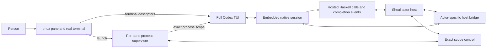

# Option A: supervised interactive Codex applications

The supervisor/resource slice is tracked in
[current acceptance](../next/command-resource-acceptance.md). Native input,
completion and recovery candidates remain separate product work; this slice does
not establish full A0–A8 acceptance.

Status: partial implementation exists on retained branches. This design defines
acceptance; use the final lane checkpoint for exact source and verified gates.
[Recursive execution allocation](../parallel-dogfood/next-wave/applications.md)
defines worker ownership and dependency joins.

Implement one full native Codex TUI for each Shoal actor, with a precise live
session binding and an independently retained process owner. Shoal remains the
owner of actor coordination and continuation. The embedded native session remains
the owner of model execution and interactive input. A person can inspect and use
the ordinary TUI, including when hosted coordination has failed.

This is the selected **option A** from the integration review. It does not move
execution to a dedicated app-server service, replace TUIs with observers, or share
one app-server across actors. Those are different architectures. Nothing in this
plan requires them as an intermediate step.

Use the [current-state review](current-state-review.md) to distinguish main,
retained swarm candidates and missing acceptance before assigning implementation.

## Read shared decisions, then assigned mechanisms

| File | Implementation obligation |
|---|---|
| [01-native-session.md](01-native-session.md) | Exact live binding, capabilities, commands, native observations and backend ownership |
| [02-delivery.md](02-delivery.md) | Durable input identity, native admission, safe retry, active updates and notifications |
| [03-process-supervision.md](03-process-supervision.md) | Full terminal behavior, exact process ownership, transactional launch and resource settlement |
| [04-hosted-completion.md](04-hosted-completion.md) | Hosted calls, persisted results, completed-call forks and coordination failure |
| [05-recovery.md](05-recovery.md) | Reconnection, terminal operations, host failure, new incarnations and recovery limits |
| [06-integration.md](06-integration.md) | Implementation dependencies, cross-repository release, checks and complete acceptance |

This file defines shared decisions. The numbered files define the mechanisms and
failure tests. The integration file is the implementation checklist. Changes to a
shared decision must update its consumers before implementation continues.

## Source baseline

The separately authored steering repair landed while this plan was being written:
Tidepool `5194426dfec9cac8f2e18a547148190d4908ae71` and Codex fork
`d760c5cb8c82f533a0bff6cab9e15f3bcdc7e9ed`. These are the original planning
baselines; the launch record selects their reviewed successors. Start from the
saved A0 work and those repairs; do not
recreate them. Other changes in the shared workspaces remain outside this plan.
These are source observations, not claims about the binary in every running pane.

The repair adds an owning-TUI input socket, submits through the TUI's existing
`AppServerRequestHandle`, updates that handle on reattachment and recognizes the
current correlated rollout input records. It is the starting transport for this
plan. It does not by itself implement operation deduplication, retained native
outcomes, process custody or whole-host recovery.

The original review established these gaps; the lane checkpoint records repairs:

| Current boundary | Required outcome |
|---|---|
| A retained thread ID with the repair's optional input socket | Durable conversation identity and a separately negotiated live owner |
| Host prefix batching followed by `codex queue`, which creates a new client ID | One durable operation identity and immutable payload through both admission owners |
| Native queue entries deleted after dispatch | Retained admission outcomes and a crash rule that prevents uncertain redispatch |
| Tmux pane observation; submitted resource leases always retained | Exact namespace/process completion plus separate hosted-work completion |
| Completion callbacks triggered through TUI integration | Native session bookkeeping independent of terminal rendering and event-loop latency |
| Conversation resume used near host recovery | Explicit distinction between a live reconnection and a new actor with retained history |
| Runtime-unconfirmed steering with no late settlement path | Authoritative reconciliation at the existing request owner |

Verify each claim against the baseline selected in A0. Repair already landed
mechanisms by extending their owners; remove superseded paths when the replacement
has a production consumer.

## Target ownership

| Mechanism | Sole owner | Other layers may do |
|---|---|---|
| Actor identity, hierarchy, requests, replies, watches, continuation | `tidepool-actor` and its existing resident driver | Project observations and issue authorized typed operations |
| CLI, frozen launch selection, initial prompt, deployment composition | `tidepool/src/shoal.rs`, `actor_host.rs` and its modules | Supply immutable inputs to the owners below |
| Backend-neutral interactive interface; Codex wire adaptation | `tidepool-agent/src/interactive.rs`, `backend/codex/` | Map backend evidence into typed host results |
| Native turns, queue admission, presentation, native history | The embedded Codex session and its existing queue/history stores | Accept input from the TUI and its host bridge through the same native owner |
| Terminal input, rendering, approvals, native interactive tools | The full native Codex TUI | Display host status; never infer actor settlement from a rendered response |
| Actor input durability and delivery cursor | `tidepool-node/src/inbox.rs` | Store typed provenance and transport outcomes in the existing inbox |
| Mount boundary and exact OS process scope | `tidepool-node/src/process_boundary.rs`, `process_scope.rs` | Run a small per-pane supervisor retaining the existing scope |
| Deployment custody and retirement orchestration | Existing host lifecycle row and `actor_host/` modules | Hold opaque capabilities to process, hosted-work and resource owners |
| Managed checkout identity and active bindings | `tidepool-worktree` | Settle the exact installed binding after its owner has all required evidence |
| Resident checkout, source sequencing and machine cleanup | `tidepool-runtime/src/session/` | Report supported source recovery and unrecoverable live state |
| Durable writes and migrations | Existing atomic-write, JSONL and version-ladder owners | Encode the records defined here without creating another persistence library |

The supervisor is a process mechanism, not another actor, scheduler or Codex
controller. The host's deployment row is the only coordination owner. The
supervisor owns the OS handles that cannot safely be approximated by a pane ID or
serialized PID. There is no parallel deployment registry in the supervisor.

Private socket permissions, launch challenges and typed provenance protect the
intended local ownership boundary. Preserve the current operational mount model:
it separates working files but is not a hardened sandbox against a hostile
process with the user's privileges. Do not describe the new helper or bridge as
providing that stronger isolation.

## Runtime shape

The supervisor starts the native application with the existing mount boundary and
inherited terminal. It does not proxy keystrokes, parse screen output, run model
turns or host Haskell. The host bridge uses the existing native session connection;
it never discovers a default daemon and loads a second executor for the thread.

## Invariants

1. **One executing native owner per deployment.** A conversation ID is a history
   locator. A fresh handshake establishes the currently addressable execution.
   Reusing a socket path, pane number or thread ID cannot establish liveness.
2. **One typed assignment owner.** Native turn completion, human input and
   notification delivery cannot complete, replace or create a Shoal request.
   Existing typed request operations retain that authority.
3. **One input operation has one identity and one payload.** Identity is fixed
   before submission. An uncertain result is reconciled, not retried as a fresh
   message. Queue admission, presentation and incorporation are distinct facts.
4. **Host failure preserves interactive use.** After launch release, loss of Shoal
   coordination disables hosted coordination while leaving the TUI and native
   tools usable. It does not trigger another executor for the conversation.
5. **Cleanup needs all owners.** Namespace drain, direct-child wait, hosted work,
   resident work and external effect resources are distinct obligations. One
   successful obligation cannot discharge the others.
6. **Custody survives cancellation.** Before work may exist, the existing host row
   retains the capability required to account for it. Lost task results and
   deadlines cannot release a lease or manufacture `NotSpawned`.
7. **Inherited context uses the real result boundary.** Preserve
   `--destination-local --after-call`, exact tool schemas and frozen shared
   instruction bytes. An invocation-only or reconstructed transcript is not an
   acceptable fork baseline.
8. **Native goals and native collaboration remain disabled uniformly.** Shoal
   owns continuation on roots and descendants. Existing omitted-effort resolution
   and model policy remain with their current owners.
9. **Authority stays in Rust.** Haskell expresses workflow intent through the
   existing typed effects. Transport states do not become a new model-facing
   process-management language.
10. **Unsupported evidence stays unknown.** No path turns a timeout, missing pane,
    dead socket, stale rollout, text label or boolean into proof of submission,
    incorporation, process cleanup or recovered Haskell state.

## Common vocabulary

Use existing `ActorRef`, request, thread, inbox and worktree types. Add only the
following distinctions at their owners; names below are proposed Rust concepts,
not extra model-facing handles.

| Concept | Meaning and lifetime |
|---|---|
| Conversation reference | Durable backend thread identity; survives native process exit |
| Deployment launch identity | Exact host incarnation, actor and launch reservation, including a nonce allocated in that row |
| Native application instance | Random native identity created for this TUI process; never inferred from its PID |
| Native session generation | Monotonic binding revision within that application, changed when its primary session handle is replaced |
| Live session capability | Non-persistable right to send to a negotiated instance and generation; cloning a transport client does not broaden its target |
| Input identity | Existing inbox identity plus durable sequence, scoped to its producer incarnation |
| Scope capability | Noncloneable owner of one launch's supervisor connection and retained process obligation |
| Coordination state | Serving, temporarily disconnected, quiescing or disabled, with a reason and observed revision |

Present status as separate native-execution, hosted-coordination, request and
resource observations. Avoid an aggregate `healthy` flag that hides which work
remains possible.

## Scope and costs

Include ordinary assignment delivery, bootstrap input, active updates,
notifications, completion acknowledgments, fork release, stop, native exit,
reconnection, failure retention and a safe new-incarnation resume. Include current
root and worker launch modes and normal interactive debugging.

Exclude automatic reconstruction of arbitrary Haskell heaps, transparent migration
of live actors to a new host, a new operator-input protocol, a second task queue,
headless backend unification and operating-system portability beyond the checked
process-scope platform. Unsupported hosts must report that fact before automated
launch; they must not silently use weaker cleanup claims.

The material additions are one small supervisor process per pane, a retained
native input outcome in the existing store, one live backend connection per actor,
and focused Codex-fork maintenance. They do not require another model context or
duplicate native runtime. Measure their memory, CPU and latency in acceptance.
The earlier memory sample covered complete Codex processes, not the TUI's marginal
cost; it cannot justify eliminating the interactive terminal.

## Relation to other plans

[NEXT.md](../../NEXT.md) continues to own the programmable Shoal package and its
normal-TUI operating model. This plan implements its missing application lifetime
and transport boundaries. It does not replace the workspace orchestration design.

Reuse the proof obligations in the existing
[namespace scope contract](../next/service/namespace-scope-contract.md),
[scoped custody contract](../next/service/scoped-custody-contract.md),
[hosted custody contract](../next/service/custody-contract.md),
[notification contract](../next/service/notification-contract.md) and
[notification inbox contract](../next/service/notification-inbox-contract.md).
Where those documents discuss a controlled app-server or observer as a future
consumer, this plan selects the full-TUI supervisor and owning-session bridge
instead. Their process, durability and authority requirements still apply.

## Completion condition

All A0–A8 slices in [the integration plan](06-integration.md) must have concrete
production consumers, their specified failure checks, a matched pinned build and
fresh full-TUI acceptance. Resource settlement must work for a successful ordinary
actor, and remain explicitly retained for an unprovable failure. A pile of staged
types, passing helper tests or an observer demonstration does not complete option A.

After acceptance, move standing contracts to the owning source and focused
references, update contributor guidance where ownership changed, and retire this
plan tree. Do not turn it into another always-loaded instruction set.
