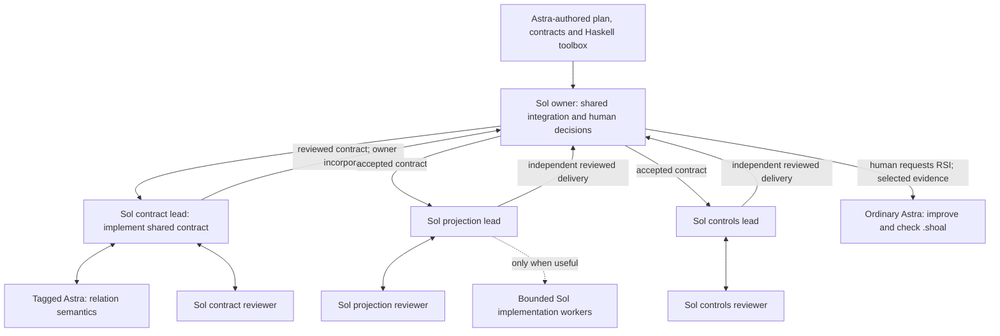

# Curate a useful Shoal workbench before the first application wave

Status: all seven implementation steps complete. Current package behavior and
verification are recorded in [coordination RSI](coordination-rsi.md). The original
[curation review](evidence/workbench-curation.md) records the responsibility audit
and cold-check performance finding. Live application acceptance remains distinct
from the model-free package checks.

The [vision](planned-swarm.md) still owns the operating model: Astra prepares
the architecture and project language, Sol executes substantial components,
tagged Astra work handles consequential difficulty, and an ordinary requested
Astra engagement improves the next swarm. This pass improves that interface;
it does not change TUI execution, TOML configuration or the frozen `.shoal` boundary.

## The product being authored

The shared `.hs` files are powerful tools for invocation in resident GHCi-style
sessions. Design from the expressions a pilot wants to write: commission work,
inspect a result, reuse a reviewer, incorporate a decision, connect dependencies,
and ask where effort went. Ordinary Haskell provides application, closures,
partial application, lists and typed effects. Use those directly.

The useful unit is a composable operation over retained values, not a mandatory
stage in an application framework. High-level convenience recipes can connect
operations once a real pattern earns repetition. Keep the constituent operations
available and their handles inspectable. No import starts work. No helper needs
to own a second scheduler, registry, actor lifecycle or source of configuration.

Short code is valuable when it removes setup or repeated inference. A tiny
context that omits the reason for a contract is false economy. Shared helpers
need clear semantic contracts and checked invocation examples; disposable resident
expressions need neither framework ceremony nor a standalone human report.

## Working topology

Default to a Sol component lead doing substantial engineering and owning its
delivery, with an independent Sol reviewer. The lead can delegate a coherent
implementation frontier when that creates useful parallel work. Creating a lead
does not automatically create an implementer and an integrator beneath it.

For the prepared application:

The lead can merge delegated candidates into its own checkout and check the
result. The application owner combines component deliveries into the shared
application branch. These are meaningful integration points. An additional
integration worker is useful for substantial combined-source work, not for a
mandatory fast-forward of every already-reviewed candidate.

Two review relationships prevent a queue cycle:

- **Lead implements:** the reviewer returns findings or acceptance. The lead
  repairs its code and commissions the next review from the same retained
  reviewer. The lead's overall delivery stays pending; each review attempt can
  settle. Never queue repairs behind the lead's active delivery request.
- **Implementation is delegated:** the reviewer can request repairs directly
  from the retained, available implementer while its own review stays pending.
  The lead need not relay those exchanges. An active implementer that still
  owes its original reply is not yet an available repair destination.

Represent this choice in project Haskell, for example `OwnerRepairs` versus
`RetainedImplementer AgentRef`. These are policies over the same workers and
requests, not new runtime roles or separate workflow engines.

## Implementation sequence

### 1. Replace the fixed lane procession with independent workbench operations

Owners: `.shoal/Project/Work.hs`, `Plan.hs`, component plans and lead instructions.

- Refactor `deliverLane`/`DeliveryLane` around task, source and actual ownership.
  Remove mandatory implementation/review/integration group-and-label bundles.
  Keep checked labels and seed selection in ordinary project constructors.
- Offer small operations for commissioning a selected worker, beginning/reusing
  review, requesting a retained repair, consulting the declared expert, and
  forwarding an owned outcome. Return existing `Forked`, `Response`, `Watch` and
  `Route` handles, or a small tuple when several handles are genuinely useful.
- Keep direct use of `unfold`, `requestWith`, `watch` and `route` fluent. Do not
  wrap every primitive or invent an opaque project handle for every operation.
- Preserve a routed delegated-work recipe where it saves actual model relays.
  Retire the old all-stages default and stale callers instead of adding adapters.
- Update the concrete contract/projection/controls allocation to the topology
  above. Preserve independent partial delivery and the preplanned Astra slot.

Done when a lead can implement directly, or delegate where useful, without
manufacturing unused stages; every admitted worker owns a substantive obligation.

### 2. Make handoffs retain the contract and one revision per fact

Owners: `Types.hs`, task constructors/context builders, review and delivery helpers.

- Carry exact source, selected plan/contract, consequential accepted decisions,
  acceptance and scope through implementation, review and delivery. Keep relevant
  rationale in the task; use source references for deeper detail.
- Remove the competing `reviewHead` and nested candidate-commit authority.
  Review evidence identifies one exact candidate. An integrated head is a
  distinct fact with its own checks, and may legitimately differ from it.
- Give a repaired candidate to the next review explicitly; preserve the original
  response as historical evidence. Acceptance never silently falls back to the
  initial candidate or drops its remaining gates.
- Have an accepted expert decision produce an explicit downstream task delta.
  Commit shared semantics in the owning contract before dependent branches fork.
  The lead may author that commit from an accepted decision; a specialist's
  proposed commit still needs incorporation and checks.
- Consolidate duplicate blocked/repair outcome variants where they require the
  same action. Retain distinctions that affect ownership, next action or claims.
  Keep unavailable execution distinguishable from a supported product conclusion.

Done when a fresh reviewer/implementer can explain the accepted decision from
its supplied task and source, and no successful composition can accidentally
select the pre-repair commit because two fields disagree.

### 3. Wire exceptional questions without closing useful work

Owners: project review/attention helpers and prompts; existing watch/update owners.

- Select typed cumulative progress when commissioning work that may need an
  owning decision. Publish unresolved questions with source, evidence, affected
  obligation and a stable local reference. Keep them until resolved; progress
  coalescing must not lose an outstanding question.
- Supply a persistent local wave router so the owning Sol is alerted to
  consequential questions. Routine successful forwarding stays in Haskell;
  routine tool steps do not become a progress-reporting ritual.
- Generalize the existing `route` from `Await (Settlement a)` to `Await a` so
  project code can also route `awaitProgressAfter` observations. Its current
  implementation already polls a generic watch and invokes a closure. Extend
  this owner rather than creating a notification service or another route API.
- Preserve watch capture, ownership, unavailable outcomes, cursor/rearm behavior
  and retained callback failure. Repeated/coalesced attention must not duplicate
  work or erase an unanswered question.
- Return the owning decision through the existing response owner's
  `updateRequest` path. Render a typed project decision as understandable steering;
  do not parse magic text into authority or treat presentation as incorporation.
  Forward down ownership boundaries where necessary. Never queue a new request
  behind the obligation waiting for its answer.
- Teach the two review relationships above. A genuinely blocked result can
  settle an obligation deliberately; obtaining a decision need not do so.

Done when a reviewer can surface a structural question, retain its pending work,
receive an owning decision and continue, while an unrelated component progresses.

### 4. Curate the actual first-turn and continuation experience

Owners: project context builders, `prompts/*.md`, focused examples and plan tree.

- Give each responsibility a useful starting packet: outcome and rationale,
  exact source and owning scope, relevant acceptance/limits, available working
  values, one short normal invocation, and its meaningful question/failure path.
- Keep the common core focused on engineering judgment, fluent resident Haskell,
  ownership/continuation and compact communication. Reuse the shared API guide
  for mechanics. Supply responsibility-specific examples beside their helpers.
- Replace one-line task/repair/integration instructions and the generic lane
  incantation with concrete behavior. Merge redundant prompt fragments; do not
  replace thin prompts with an always-loaded instruction encyclopedia.
- Teach when to act locally, when to fork, when to retain a worker, when a
  useful review attempt ends and when the model turn should simply end waiting.
  Preserve judgment, within-scope refactoring and room to challenge a bad premise.
- Make previews cover the same selected task and behavior actually launched.
  Read rendered contexts as a fresh Sol would; check the next meaningful action
  after a repair or question, not just the startup paragraph.
- Keep peer communication compact and typed, with exact evidence and uncertainty.
  Human explanations belong with the owner making the decision. Do not require
  every internal reply to be a standalone narrative report.

Done when the real start/review/repair/decision/finish examples need no invented
operation, missing helper definition or knowledge of harness implementation.

### 5. Give workspace improvements an executable checking path

Owners: `shoal check`, the existing deterministic resident test driver,
package-owned check fixtures and the RSI prompt.

- Preserve the existing no-provider compilation check. Add a documented way to
  run focused package checks against an explicit candidate workspace; desired
  entry point: `shoal check --workspace PATH --recipes`.
- Reuse/extract the current deterministic resident harness. Load the candidate's
  check inputs and recipe sources, rather than testing compiled-in copies of the
  shipped package. Keep ordinary Haskell fixtures alongside the package. Do not
  introduce another scenario language, scheduler or model-evaluation framework.
- Exercise pure context/decision projections and the selected effectful recipes
  in isolated temporary checkouts, without native worker/provider launches.
  Report the selected definition identity and exactly which checks executed.
- Keep the fixture set small: direct lead review/repair; delegated retained
  repair and routing; expert decision through consumer incorporation; question
  attention/return with coalescing; partial delivery and next-swarm customization.
- The RSI worker must be able to edit a helper, prompt and example together and
  run this command from its candidate checkout. New behavior needs a corresponding
  check; successful compilation alone must not be reported as behavioral coverage.

Done when a deliberate candidate-only recipe defect fails the check, its repair
passes, and neither test uses the old frozen package or starts a paid worker.

### 6. Make observation answer decisions rather than dump state

Owners: `Project.Observe`, owner and RSI contexts.

- Provide small projections for delivered work/open gates, unresolved decisions,
  useful retained workers and effort concentrated by component/model.
- Keep plan, source/definition identity, exact actor identity and result linked.
  Retain underlying observations; show a concise view by default and expand the
  evidence that answers a real question. Preserve unknown/partial usage coverage.
- Build the RSI packet from selected outcomes, questions, before/after usage and
  a few concrete friction references. Do not require a separate summarizing
  worker, persistent Astra monitor or regular whole-tree reporting ceremony.
- Teach observation at meaningful decisions, not on every turn. Let the requested
  Astra complete a checked workspace improvement with ordinary tools.

Done when the packet explains which working definition to inspect and why,
without reconstructing the whole run or claiming counts establish work quality.

### 7. Execute one complete rehearsal and replace the readiness signoff

Owners: existing focused integration tests, package docs, fixed build and app install.

- Run the actual curated expressions through the full path: expert decision,
  incorporation, implementation, a failed review, retained repair, acceptance of
  the repaired head, partial delivery, combined-source checks and an RSI edit.
- Include both review relationships, unavailable/failed routes, pending question
  return and independent progress. Verify useful handles and open obligations
  survive; a generic happy-path fixture does not establish these compositions.
- Verify current frozen prompts stay fixed and the next selection consumes the
  checked edit. Compile changed consumers and run relevant formatting/boundaries.
- Replace the installed application package with the checked revision; preserve
  runtime artifacts and user work. Update its executable/source identities and
  launch instructions. Remove stale fixed-pipeline examples and contradictory
  readiness statements from active docs.
- Review context quality and unnecessary worker activations explicitly. Successful
  deterministic wiring is a prerequisite, not evidence of measured live savings.

Done when the first standalone run has a coherent plan, a useful workbench,
executable examples and an RSI checking command. Starting the paid run remains
the subsequent operator action.

## Current invocation surface

The checked operations now live in Project.Work; the package's
[run guide](../../examples/shoal-workspace/.shoal/plans/run.md) owns complete
first-turn and continuation examples. component constructs a source-bearing Task;
componentLead does substantive engineering. reviewCandidate returns a fork and
its WorkProgress; reviewAgain reuses an available reviewer. implement returns
a candidate fork with WorkProgress when delegation is useful.

withDecision carries a checked accepted choice into the next Task.
Project.Routing.followWork collects progress and results in one local actor; its
sink routes actionable changes without choosing the owning answer.
observeWork takes the existing Task and work/progress pair, retaining detailed
observations behind workSummary. The ordinary rsiBranch returns Outcome Candidate.

The operations preserve the existing owned handles and explicit execution failures.
No helper may synchronously await a child inside its admitting tool block or discard
an obligation it just created. Keep examples and their executable fixtures together.

## Boundaries and sequencing

Implement sequentially. Establish task/review semantics in steps 1-2, then make
attention and the working prompts agree with them. Build the checking consumer
alongside those changes, then execute the complete rehearsal and refresh the
application package. Do not start another swarm to implement this pass.

Keep general primitives powerful and project policy in Haskell. No new Rust
workflow roles, service migration, operator UI, budget governor, plan compiler,
parallel task registry or mandatory adoption tree. Defer automatic topology
tuning, monetary estimates, generalized policy frameworks and new reporting
workers until real use exposes a concrete need. A later worker must still see
the current swarm's frozen definitions, and useful experts must still be allowed
to finish their work.
