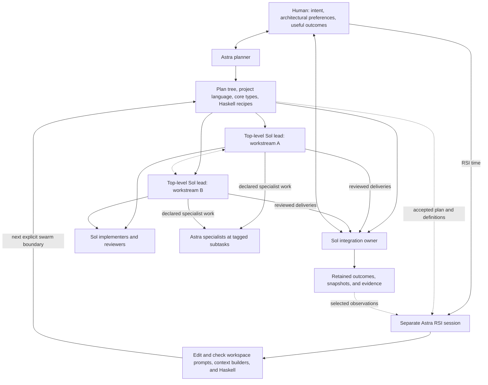

# Planned swarms: Astra plans, Sol executes

## The vision

Build challenging systems through a deliberately designed collaboration.
Astra turns the human's intent into an architectural plan, a recursive tree of
focused assignments, and a shared project language. Sol technical leads execute
their branches, coordinate implementation and review, and activate Astra specialists
at explicitly tagged subtasks. When the human asks for RSI, a separate Astra
session studies the wave and directly improves the way the next work is done.

Active, project-specific customization is a core product requirement. Each
workspace grows an executable working style in `.shoal`: prompts, project types,
context builders, and Haskell recipes that improve through actual use. A useful
local definition need not become a general Shoal feature to justify keeping it.
The [workspace customization design](workspace-pilot.md) develops this surface.
Edit those files as ordinary repository source. Each swarm fixes its prompts
and modules at startup; customization takes effect only at an explicit swarm
teardown/restart boundary, including for actors spawned later in the same swarm.

The aim is excellent work with less repeated reasoning, smaller relevant
contexts, and fewer coordination turns. Concentrate Astra cognition in artifacts
that many workers can reuse: good boundaries, meaningful types, clear assignments,
and powerful Haskell definitions. Give Sols enough understanding and responsibility
to finish real work within that architecture.

The plan is the main delivery from planning to execution. It should let a fresh
lead begin its component without asking the planner to reconstruct the project.
The working Haskell environment carries the resulting relationships: typed
requests, shared definitions, dependencies, review/repair flows, and retained
evidence. Known coordination executes as code.

This is the chosen operating vision for deep systems projects with several
substantial technical workstreams. The [Haskell and workflow blueprint](sol-worker-routing.md)
provides the detailed interface reference; the [wave closeout](evidence/wave-closeout.md)
records historical source and checks; [NEXT.md](../../NEXT.md) owns current
implementation scope and acceptance. Examples below
describe desired usage, not an already implemented API or a live run.

## A clear division of work



The diagram shows responsibilities and working relationships. Each worker family
can contain several independent contexts. Multiple top-level actors can execute
the plan together, with local Sol trees under the leads. Backend migration
is not part of this implementation: preserve the existing interactive Codex TUIs.
The human opens a worker's pane and talks to it normally. Runtime supervision, context
ancestry, result destinations, and pane presentation remain distinct choices.
The plan tree need not mirror the process tree. An overall Sol coordinator is
optional when cross-workstream decisions justify a separate responsibility.

| Responsibility | Owner |
|---|---|
| Architecture, intended decomposition, model placement, shared project language | Astra planner |
| Cross-workstream incorporation, shared integration, ordinary human progress | Sol integration owner; an overall coordinator when useful |
| An assigned subtree, local implementation judgment, review/repair, within-contract integration | Sol technical lead |
| A concrete implementation, investigation, or review obligation | Assigned Sol or tagged Astra specialist |
| Requested analysis and completed improvements to workspace prompts, contexts, and Haskell | Separate Astra RSI session |

A technical lead owns a useful outcome, not a stream of forwarding duties.
A small task can be finished directly. A directory grouping, shared contract,
or conditional checkpoint does not automatically need another actor.

All worker roles use the same underlying actor/request primitives and normal
interactive Codex TUIs. Model choice, context, typed input/result, and actual
permissions express their differences. Review, leadership, specialist work, and
RSI are compositions and assignments, not separate runtime or UI subsystems.

The initial planner can become idle once the execution owners' understanding
has been reviewed and consequential corrections incorporated. Material
architectural amendments still have an explicit owner. Routine execution does
not depend on a permanently monitoring Astra.

## Sol explains its plan before execution expands

Human and Astra establish the initial architecture, intended decomposition and
model placements before commissioning the Sol execution tree. A tagged Astra
implementation specialist does not replace that initial planning responsibility.

The Sol integration owner and substantive component leads then write detailed
execution plans in their own words, scoped to their plan branches. Explain the
intended user behavior with concrete examples, proposed implementation boundaries,
dependency and fork structure, acceptance evidence, and meaningful partial
deliveries. Distinguish verified capabilities from assumptions. Include questions,
perceived contradictions, suggested improvements and reasons to challenge the
initial plan. Repeating the planner's prose does not establish understanding.

The original Astra planner reviews these interpretations together with their
feedback. It corrects misconceptions, resolves shared questions with the human
when necessary, and improves the authored plan where the Sols found a real gap.
Owners incorporate the specific corrections into their branch plans and downstream
assignments before dependent implementation fans out. Carry the accepted source
and the reasoning together; a receipt or acknowledgment alone is insufficient.

Keep the checkpoint at useful architectural boundaries. Admit the leads needed
to understand and refine the plan, without launching their whole implementation
trees first. Independent investigation and explicitly authorized bounded work can
continue. One coordinator can collect branch interpretations; Astra receives the
plans and consequential questions, not every worker's transcript. Local routine
splits do not need repeated planner approval, and this is not a mandatory extra
worker role, plan compiler or Rust lifecycle stage. Ordinary Markdown artifacts,
typed requests/progress and existing steering support the interaction.

The [plan-understanding follow-up](plan-readback.md) tracks adoption in the authored
workspace package. Current live work can use explicit operator steering over the
frozen interfaces; shared prompt/helper changes activate at the next swarm boundary.

## Astra delivers a plan that can be executed

The planner begins with the intended behavior, relevant owning source, and the
human's architectural preferences. It resolves the shared decisions that make
parallel work possible: interface ownership, invariants, source boundaries,
dependencies, acceptance, and useful partial deliveries.

The output is a directory-structured plan with detail where it belongs:

```text
project-plan/
  README.md                    # Project architecture, intended tree, branch index
  execution.md                 # Top-level owners, dependencies, shared integration

  shared/
    language.md                # Project terms, definitions, examples
    types.md                   # Core Haskell types and their compositions
    contracts.md               # Shared invariants and owning source references
    acceptance.md              # Product gates and useful partial outcomes
    working-patterns.md        # Relevant Haskell recipes and development style

  controller/
    README.md                  # Sol lead: outcome, dependencies, planned children
    core.md                    # Astra: designated core implementation and repairs
    consumers/
      README.md                # Grouping and common consumer context
      adapter-a.md             # Sol: one owned consumer
      adapter-b.md             # Sol: another owned consumer
    review.md                  # Sol: independent review and direct repair

  evidence/
    README.md                  # Sol lead: outcome and planned children
    reader.md                  # Sol: source reader
    projection.md              # Sol: typed projections and consumer wiring
    review.md                  # Sol: independent review and direct repair

  integration/
    README.md                  # Sol: integration owner, sequencing, checks
    architecture-check.md      # Astra: designated boundary review

  conditional/
    ordering-conflict.md        # Astra: activate for this specified finding
```

This is an example allocation. The planner chooses models for actual obligations
and records those choices explicitly. The plan does not rely on parent-model
inheritance to select the right worker.

The root document establishes direction and points to the branches. Each lead
document explains its outcome, the architectural reasoning it needs, its children,
and its relationships to other workstreams. Leaves contain actionable detail.
A worker reads its component and explicitly selected shared material; sibling
history and the planner's entire conversation stay out of its starting context.

Plan the intended recursive structure before broad execution. Elaborate a branch
far enough that its next obligations can start against a real source baseline.
Where deeper detail depends on discovery, include a bounded investigation or
designated planning obligation whose result refines those descendant documents.
The unknown is then visible work with an owner and a result.

Dependencies determine admission. Independent branches progress together; a
conditional specialist starts when its declared condition occurs. A useful
candidate can reach its consumer while unrelated work continues.

## Each component is an actionable responsibility

A component supplies the following information in a compact form:

| Information | What it enables |
|---|---|
| Model, role, and scope | The intended worker knows what it owns and how it may delegate |
| Inputs and starting context | Work begins from the relevant contract, source, rationale, and evidence |
| Planned children and dependencies | The lead can execute the subtree without inventing its organization |
| Result and acceptance | The worker knows what to return and what establishes its claims |
| Review, integration, and question destinations | Results reach the next owner directly |
| Local discretion and amendment boundary | Implementation proceeds while consequential changes stay deliberate |

Scale detail to the responsibility. A leaf may need a few precise paragraphs;
a technical lead needs enough architecture to understand interactions between its
children. Reference canonical definitions instead of copying a whole API guide
or contributor manual into each file.

An illustrative leaf assignment:

```text
Component: controller/consumers/adapter-a
Model: Sol
Input: accepted controller contract and the corresponding source baseline.
Own: this adapter and its focused consumer checks.
Deliver: Candidate, exact checked revision, and any remaining acceptance limits.
Review: send the candidate directly to controller/review; retain repair context.
Constraints: preserve the contract's ordering owner and declared legacy behavior.
Amendment: bring a contradicted invariant or missing dependency to the controller lead.
```

The actual package names concrete source, inputs, and recipients. Shared types
define what a Candidate contains, so each assignment can stay focused on its
own work.

A good component supplies enough rationale for the worker to recognize a bad
assumption. Executing the plan includes discovering and reporting that the plan
needs to change.

## The initial plan defines a shared project language

The planner gives the team a small vocabulary for the distinctions that recur
across its work: ownership, candidate state, compatibility, partial delivery,
acceptance, and unresolved architectural choices. A useful term has a precise
meaning, an example, and a clear boundary.

For example, a preparation slice may establish an adapter interface while native
transport remains open. Native end-to-end acceptance requires different evidence.
That distinction belongs in the shared language and in the Haskell values
workers exchange.

Illustrative project types:

```haskell
data DeliveryScope
  = Preparation [OpenGate]
  | NativeEndToEnd NativeEvidence

data ReviewDecision
  = Accept ReviewEvidence
  | Repair [Finding]
  | Replan PlanQuestion

data PlanQuestion
  = AssumptionBroken Assumption Evidence
  | MissingDependency Dependency Evidence
  | ProposedDecompositionChange Change Evidence
```

Types are part of the prompt. They show the worker which meaningful outcomes
exist and make uncertainty expressible. Their accompanying definitions teach
when each case applies. Owning checks and retained evidence establish whether
a claim is supported; a constructor name alone does not establish truth.

The API's composition teaches the working pattern:

```text
Candidate -> independent review
Repair findings -> retained implementer
Reviewed candidate -> integration owner -> checks at the integrated revision
Plan question -> amendment owner -> affected consumers
```

Make useful input/result relationships visible at specialist nodes. The Sol lead
should know what it is commissioning, what answer can come back, and what
composes with that answer. Avoid requiring it to interpret a generic report
before discovering the next operation.

Keep the common vocabulary small. Local definitions belong in their owning
branch. Prefer familiar words and ordinary Haskell; introduce a term or type
when it preserves a distinction the work actually uses. Shared language should
reduce repeated explanation and inconsistent labels without making every worker
learn an elaborate private terminology.

During planning, core types can be sketched in fenced Haskell. As definitions
become executable, place them in the owning module and align the plan's
signatures and examples with that source. Maintain the meaning, implementation,
and model-facing presentation together.

The planner can also supply context builders and short recipes for common tasks.
This is a reusable investment in Sol effectiveness: the worker receives a useful
way to think about the problem and useful operations for acting on that
understanding.

## The workspace grows its own way of working

Keep `.shoal/config.toml` as the core configuration owner, selecting relevant
Haskell modules, prompt files, and metadata. Use ordinary project Haskell modules
and Markdown prompts to customize the working style over useful defaults. Permit replacement of
Shoal's authored core prompt as well as role-specific changes. Keep factual tool
and authority descriptions aligned with the actual runtime. The workspace owns
the behavioral style; the existing runtime owners implement the mechanics.

The plan tree describes the current work. Workspace definitions retain the
project's reusable knowledge: its meaningful result types, contract rationale,
review and repair flows, context construction, and useful observations. Ordinary
Haskell imports and functions let these grow without creating a generic workflow
framework or rewriting Rust for each new collaboration pattern.

Context builders are a particularly valuable part of this program. Give each
responsibility its outcome, relevant source and owners, invariants and rationale,
acceptance, working recipes, and result/question recipients. Include enough to
start useful work immediately, with references for deeper investigation. A Sol
reviewer needs a different selection from an implementer or an Astra specialist.
Relevant definitions must also be available in the worker's Haskell environment.

Expose the rendered context and selected definitions for direct inspection. An
Astra can preview what a fresh Sol would receive and improve the builder once
for consumers in the next swarm. Preserve stable common material, then append role
and task-specific input. Compact contexts must still explain enough for a worker
to recognize a contradicted assumption.

Let local success become project knowledge: try a resident definition, use it in
real work, then retain it in `.shoal` when it is useful again. Keep the type,
behavior, context explanation, and example together. A project-specific recipe
is a complete outcome; generalization into shipped defaults is optional.

The current swarm keeps its selected `.shoal` configuration throughout its
lifetime. Source edits and candidate checks can happen while it works, but
activation requires an explicit swarm boundary. Ordinary resident bindings and
task-local compositions remain available over the fixed shared interfaces.

## Sol leads execute through fluent Haskell

### The model works through a project interface

The normal working surface is a small Haskell eDSL built from the project's
types, functions, and effects. A Sol should be able to understand a function's
purpose, supply its typed input, compose its result, and inspect a problem
without learning the Rust process, mailbox, provider, or persistence machinery.
Those mechanics stay with their existing owners.

Curate three complementary views:

| View | What belongs there |
|---|---|
| Task-facing project vocabulary | The few operations, result types, and examples useful for this responsibility |
| Reusable Haskell composition | Shared recipes over actor/request/effect operations; relevant signatures available through focused inspection |
| Runtime implementation | Authority enforcement, scheduling, source isolation, delivery and recovery mechanics |

This is a division of responsibility and documentation, not three new services
or mandatory packages. Start with ordinary helpers over the existing effects.
Use extensible `Member ... effects` constraints; avoid exposing stack order or
forcing every project to invent a new effect family. Add a domain effect when
it expresses a useful operation with a real interpreter and consumer.

An illustrative Sol-facing composition is:

```haskell
consumer <- implementConsumer adapterTask
reviewed <- reviewConsumer consumer
delivery <- deliverConsumer reviewed
```

These project helpers configure the declared model placement, context builder,
review/repair relationship, and destination once in `.shoal`. They install work
and dependencies and return inspectable handles promptly; the expression does
not wait for a child inside its admitting tool block. The more explicit examples
below show the mechanisms a helper author composes, rather than setup every Sol
must repeat. These names are illustrative, not additional required public APIs.

Keep semantic consequences visible. A handle for pending delivery is not accepted
work. Results distinguish useful partial acceptance, a needed decision, failed
checks, and unavailable execution as the task requires. A short observation
identifies the current obligation, the next useful action, and the evidence to
inspect. More detailed diagnostics remain accessible when a technical owner
needs them. Opaque internals must not turn an uncertain effect into apparent
success or an invitation to replay it.

### Sol pilots its declared component

Sol owns local coding decisions, investigation, sequencing of ready work,
review, repair, and integration within its assigned contract. By default, it
executes the declared decomposition and model placements. A component can
explicitly permit smaller local Sol splits; otherwise structural changes,
new specialist roles, and changed acceptance boundaries become plan amendments.

A preplanned Astra node can be activated without another permission round when
its inputs or stated condition are satisfied. Its model, result type, context,
and working relationships come from the plan.

Ordinary Haskell connects the work. A desired implementation-frontier sketch is:

```haskell
let ready = readyComponents controllerPlan current

workers <- unfold controllerGroup $
  traverse (child . branchFor controllerPlan) ready

routes <- for workers $ \worker -> do
  reviewed <- reviewAndRepair reviewPolicy controllerContract worker
  route (awaitSettled reviewed) (handleReview integrationOwner)
```

This example covers nodes returning candidates. Other obligations use their
own typed results and consumers. The proposed helpers install work and routes
and return promptly; children start after the admitting tool block returns.
They reuse the existing actor, request, watch, and authority mechanisms.

A reviewer retains responsibility for its local repair loop. It inspects the
actual candidate and evidence, requests repairs directly from the implementer,
and reviews the revised result. Integration checks the resulting source.
Unavailable replies and failed checks remain explicit outcomes of their owners.

Wake the model that has a decision to make. Known delivery, dependency routing,
and observation projections run as code. A lead needs actionable cross-component
findings and useful results; routine local repair traffic stays with its owners.
Astra planning and RSI consume selected questions and evidence, without serving
as the run's message router. Leads can inspect retained handles and deeper
evidence directly when useful.

Resident Haskell is executable working state. Use local bindings, partial
application, closures, tuples, sum types, and ordinary collection functions
directly. A short coordination expression can be disposable. Promote a recurring
pattern into a shared helper when another obligation can benefit from it.

Shared helpers deserve clear contracts and checked examples. Keep their visible
signatures, defaults, and next compositions easy to understand. The initial
system needs a small useful library over existing owners; it does not need a
new Markdown workflow interpreter or general-purpose plan compiler.

## Amend the plan precisely and preserve useful work

An unexpected finding should produce a focused decision:

```text
Component: controller/consumers/adapter-a
Finding: the planned adapter boundary cannot preserve the ordering contract.
Evidence: two owning call paths and the failed focused check.
Proposal: extend the existing core obligation; adapt this consumer afterward.
Affected: adapter-a waits; evidence work can continue.
Needed: revised contract and confirmation of the changed dependency.
```

The amendment owner receives the evidence and proposed change. It can inspect
source, revise the relevant contract/component, and return the decision to the
waiting work. Sol handles incorporation and verifies the affected results.
The planner does not then need to find and message every descendant.

Keep the current plan/source revision and the changed decision clear. Editing
a document does not mutate captured Haskell definitions, refresh a child's
context, or transfer response ownership. Task and source-plan amendments can use
the supported update or next-obligation boundary while preserving pending work.
Changes to the loaded `.shoal` prompts, types, or helpers require the separate
swarm teardown/restart boundary.

Retain useful implementer and reviewer contexts through repairs. A specialist
may need substantial time and several model/tool turns to complete its obligation.
Do not kill that work because a planning estimate was crossed or its first
candidate arrived.

Use budget awareness to make informed choices about further expansion,
repeated attempts, context quality, and model placement. Prefer good task
design and prompting as the initial response to wasteful behavior. Existing
authority and capacity limits remain distinct from introducing a new hard
spending cutoff.

A partial delivery is valuable when its accepted scope and remaining gates are
explicit. Completion of one obligation should enable its next consumer without
waiting for the slowest independent branch.

## Observe the plan and execution together

The Haskell workbench should provide a typed snapshot that the pilot can retain,
project, and compare with the plan:

```haskell
current <- snapshot run
inspectFull (plannedAndActual plan current)
inspectFull (usageByModel current)
inspectFull (pendingPlanQuestions plan current)
```

The useful view includes planned and actual model placements, active obligations,
who spawned whom, supervision and context ancestry, received-message/event
counts, compactions, and token usage. Keep each actor's own usage distinct from
inclusive descendant totals. Preserve observation scope, timestamps or
watermarks, and incomplete/unavailable coverage.

A snapshot reads existing observations. It does not ask every worker to compose
a report, wake idle experts, or load the raw event stream into the observer.
Further detail is available through deliberate inspection.

Counts help locate friction; they do not establish task quality or prove that
a nearly finished implementation should stop. The human steers through existing
Codex TUI conversations; agents compose the existing Haskell steering primitives.
Do not add a budget-policy, specialist-admission, or checkpoint subsystem.

Keep this surface small and useful. The pilot should be able to answer a real
question with a projection, then return to the work.

## RSI happens when the human asks

When the human says "RSI time," use an ordinary Astra session with a fresh
relevant context. RSI is a usage pattern, not a special request or actor lifecycle.
Supply the accepted plan, shared language/types, a compact
execution snapshot, useful outcomes, recurring friction, and references to
selected underlying evidence.

The sidecar studies how the plan and working interface affected the wave:

- Which decomposition and dependency choices helped or obstructed useful work.
- Whether model placements matched the actual obligations.
- Which terms, sum types, or examples clarified decisions or led to confusion.
- Where workers repeatedly lacked context or reconstructed the same reasoning.
- Which coordination should become a reusable Haskell definition.
- Where context continuity or routing should change.

Investigate specific evidence when needed. Separate observed causes from
hypotheses, and relate usage to the actual results. A scientific evaluation
campaign is not a prerequisite for making a well-supported improvement.

Return a concrete change: a revised plan component, clearer type/definition,
helper or context-builder candidate, or better placement of future work. For
example, repeated confusion about preparation versus full acceptance may call
for a clearer result type and consumer recipe that preserves open gates.

Once the runtime supports this surface, one Astra should be able to finish the
workspace improvement in a focused context window: inspect selected evidence,
edit the prompts/types/context builders/helpers together, run focused checks,
preview the affected contexts, and deliver checked source for the next swarm.
There is no mandatory Sol adoption tree for routine workspace RSI. Use
the existing product owners when a change actually requires deeper runtime work.

An edit does not change the active swarm's configuration, including what later
workers receive. Finish or deliberately hand off outstanding obligations and
explicitly close/restart the swarm before loading the revision. Preparing an RSI
change does not itself trigger that transition. Core primitives and prompts are
never reloaded mid-wave. This uses the existing swarm lifecycle and does not
introduce a backend migration or change the human's TUI steering interface.

This makes recursive improvement an occasional high-value use of Astra
cognition, grounded in useful work the system has already performed.

## Build the foundation and a usable orchestration package

The implementation owner is one Astra at Medium working sequentially, without
delegating implementation or review. The topology in this document is the product
behavior to build and verify, not a Shoal tree for implementing the system.

Complete the general worker, interaction, lifecycle and inspection capabilities
alongside a real workspace Haskell consumer. Build a reusable orchestration
package with project prompts, context builders and a Markdown plan tree. Changes
to model placement, decomposition, review policy or reporting should normally be
workspace source changes. Rust extensions serve missing execution capabilities
and ownership invariants, not named project roles or one preferred workflow.

Frozen customization, model/context selectors, routes and basic snapshots have
landed. [NEXT.md](../../NEXT.md) distinguishes that foundation from the remaining
work. A compiled signature or illustrative handler is not a complete consumer.

Use `shoal-repl` (the standalone TUI application) or another non-self-hosting
project for the next live runs. A fixed Shoal build hosts fresh actors working
on the target application. The Astra planner supplies the shared source contract,
language/types and declared model placements before independent execution.
Include multiple Sol lanes, review/integration and a tagged Astra obligation.

The application actors learn the orchestration surface from the authored prompts,
guide, modules and selected plan documents. They inspect target-project source
normally, but do not inherit the Shoal builder's conversation or need to read
Shoal implementation code to learn how to operate it. Missing usage knowledge
becomes an explicit prompt/helper/API improvement. This separates the quality of
the supplied interface from incidental knowledge gained while building the harness.

Complete a useful candidate, local repair, independent review, and integration
at the resulting revision. Preserve unavailable outcomes and acceptance limits.
Expose enough of the typed snapshot to inspect that work. Then support a
human-requested RSI session that completes a workspace improvement the next swarm
can use, including the resolved prompt and context configuration. Verify the
explicit boundary and that late spawns in the old swarm keep its original configuration.

The mode is working when:

- A fresh Sol lead can execute its component from the supplied context and recipes.
- Planned specialist work runs with the intended model and returns to its consumer.
- Routine coordination and repair proceed without repeated Astra activation.
- A contradicted assumption becomes a precise, actionable amendment.
- Useful partial results integrate while independent work continues.
- The human can inspect activity and spending without becoming the scheduler.
- Requested RSI produces a concrete improvement to future execution.
- Workspace prompts and Haskell can evolve through use without routine runtime changes.
- Configuration changes activate only at an explicit swarm boundary.
- Existing interactive Codex TUIs remain the human steering/review interface.
- A worker uses project operations without reconstructing runtime mechanics.

Verify these behaviors at their owning boundaries with focused checks, including
execution of the actual recipes and their failure paths. Then establish live
product acceptance on the separate application. Implementation readiness and live
acceptance are distinct milestones. This vision does not itself start a live run
or authorize replacing unrelated services.
