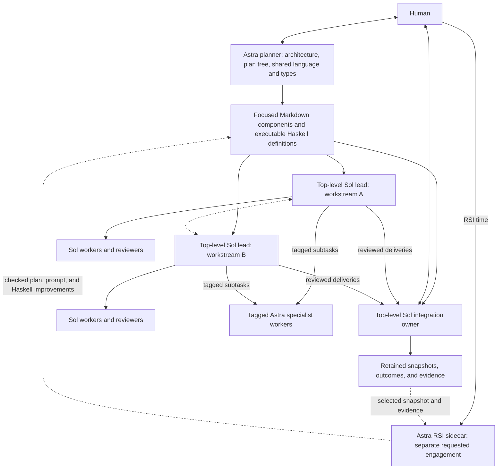
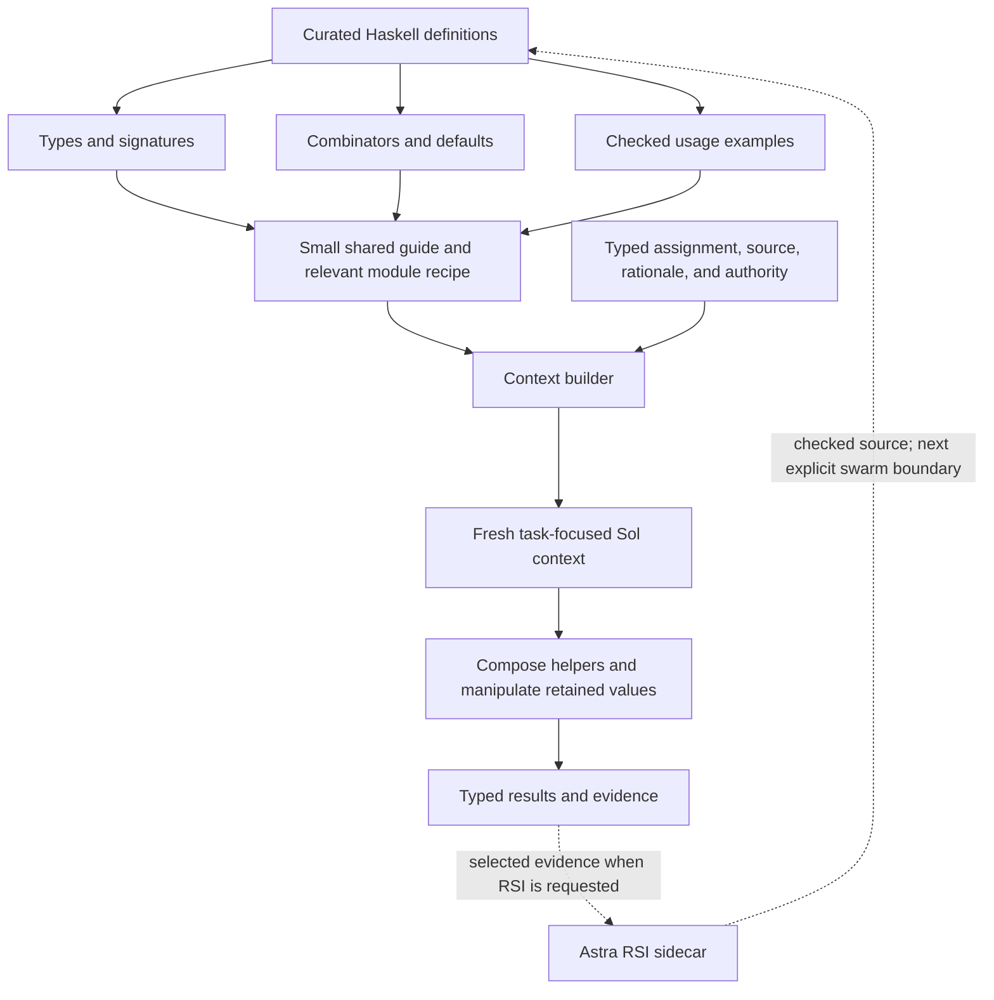
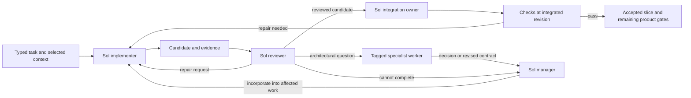
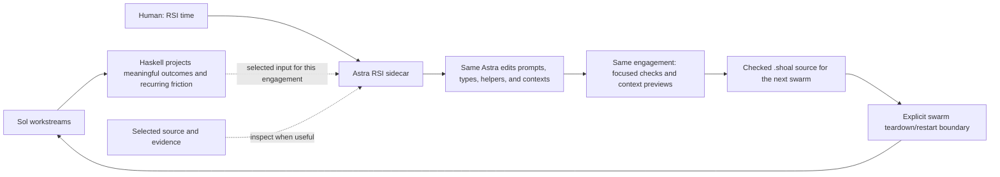

# Piloting Shoal: Astra planning, Sol execution, and shared Haskell

## Purpose and status

The [planned swarm vision](planned-swarm.md) defines the selected operating mode:
Astra authors the architecture, recursive plan, and shared project language;
Sol leads execute focused components and activate explicitly tagged Astra work;
an ordinary Astra session directly improves the method when the human requests RSI.
This document supplies the detailed Haskell and workflow reference for that mode.
Shared definitions are both executable coordination and a prompting artifact:
types, names, composition, defaults, and examples teach agents how to work.

Active project-specific customization is a core goal. The
[workspace Haskell design](workspace-pilot.md) describes `.shoal` as an XMonad-style
configuration of prompts, context builders, project types, and working recipes.
TOML remains the core configuration owner, including module lists, prompt
references, and metadata. Haskell supplies the project behavior.
It can replace Shoal's authored core prompt and grow through use. Routine RSI
should let one Astra complete a checked workspace improvement in one focused
engagement. Fable is out of scope for this phase.

`.shoal` Markdown and Haskell are ordinary repository source. A swarm selects
one fixed configuration at startup, including for later actors and fresh task
contexts. Edits become active at an explicit swarm teardown/restart boundary;
there is no mid-wave reload of shared prompts, modules, or core primitives.

For deep systems projects with several technical workstreams, use the
[plan-tree operating format](planned-swarm.md): a directory-structured set of
focused assignments, explicit models, planned children, dependencies, and
acceptance. Sol leads execute their components with local implementation
judgment; consequential changes to the decomposition or model placements return
to the planner unless already authorized. A component may permit smaller local
Sol splits; the default is to execute its declared structure.

The goals are lower token and usage-limit consumption **and** shorter time to
useful, accepted results. Spend Astra reasoning on architectural planning and
requested recursive improvement. Use tagged specialists for their designated
subtasks and preserve their context through useful implementation and repair.
Let Sols own substantial implementation and task-focused coordination. Execute
known routing, projections, and waiting as programs without another model turn.

**Start with the strongest useful design and improve recursively through real
development.** This is an operating plan, not a scientific experiment, comparative
evaluation campaign, or instruction to optimize message length at the expense of
effective work. Diagnostics answer concrete questions when something is wasteful.

The selected topology has **Sol execution teams and top-level Astra planning**.
Several top-level Sol leads and an integration owner can cooperate directly;
an overall Sol coordinator is optional. The plan tree need not mirror the runtime
supervision tree. Preserve the current interactive Codex TUI execution path:
the human opens a worker's pane and talks to it normally. No backend migration,
replacement observer, or new operator-input interface is part of this build.
The planner delivers focused documents and can be consulted
for material amendments while Sol owns routine follow-through. The default does not
include a permanently monitoring Astra: RSI is a separate human-requested
engagement. A designated specialist can retain continuity where its work needs it.
This supersedes a fully discretionary Sol decomposition model and the earlier default
Astra technical tree. It also supersedes older default-full-prefix and
numeric-first sequencing in the linked worker plans.

**The Haskell snippets below are design sketches, not the runnable API reference.**
Some constituent primitives have landed, including model/context selectors,
automatic routes and basic snapshots. The sketches also contain desired helpers
and omitted setup. Use the [shipped guide](../../prompts/shoal/api-guide.md) for
exact signatures and [NEXT.md](../../NEXT.md) for implemented scope and remaining gaps.
Names for unimplemented compositions are suggestions.
Builders must turn chosen signatures into coherent, compiled interfaces and
executable examples together. Supporting labels, imports, domain definitions, and
effect constraints are omitted where they distract from the usage.

Implementation uses one linear Astra Medium coding session, with no implementation
or review delegation and no Shoal tree building the system. Live acceptance uses
`shoal-repl` (the standalone TUI application) or another non-self-hosting project.
Fresh actors use the authored guide, prompts, project modules and selected plan
branches, without inheriting the builder's transcript or learning orchestration
from the Shoal implementation. This document does not itself launch a swarm.
The [wave closeout](evidence/wave-closeout.md) records historical source and checks;
NEXT.md owns current scope and acceptance.
The [workbench curation plan](package-curation.md) applies this design to the package:
independently callable GHCi tools, substantive lead ownership, complete decision
handoffs and useful task contexts. The worked stage diagrams below express
responsibilities and possible compositions, not a required actor for each stage.
The [small-agent design](../small-agents.md)
retains broader typed-tool and authority requirements.

## Read this as a builder

The operating model, API design principles, and worked flows establish the shared
contract. Context construction and the sidecar sections explain how it remains
effective over time. NEXT.md records the current implementation boundary; the
behavioral acceptance table describes what must actually work.

Read the sections relevant to the obligation. Do not put this whole blueprint
into every worker's prompt. The production result should be a small working
vocabulary, selected examples, and reusable context builders.

This plan specifies user experience and semantic contracts. Existing Rust owners
still implement scheduling, process lifecycle, providers, authority, persistence,
and resource management. Haskell authors collaboration over those owners.

## The operating model



Edges show working relationships, not a required runtime supervision tree.
The root model, technical owner, context ancestor, result recipient, and visible
pane do not have to coincide. Managers activate tagged specialist obligations
without a root relay. The requested RSI sidecar starts from deliberately selected
inputs; it need not inherit the initial planner or execution lead's history.
Later examples may use a Sol root as a convenient project coordinator; that is
an optional working arrangement, not a requirement for one root above all actors.

| Role | Owns | Receives |
|---|---|---|
| Sol integration owner; optional overall coordinator | Shared integration within its contract, cross-workstream decisions, human progress | Useful deliveries, cross-team conflicts, plan amendments |
| Sol manager | Its assigned plan component and declared subtree, dependencies, review/repair, routine integration | Results, current plan inputs, and questions that change its work |
| Sol worker | Implementation, investigation, review, or a smaller delegated team | The task, relevant context, tools, and expected result |
| Tagged specialist worker | Its explicitly assigned architectural, implementation, or review obligation | Its plan component, typed problem, source, and evidence |
| Astra planner | Architecture, plan documents, model placement, project terminology, core types and working recipes | Human direction, relevant source, necessary investigations, material plan amendments |
| Astra RSI sidecar | Analysis and completed workspace prompt, context, type, and helper improvements | A human RSI request, workspace definitions, selected observations, outcomes, and evidence |
| Human | Intent, consequential tradeoffs, and development style | Concrete choices and meaningful outcomes |

A small obligation needs no manager layer. A manager can implement directly.
Every role uses the same core primitives and ordinary interactive Codex TUIs.
Vary model, context, typed input/result, and permissions through specifications;
do not add a runtime lifecycle or presentation implementation for each role.
Create another manager when it has a coherent responsibility and independent
judgment to exercise, not merely to forward a child's reply. Review capacity
should grow with independent work within the existing allowance; a shared review
specification need not mean one serial, ever-growing reviewer conversation.

Sols exercise substantive implementation judgment within their assigned plan
components. They can challenge a bad assumption and request an amendment; they
need not silently improvise a new architecture. Tagged specialist assignments
remain substantive work. The planner and requested RSI sidecar do not
routinely approve merges, classify every event, or repeat Sol project management.

## Preserve useful specialist continuity

A tagged specialist engagement means **one bounded obligation**, potentially with
many model/tool turns and substantial implementation. It does not mean one
stateless text completion. The worker can inspect owning source, question the
assignment, produce a revised design, implement it, and participate in the
relevant repair loop before its obligation is discharged.

Good engagements include:

- Establish the initial decomposition and shared invariant for an unfamiliar
  cross-component change.
- Implement the difficult core while Sol teams handle surrounding consumers.
- Resolve contradictory production evidence or incompatible ownership assumptions.
- Review a change at a consequential architectural boundary.
- Design a reusable collaboration helper when the current vocabulary is awkward.

Use planned architectural work at meaningful boundaries as well as escalation.
Only consulting a specialist when a Sol knows it is stuck leaves confidently mistaken
decompositions unchallenged. This is selective engineering judgment, not mandatory
specialist review of every candidate.

A specialist can return a conclusion that the question was too narrow, with evidence
and a proposed combined obligation. A Sol manager should preserve that finding
and arrange the appropriate ownership. The answer need not fit the requester's
original hypothesis.

Retain a specialist while successive decisions depend strongly on its accumulated
understanding. For a controller invariant being revised across several consumers,
that may mean a milestone-length technical lead with a Sol orchestration partner.
For independent investigations, use separate selected contexts. Release useful
results into contracts, code, and context builders when the engagement ends.

Actor lifetime, assignment lifetime, model context, and individual model turns
are separate choices. Do not discard an implementer's repair knowledge just
because its first candidate arrived. Do not keep a large context active merely
to maintain the appearance of a permanent lead. A stable responsibility can
survive an explicit context handoff without pretending that outstanding handles
automatically transfer ownership.

The plan can give an expert a sustained technical obligation when successive
changes depend strongly on its understanding. That does not change unrelated
descendants' model assignments or Sol ownership of routine coordination.

## Haskell is executable collaboration and a prompting artifact

The initial plan supplies shared project terminology and definitions, core
Haskell types/sum types, and examples of the intended compositions. Treat these
as one authored problem representation: prose establishes meanings, types
express meaningful alternatives, and helpers carry the working relationships.
The [shared-language guidance](planned-swarm.md#the-initial-plan-defines-a-shared-project-language)
shows how to keep this focused and tied to owning source.

The API is part of the prompt. Every visible signature suggests an action; every
result type suggests what can happen next; every example teaches an organizational
pattern. Curating prose while leaving the callable surface incoherent will not
produce fluent Sol managers.

Design source definitions, model-facing signatures, short explanations, and
examples as one artifact. A helper is ready for the shared vocabulary when an
agent can understand its purpose, supply its inputs, use its result, and handle
a meaningful failure without reconstructing its implementation.

### Opaque mechanics, explicit working semantics

The normal model-facing interface is the project's small Haskell eDSL. A worker
should recognize operations such as implementing a consumer, reviewing a
candidate, or asking the designated architect. Shared definitions configure
their actor/request relationships and compose existing effects. Process launch,
mailbox transport, provider protocols, and persistence formats stay behind
their owning runtime interfaces.

Distinguish the caller's view from the helper author's view. The worked examples
below expose lower-level setup to specify the composition and its contracts.
They do not require every Sol to repeat model, context, source, allowance, and
destination setup for each task. Bind those choices once in the workspace recipe
or supplied component input, and expose the arguments that vary meaningfully.
Keep the resolved choices inspectable, including the actual model and authority.

The helper still has an honest effectful contract. It makes clear whether it
returns a value, admits asynchronous work, installs a dependency, or observes
state. Operations that admit work return promptly, with an inspectable handle;
the helper must not conceal a synchronous wait that prevents children starting.
Pending delivery, domain rejection, missing evidence, and unavailable execution
remain distinguishable where they require different actions. Preserve the
underlying evidence while presenting a compact, actionable observation.

Do not expose every internal failure constructor just because it exists. Show
the fact that changes the caller's next decision, with a reference to deeper
diagnostics. Conversely, a friendly wrapper cannot erase uncertain effects,
pretend partial work is accepted, or invite blind replay. This is an interface
contract, not a new universal error taxonomy.

Use ordinary Haskell composition and extensible `Member ... effects` constraints.
The eDSL can begin as a small module of typed functions over existing effects.
A new domain effect is useful when an actual consumer needs its operation and
interpretation; it is not a prerequisite for each workspace. Do not introduce
a second orchestration AST, scheduler, or provider client to obtain nicer syntax.

Curate a compact common guide and the relevant project recipes. Detailed API
inspection remains available when a worker needs another composition. Exported
definitions, model-visible documentation, and runtime authority are separate
concerns: hiding a reference page neither removes a capability nor grants one.
The workspace can supply a clean starting surface without losing access to
useful diagnostic and authoring tools.

### Shape the choices through types and composition

The definitions and their presentation form one teaching surface:



The builder supplies genuine runtime authority observations; rendering context
does not grant authority. The feedback edge activates checked source at the
next explicit swarm boundary, not in the active swarm or its later children.

| API choice | Pattern it should teach |
|---|---|
| A candidate is distinct from a reviewed candidate | Delivery is useful evidence, and review is a separate obligation |
| Integration consumes reviewed work and returns the resulting revision plus checks | Acceptance of one revision does not establish the integrated result |
| Review can request repair or raise a contract question | A reviewer can continue useful work without forcing a parent relay |
| A question declares its answer type and return destination | Resolve the concrete choice and return it to the waiting obligation |
| A worker specification separates model, context, tools, and allowance | Sol can inherit useful reasoning without accidentally becoming Astra |
| A route consumes a typed result and names its handling policy | Known forwarding runs as code; unavailable replies remain visible |
| Evidence is retained separately from its compact projection | Short communication can preserve access to the underlying proof |
| Defaults select Sol and a suitable local workflow | Calling a helper from Astra does not silently expand Astra usage |

Types should capture distinctions that affect action. Avoid wrapping every noun
in a new type, encoding an entire project plan at the type level, or turning an
ordinary local tuple into a mandatory universal record. A small, well-chosen sum
type often does more work than a paragraph of warnings.

A desired project vocabulary might be:

```haskell
data ReviewOutcome
  = Reviewed ReviewedCandidate
  | NeedsDesign DesignNeed
  | CannotComplete ReviewProblem

reviewAndRepair
  :: ReviewPolicy
  -> Contract
  -> Forked Candidate
  -> Eff effects (Response ReviewOutcome)

integrate
  :: IntegrationOwner
  -> ReviewedCandidate
  -> Eff effects IntegrationOutcome
```

The relevant `Member ... effects` constraints belong on actual signatures; do not
replace extensible effects with a new fixed stack. The workflow wrapper reuses
existing actor identities, responses, and watches. It is not a new registry.

`ReviewedCandidate` ties the candidate revision, contract revision, review
evidence, and consequential limits together. Integration performs the required
checks at the resulting source. A partial delivery identifies what is accepted
and what remains open; a broad success flag must not erase that distinction.

These types guide composition and carry evidence. They do not make a model's
claims true or grant runtime authority. The owning operations still enforce
permissions, stale-source checks, and other runtime invariants.

Repair is internal to `reviewAndRepair`: the reviewer retains its assignment,
requests a revised candidate from the implementer, and reviews the revision.
Its externally visible result is reviewed work, a design need, or a problem
that the local workflow could not resolve. Cancellation or a lost worker can
also produce an unavailable settlement; callers must handle that outer outcome.

### Make the intended composition easy to infer

Use consistent argument order within function families, useful partial
application, and conventional names. Put varying task inputs where ordinary
`map`, `traverse`, and function composition can reach them naturally. Provide
small escape hatches to underlying handles when a custom workflow needs them.

A shared helper should have a compact reference entry:

```text
reviewAndRepair policy contract implementer
  Starts and owns candidate review plus bounded repairs; returns promptly.
  Result: Response ReviewOutcome.
  Next: route (awaitSettled result) to the integration/design handling policy.
  Preserves: exact candidate, contract, review evidence, unresolved limits.
  On failure: explicit domain problem or unavailable settlement.
```

That entry teaches when to call the function and what to do afterward. A long
list of parameter types without a next composition is insufficient. Conversely,
a prose recommendation without the actual signature makes the model invent an
API.

Prefer a few explicit stages to a universal `runTask Text` operation. A completely
opaque workflow forces callers back into prose whenever the task differs
slightly. Keep results inspectable and policies editable in `.shoal` source for
the next swarm. Task arguments and local composition can vary within the loaded
interface during ordinary work.

Use domain distinctions at the layer that owns them. The platform need not know
what a controller ownership conflict is; a project type and answer function can
express it. Do not parse words such as "accepted" or "blocked" from compact prose
to drive lifecycle or integration.

### Teach the common workflow through examples and defaults

The first implementation example should show a candidate reaching review and
integration, including a repair or unavailable result. The first delegation
example should use a meaningful shared scaffold, explicit Sol selection, and
independently useful outputs. The first question example should return an answer
to its origin without a root forwarding turn.

Supply one canonical spelling per common operation. Avoid accumulating several
near-identical wrapper families because different agents coined different names.
Curate the smallest vocabulary that covers the actual flows, then compose it with
ordinary Haskell.

Low effort is a useful default for routine bounded work. Managers and workers
can deliberately choose more reasoning when their obligation warrants it.
Model selection is explicit and independent of the caller. Existing delegation
authority and capacity limits remain in force; recursive work does not manufacture
more capacity. Initial spending targets are advisory and must not become token
cutoffs that terminate useful in-flight work.

Known transformations, evidence projections, route selection, and waiting should
not invoke a model. Use a Sol when judgment is required, not to reproduce an
already written function's answer.

### Treat code, signatures, and prompt examples as one change

When a shared helper changes, update its type-facing description and owning
examples in the same change. Keep signatures derived from or checked against
the actual Haskell interface. Project examples should compile and execute the
important paths once implemented.

Errors should show the meaningful mismatch, for example a candidate supplied
where reviewed work is needed, with a short next step and access to full details.
Improve that presentation at its existing owner; do not build a second parser
that guesses protocol state from rendered compiler errors.

The API can encourage good behavior, but clear types do not eliminate the need
for domain context or good judgment. A worker must still understand the
acceptance contract and have access to the relevant source.

## Resident expressions and shared library code have different jobs

Resident Haskell is an executable workspace for coordination. An agent should be
comfortable defining a local function, partially applying a policy, traversing a
list of tasks, projecting a retained result, or installing a route. It does not
need to package each operation as a human-facing software artifact.

| Resident coordination | Shared library code |
|---|---|
| Serves the current operation and available bindings | Serves repeated use by independent tasks |
| Uses short, locally meaningful names and ordinary expressions | Establishes stable meanings and useful composition |
| Can be disposable after the obligation ends | Needs an owner, focused examples, and maintained contracts |
| Introduces structure when it simplifies the work | Receives appropriate implementation review and checks |
| Keeps current effects and outcomes inspectable | Makes behavior understandable without its author's history |

A proposed resident instruction:

> Your Haskell is executable working state for coordinating agents and machines.
> Optimize for correct effects, concise composition, and easy inspection of the
> values you need. Use existing bindings, ordinary functions, closures, and
> collection operations directly. Introduce names and types when they preserve
> a useful distinction or support reuse. Promote recurring patterns into shared
> helpers; one-off coordination does not need production-library ceremony.

A local expression can be as simple as:

```haskell
let affected = nub (concatMap findingOwners findings)
let taskFor owner = Incorporate contractChange owner
responses <- traverse (requestIncorporation . taskFor) affected
```

The helper owns label construction and the ordinary request contract. Labels
remain useful for inspection; the author should not repeatedly write validation
boilerplate for predictable internal labels.

Ordinary Haskell remains the language. Do not require JSON schemas, handwritten
tool-call envelopes, a new context markup language, or a custom batching verb
where existing types and functions suffice. A pure projection should not require
printing the whole value first.

Concise, conventional Haskell helps the next model understand and modify the
expression. Remove ceremony and duplication; do not reward obscure abbreviations
or code golf. Preserve explicit uncertainty, effect ownership, and the distinction
between installing work and observing that it finished.

A reusable helper may first be defined in the live workbench. Moving it into a
module is justified when another task needs it or its contract becomes important.
A one-off helper need not become platform API. Conversely, a consequential shared
helper deserves review even if it began as three interactive lines.

## A small shared core and task-specific modules

Keep the common actor vocabulary stable: branch construction, typed responses,
settlements, await/watch, retained values, and authority boundaries. Add only
the smallest missing primitives required by actual consumers.

Build the working practice mostly as ordinary Haskell helpers above that core.
Illustrative modules, not required new package boundaries:

| Module or focused export set | Typical contents |
|---|---|
| Collaboration | Sol worker defaults, selected context builders, basic delegation and route helpers |
| Review | Independent review, retained implementer repair, exact candidate evidence |
| Decisions | Project question types, expert engagement, returning answers to their origins |
| Project-specific team module | Acceptance contracts, consumer tasks, incorporation policies |
| Improvement | Compact observation builders, workflow friction, context previews, checked configuration changes |

The curated surface is a shared library, not a requirement that every role load
every module's documentation. Reuse one stable common guide and stable tool
definitions. Supply relevant project signatures and examples after that shared
base as part of selected task context. Avoid rebuilding provider tool schemas or
changing the common prefix for each individual actor.

A useful project module might export:

```haskell
module ControllerTeam
  ( controllerContract
  , implementPart
  , consumerContext
  , reviewAndRepair
  , handleReview
  , architectureContext
  , incorporateDecision
  ) where
```

Sols can compose, inspect, and extend those definitions. Astra curation improves
the shared vocabulary without becoming the only entity allowed to author Haskell.
Give Sols a strong default path and enough semantic transparency to adapt it.

## Worked flow: Sol implementation, review, repair, and integration

A Sol manager receives a coherent contract, current source, useful rationale,
and an integration owner. It can implement directly or establish a scaffold and
delegate independent consumers. Desired usage:



This is the useful delivery path, not an exhaustive failure-state graph.
Unavailable work and route failures remain explicit obligations of the relevant
owner. Independent workstreams can execute this pattern concurrently.

```haskell
let implementPart part =
      coding @Candidate (partLabel part) scaffoldHead part
        & withModel Sol
        & withEffort Low
        & withContext (selected (consumerContext controllerContract))
        & withinAllowance consumerAllowance

workers <- unfold consumerGroup $
  traverse (child . implementPart) independentParts

routes <- for workers $ \worker -> do
  reviewed <- reviewAndRepair reviewPolicy controllerContract worker
  route (awaitSettled reviewed) (handleReview integrationOwner)
```

The assigned plan component supplies the intended `independentParts`; the
manager selects ready work and handles local sequencing. A change to that
decomposition follows the component's declared autonomy or goes to the planner.
Use inheritance from the compact scaffold instead of selected context when
that shared reasoning is particularly useful. Model selection remains Sol.
Here `consumerContext :: Contract -> Part -> Text` supplies an input renderer;
`selected` consistently receives a renderer, rather than sometimes taking text
and sometimes a function. The resulting route handles remain available for
deliberate inspection.

The setup calls return promptly after admitting work and installing relationships.
Children can start after the admitting tool block returns. Do not synchronously
await them inside that block. Ordinary `traverse` does not itself promise parallel
execution; parallelism comes from the admissions it composes and the available
runtime capacity.

`reviewAndRepair` establishes a reviewer responsible for the whole local loop.
It uses a fresh relevant review context, keeps the implementer available for
repairs, and returns a typed response that the manager can route. Ordinary
repair exchanges stay between their owners.

The sketch deliberately uses the existing `Forked`, `Response`, `Await`, and
`Settlement` concepts rather than inventing another task scheduler. Its typed
route extension would have a shape such as:

```haskell
route
  :: Await (Settlement a)
  -> (Settlement a -> Eff effects ())
  -> Eff effects Route
```

Here `route` installs a continuation for one settlement. It does not imply a
repeating stream, a synchronous wait, or a model wake for the registering actor.
A separate progress subscription has explicitly different semantics. The
returned route is inspectable, and failure in its continuation belongs to a
known owner with an actionable outcome.

Sharing a handle does not grant ownership. The route and review helper must
establish the required authority through existing owners or an explicit owning
extension. A closure capturing a response must not become a way to read or
settle another actor's request without authorization. This is a required
behavioral contract, not incidental boilerplate left to each caller.

The integration handling policy preserves both domain and execution outcomes:

```haskell
handleReview owner (ReplyUnavailable failure) =
  recordUnfinished owner failure

handleReview owner (ReplyAvailable response) = do
  retainExecutionEvidence response
  case responseValue response of
    Reviewed candidate ->
      integrate owner candidate >>= retainIntegrationOutcome owner
    NeedsDesign need ->
      resolveDesignFor owner need
    CannotComplete problem ->
      recordReviewProblem owner problem
```

The examples name project helpers for clarity. They are not a mandatory record
schema or a new platform error taxonomy. Integration outcomes retain failed
checks and pending work; recording a failure is not treating the deliverable as
accepted. Consequential unresolved outcomes reach the responsible Sol manager.

A repair policy should identify repeated unsuccessful attempts and bring the
owner evidence for a useful replan. That checkpoint does not kill a running
expert or discard its repair context. When the local work cannot resolve a
problem within its contract, the result carries evidence and the next useful
decision. Do not repeatedly resubmit the same ambiguous assignment to fresh
workers. Spending guidance belongs to the workstream across those attempts.

A low-impact change can use a shorter policy with direct focused verification.
The standard review path should be easy to strengthen for a consequential
semantic change, including a tagged specialist reviewer, without rewriting the surrounding
routing or forcing maximal review of every small edit.

## Worked flow: a Sol manager activates a tagged specialist

An architectural question should include the current contract, exact relevant
source, evidence, competing interpretations, a recommendation where useful, and
what is waiting for the answer. Do not require a full history or an elaborate
template when a small typed input suffices.

```haskell
let architect =
      worker taggedSpecialistModel
        & withEffort High
        & withContext (selected architectureContext)
        & forOneObligation

decision <- expertFor @OrderingDecision architect $
  ResolveOrdering
    { contract = controllerContract
    , evidence = conflictingConsumers
    , affected = waitingConsumers
    }

route (awaitSettled decision) (incorporateDecision controllerOps)
```

`expertFor` admits a bounded worker and returns a typed response. It uses existing
actor/request mechanisms; it is a library entry point, not a second provider
client. The plan supplies `taggedSpecialistModel`; this example activates an
already tagged obligation. A new model placement or expert scope follows the
component's amendment boundary. No permanent expert parent is required.

A useful question might say:

> Two consumers assume opposite owners for notification ordering. Recommend the
> existing inbox owner; the adapter contract would change. These two candidates
> wait on the decision. Usage projection can continue. Relevant call paths and
> the proposed interface are attached.

The specialist can inspect those paths, find a different cause, implement a difficult
part, or ask to take a combined obligation. Its result distinguishes a resolved
decision from missing evidence or a justified scope change. A temporary worker
must not be forced to produce confident advice to satisfy a success-only type.

When different questions have different answer types, a domain can express that:

```haskell
data DesignQuestion answer where
  ChooseOrderingOwner :: OwnershipEvidence -> DesignQuestion OrderingDecision
  ReviseAcceptance    :: AcceptanceConflict -> DesignQuestion AcceptanceDecision
```

Use a GADT only where the domain benefits. The actual input/output relation must
be present in the worker or request specification so the model receives the
expected reply type. Ordinary records and sum types are sufficient for many
projects.

The answer returns to the originating obligation. Sol owns propagating accepted
contract changes, arranging incorporation, and checking affected results. An
architectural decision does not silently grant new authority or prove that a
consumer adopted the change.

Avoid a wait cycle: a busy worker awaiting an answer must not receive that answer
as a separate queued assignment behind its current request. The supported
question/answer or exact amendment mechanism must resume the waiting work with
its original obligation intact.

## Worked flow: direct dependencies and incremental delivery

Controller and evidence managers can exchange usable changes directly once the
shared contract establishes their meaning:

```haskell
route (awaitSettled controllerSlice) (incorporateAt evidenceOps)
route (awaitSettled compatibilityReview) (resolveAt controllerOps)
```

Neither the root nor a planner needs to relay ordinary incorporation. A conflict
in the meaning of the shared contract becomes a design question. Delivery,
acceptance, integration, notification, incorporation, and resulting checks
remain distinct facts.

Each independently useful result gets its own route. A preparation slice can
be accepted while native end-to-end behavior remains open. Do not put a global
join in front of unrelated consumers just because their workers were admitted
in the same `unfold`.

One owner coordinates each shared integration point. Other workers can supply
candidate changes without editing the same shared file concurrently. A shared
worktree is useful for bounded inspection and deliberately partitioned work;
independent implementation can use isolated branches. Presentation in one pane
does not settle write ownership.

## Worked flow: a recursive Sol team

A Sol executes its assigned part of the planned recursive tree. Where the plan
authorizes local decomposition, it can establish a shared interface and create
a smaller frontier; otherwise it uses the declared child components and requests
structural changes from the planner. The default stays Sol unless the plan
places a specialist at a particular obligation. Preplanned conditional expert work
can proceed when its stated condition is met.

Capacity belongs to the enclosing workstream. Child allocations subdivide that
allowance; they do not multiply it. Reserve enough room for reviewers, repairs,
and urgent questions so a large implementation frontier cannot monopolize the
team's useful capacity.

Fork around shared decisions and genuinely independent obligations. A fresh
worker needs enough context to start useful work, but not every ancestor's
conversation. A meaningful shared scaffold is more useful than a long custom
brief assembled independently for each child.

The shared review practice can serve many independent candidate families.
Retain a reviewer through its repair loop, and use another context for unrelated
candidates. Do not create a single mandatory Sol manager that reads all detailed
reviews just to save on Astra.

## Smaller typed workers and function-valued results

The same vocabulary should support a small inspection task with a narrow typed
tool interface, not just full coding teams. For example, a numeric worker can
receive one discrepancy and functions for comparing engines, inspecting nearby
cases, and reducing the case. Known classifications and routine calculations
remain ordinary Haskell.

The tool interface comes from typed Haskell definitions and the existing bridge.
Reuse stable definitions across a task family; do not hand-maintain JSON schemas
or construct a unique provider tool catalog per input. Rust still authorizes
the concrete operations available to the worker.

Results can include a useful strategy or function where the resident environment
supports it:

```haskell
policy <- inspectResult policyWorker
let chosenCases = filter (policyRelevant policy) incomingCases
let nextProbe = chooseProbe policy observedFailure
```

Applying a retained function should not require a `Show` instance for its closure
or a JSON representation of its entire captured environment. Keep capture
semantics explicit: later redefinition does not mutate previously captured
values, and a captured handle does not confer its author's permissions.

## Budget awareness and a Haskell control workbench

The initial system should make spending visible and steerable without a new
hard token-budget enforcement layer. A valuable expert engagement must not be
killed because a planning allowance ran out near completion. Bounded expertise
means a coherent obligation and deliberate supervision, not a token-triggered
process termination.

Prefer good defaults, examples, and task-focused prompting over new infrastructure
whose purpose is to police poor collaboration. Add an enforcement mechanism only
for a concrete requirement that guidance and existing owners cannot satisfy.

Spending targets are advisory. A target crossing can identify a useful decision
for the owning Sol, sidecar, or human. It does not automatically cancel a request,
retire an actor, discard its context, or stop its tool execution. Existing
authority, concurrency, and resource limits still apply; those are distinct
from introducing a new cost cutoff.

Keep completion and expansion separate. When spending looks excessive, prefer
reconsidering new independent work, unnecessary delegation, or repeated
orientation. Let an in-flight expert complete its current useful obligation,
including the relevant checks and agreed repair work. A model-turn boundary
alone does not establish a useful delivery or handoff boundary.

An expert can report a changed estimate, an unresolved design problem, or a
candidate ready for review. Do not force it to manufacture a premature final
answer to satisfy a token quota. Human approval of substantial expansion remains
an available later policy; it is not a mandatory gate on every initial specialist
engagement. Add stronger admission controls only where real usage justifies them.

### Observe the actual organization and activity

The pilot should obtain a typed snapshot directly from Haskell, retain it, and
project the relevant view. Reading the snapshot must not invoke a model, ask
each worker to summarize itself, wake dormant Astras, or append raw logs to
the observer's conversation.

| Observation | Meaning to preserve |
|---|---|
| Actor identity and current obligation | Exact actor/incarnation, useful label, model, and the work it currently owns |
| Who spawned whom | Creation provenance, including the initiating actor/obligation when available |
| Supervision and context ancestry | Distinct relationships; neither is automatically the spawner or current manager |
| Current activity | Working, waiting on a dependency, available for work, or unavailable; keep runtime posture distinct from claimed task completion |
| Message counts | Counts by meaningful kind, with queued/received/presented distinctions where available |
| Event counts | Typed categories such as request updates, dependency wakes, and provider events, with their counting boundary stated |
| Compactions | Observed completed context compactions, distinguished from fresh contexts, handoffs, and inherited history |
| Token usage | Input, cached input, output, and available reasoning breakdowns, attributed to their model and source |
| Ownership and outcomes | Current requests, useful candidates, accepted work, and consequential unresolved failures |
| Observation coverage | Time/watermark, scope, completeness, and explicit unavailable values |

These are desired views over existing owners, not a universal new task database.
Reuse actor lineage, request/watch state, runtime observations, and the exported
provider-usage reader. Add missing counters at the owner that can observe the
event correctly. Do not create another provider-home scanner or infer compaction
from an apparent drop in token counts.

Who created an actor, who supervises it, where its context came from, and who
commissioned its current assignment can differ. Make each relationship selectable.
If historical creation provenance was not retained, show that limitation rather
than inferring it from a branch label or current supervisor.

A count needs a clear definition. For example, an actor's received-message count
can mean distinct messages accepted into its mailbox; presentation to a model
is a different observation. Retransmission attempts are not additional logical
messages. Count provider events separately from actor requests and dependency
wakes, rather than combining all traffic into one misleading total.

Count actual observed compaction completions for the relevant provider context.
An inherited ancestor compaction must not become another local compaction merely
because its transcript appears in a fork. A resumed context and a new context
are different events. Incomplete history yields a partial count or unavailable
value, not a confident zero.

Keep each actor's own usage separate from inclusive descendant totals. Aggregate
without counting a child's cost again through each ancestor, or duplicating
provider responses across inherited/resumed records. Preserve source identities
and existing completeness distinctions. If reasoning tokens are included in
reported output, do not add them again as separate spending.

The initial view can show token usage grouped by model. A monetary estimate or
subscription-limit estimate requires an explicit supported interpretation;
a single unqualified total must not pretend to measure both. We can be useful
immediately with honest usage counts and model attribution.

Snapshots should be bounded observations with their scope and watermarks. They
need not pause the whole swarm to manufacture a globally atomic picture.
Changes between snapshots preserve unavailable coverage and counter resets;
a restarted counter is not negative activity.

### Compose queries without another reporting model

Desired Haskell usage:

```haskell
before <- snapshot run

inspectFull (treeView SpawnedBy before)
inspectFull (treeView SupervisedBy before)
inspectFull (usageByModel before)

let expertRows = filter ((== taggedSpecialistModel) . actorModel) (actorRows before)
inspectFull (map activityAndUsage expertRows)
```

Here `snapshot` is the observation operation. `treeView`, `usageByModel`,
`actorRows`, and `activityAndUsage` are ordinary typed projections or project
helpers. They do not call models or introduce a new runtime service for each
question. An actor row can expose received-message/event counts, compactions,
own usage, and its current obligation in a small display.

Later, after meaningful work:

```haskell
after <- snapshot run
let changes = changesSince before after

inspectFull (messageChanges changes)
inspectFull (compactionChanges changes)
inspectFull (usageChangesByModel changes)
```

The pilot can ask what changed without repeatedly printing lifetime history.
A compact default view should answer where work and spending are concentrated.
Detailed evidence remains available through a deliberate projection.

Do not begin each turn with a snapshot ritual. Observe when making a decision,
investigating friction, responding to the human, or preparing a useful sidecar
update. A growing counter is a clue, not proof of wasted work or poor quality.
Relate it to the obligation, source, and useful results before changing policy.

### Steering through existing primitives

The human steers by talking to a worker in its existing Codex TUI. Agents use
the existing Haskell request/update/control operations and ordinary compositions
over them. The observations above help choose an action; reading them never
changes work or grants authority.

Do not add a budget-policy engine, specialist-admission controller, or dedicated
checkpoint protocol. A request for a useful checkpoint can be an ordinary
conversation or update to the owned obligation. Preserve actual request/turn
correlation and distinguish submission from presentation and incorporation.

A strong suite of reusable primitives is the goal. Project code can compose
them when a real workflow needs it; this implementation does not prescribe a
new policy subsystem for each steering pattern. In-flight work is not killed
because a spending estimate is exceeded.

### Feed the sidecar a projection, not an event stream

When the human requests RSI, supply the sidecar a compact change view for the
relevant work interval. Meaningful milestones and friction can be retained in
advance without automatically starting another model session. Combine activity and usage with accepted
work, open decisions, and recurring friction. Keep the underlying actor/source
references so it can investigate a specific cause.

For example: repeated compactions and many received updates in one Sol manager
may justify splitting its responsibility or changing routes. An expert with
substantial usage but a nearly reviewable core implementation may deserve time
to finish. Neither decision follows from a counter threshold alone.

The first implementation should expose enough of this view to pilot the first
Sol-tree workstream. Extend missing counters and direct controls incrementally
through their existing owners. Accurate observation and preservation of valuable
in-flight work take priority over elaborate financial enforcement.

## On-demand Astra RSI: observe selectively, improve concretely



The Astra RSI sidecar is an ordinary Astra session the human starts to analyze
the wave. It is a usage pattern, not a dedicated request or actor lifecycle.
It receives the accepted plan, shared project language,
core Haskell types, a selected execution snapshot, useful outcomes, and evidence
references. It need not inherit the initial planner's conversation or monitor
the wave continuously. Plan components and amendments follow the
[plan-tree format](planned-swarm.md).

Its value comes from connecting observed execution to the authored decomposition,
terminology, types, contexts, and helpers, then completing concrete improvements
to the workspace's way of working. Once the runtime supports the Haskell surface,
this should normally fit one focused Astra engagement.

Keep these responsibilities distinct:

- What does the current deliverable need? Its Sol owner and any commissioned
  tagged specialist worker handle that.
- Does the architecture, intended decomposition, or model placement need to
  change? The planner revises the relevant contract and plan components.
- What should change so future obligations run better? The sidecar edits and
  checks the workspace prompts, contexts, and Haskell together. It can complete
  routine RSI directly, without a mandatory Sol implementation/adoption tree.

The sidecar may notice a product issue, and a task worker may discover a workflow
defect. Route the finding to its owner; the distinction is about responsibility,
not withholding useful information.

### Intake and attention

A useful observation contains a current source/contract reference, meaningful
accepted work and remaining obligations, consequential decisions, and recurring
friction with evidence pointers. It should usually be a projection of existing
typed work and retained outcomes, not a new report written from scratch by
every worker.

Illustrative snapshot:

```text
Accepted: controller preparation, with native E2E still open.
Decision: ordering ownership needs a shared contract revision.
Continuing: independent usage projection.
Friction: two consumer reviews required the same missing contract explanation.
Evidence: @consumerReviews; current helper/context definitions: @teamLibrary.
Suggested improvement: include the ownership rationale in consumerContext.
```

This is an example, not a claim about a current run. Actual snapshots retain
exact source and evidence references and distinguish observation from inference.

A meaningful milestone, repeated coordination problem, or cross-team design
contradiction can motivate the human to request RSI. Retaining those observations
does not itself start a sidecar. The human can request analysis during the wave
or after a useful slice completes. Urgent correctness discoveries go directly to
the responsible workstream and do not wait for a sidecar batch.

Accumulate ordinary progress without a model round per event. Sidecar snapshots
may coalesce current state, but indispensable results, unresolved failures, and
pending questions retain their own reliable obligations. A compact display
must not be the only surviving record of a failed task.

No fixed heartbeat requires an Astra response. An idle sidecar spends no model
turns keeping its context warm. When a delayed observation justifies reactivation,
supply a useful current snapshot rather than a history of intermediate events.

The sidecar can deliberately inspect source, a disputed contract, a specific
review exchange, or the evidence behind a summary. Sol interpretation is not its
only source of truth. This helps it detect omitted architectural concerns without
subscribing to the raw event stream.

### Outputs and ownership

The normal output is a concrete improvement:

- A helper that removes repeated coordination expressions or parent relays.
- A context builder that supplies a repeatedly missing invariant.
- A better result type that preserves a consequential distinction.
- A revised assignment or review pattern.
- A topology or ownership adjustment for a coupled problem.
- A focused improvement to the visible signatures, examples, or diagnostics.

A plan is useful when it enables that change. A growing queue of speculative
self-improvement proposals is not the desired product. Prefer the highest-value
repair that ongoing work can use; do not turn a minor friction finding into a
prerequisite cleanup campaign.

The sidecar has authority appropriate to its assigned collaboration work and
finishes routine workspace improvements itself. Delegate source work when its
size or uncertainty actually warrants it. A change to product scope, shared
semantics, or human preferences goes to the corresponding owner. Routine helper
maintenance does not need a new human approval flow.

Use ordinary context and observation functions to prepare the engagement:

```haskell
observed <- snapshot run
inspectFull (rsiContext plan observed)
```

The human opens an Astra session with the relevant project source and selected
context. That Astra edits and checks the actual modules and prompt files. Its
normal delivery identifies the changed source, useful checks, and what the next
swarm will load. No `ImproveWorkspace`/`WorkspaceImprovement` protocol,
specialized session launcher, or result-adoption agent is required.

The Haskell surface should let the Astra understand and change the complete
project-level composition within a focused context. A deeper runtime defect
remains ordinary source work in its owning subsystem.

### Curate an executable practice

For each shared helper, maintain together:

1. Its Haskell definition and useful exported signature.
2. A short explanation of when to use it and what its result composes with.
3. A representative usage example and the meaningful failure or repair path.
4. Its assumptions about context, source, authority, and lifetime.
5. An actual production consumer that justifies retaining it.

These are review criteria, not a demand for a five-section document per helper.
A small function can satisfy them with its type, a short comment, and an example.

Prefer deleting redundant helpers and simplifying an awkward family over adding
another alias for each incident. The library should reduce the number of
decisions a Sol must reconstruct while leaving ordinary Haskell available.

Promote a live definition deliberately:

```text
local expression
  -> useful in real work
  -> focused shared helper and example
  -> appropriate review/checks
  -> checked .shoal source
  -> explicit swarm teardown/restart boundary
  -> next swarm uses the revised definitions
```

A source edit does not change the active swarm's selected modules or prompts.
New assignments and later spawns within that swarm retain the same configuration.
The revised `.shoal` is loaded only after an explicit swarm teardown/restart
boundary, with outstanding obligations finished or deliberately handed off.
An urgent configuration repair uses that same explicit boundary. Ordinary
task-local expressions and updates to task data remain available over the fixed
shared interface; they are not a way to replace its core primitives mid-wave.

Keep source definitions and consequential decisions available for fresh sessions.
Arbitrary resident closures and handles are not a restart archive. Reconstruct
what can be reconstructed from source, and report lost live state honestly.

## Context is part of the curated interface

This is a primary customization surface. The
[workspace context design](workspace-pilot.md) gives the selected packaging,
prompt override, preview, and configuration iteration model. A useful local
builder is complete when it improves this project's work; cross-project
generalization is optional.

A worker specification consists of more than a model name. It includes typed
input/result, useful tools, context construction, and the obligation's operating
policy. Context builders are ordinary authored functions over typed assignments;
an `input -> Text` function is often enough.

Supply material in a predictable order:

1. Stable common behavior and the compact shared API vocabulary.
2. Relevant project helper signatures, a useful example, and shared vocabulary.
3. The obligation, acceptance contract, current source, and necessary rationale.
4. Exact runtime authority observations and the current decision/evidence delta.

Respect the existing owner's separation of common instructions and dynamic
authority. This is a desired content organization, not an instruction to forge
runtime observations or change the shared prefix per actor.

The worker should understand which retained values it has and why they matter.
An opaque evidence handle is not a substitute for the proposition that makes
the evidence relevant. Include the short orientation, then let the worker select
fields or inspect more when useful.

A compact context should omit unrelated history, not architectural reasoning
needed to challenge the task. Preserve human style preferences as concrete
constraints and examples: extend the existing owner, use types for control flow,
and remove obsolete paths when their removal is in scope. Do not strip the why
until the worker becomes a mechanical executor.

| Responsibility | Useful selected context | Usually unnecessary |
|---|---|---|
| Sol manager | Deliverable contract, dependencies, integration ownership, relevant library recipes | Every worker's debugging transcript |
| Implementer | Current source, owning consumers, invariants, acceptance, repair relationship | Unrelated project history |
| Reviewer | Exact candidate and contract, evidence, relevant architecture, repair destination | The implementer's entire reasoning trace |
| Tagged specialist | Its assigned question, underlying source/evidence, alternatives, affected work | All administrative traffic |
| Astra planner | Project intent, owning source, shared design choices, planned decomposition | Routine execution traffic |
| Requested Astra RSI sidecar | Accepted plan/language/types, meaningful outcomes, selected activity and usage, friction | A raw event stream or the planner's entire history |
| Small typed worker | One task, stable narrow tool vocabulary, expected result | The manager's whole workstream |

Selected context is the normal entry for a new workstream or independent
obligation. Inherit a compact useful scaffold when that understanding materially
helps the child. Model and context selection are independent; neither determines
permissions. Selecting model-visible text must not accidentally discard the
Haskell definitions intentionally supplied to the worker.

Retain a reviewer through bounded repair and an implementer while its learned
detail remains useful. Refresh a manager when a new coherent responsibility or
unrelated accumulated history makes a handoff worthwhile. Do not use
fresh-every-message as a policy.

A handoff carries accepted source, live contracts, remaining work, unresolved
decisions, relevant specialists, and evidence references. It identifies who still
owns pending responses and watches. A context handoff is not automatically an
actor retirement, a process restart, or an ownership transfer.

Stable instructions and repeated project definitions help reusable context
construction. Do not depend on a long-delayed result preserving a provider cache,
or spend model turns on keepalive bookkeeping. Smaller relevant contexts and
fewer unnecessary activations remain useful when reuse is poor. Use existing
bounded tracing to diagnose a concrete cache problem; do not infer savings from
rollout metadata alone.

## Compact inter-agent communication

The desired style is precise technical shorthand grounded in shared vocabulary.
The goal is high useful information per exchange, including fewer exchanges.
Removing spaces or inventing cryptic codes is not a reliable token optimization.

A proposed peer-communication instruction:

> Address the recipient's next decision or action. Assume only the named shared
> context. Send new facts, changed conclusions, requests, and constraints; refer
> to retained evidence. Omit recaps and repeated acknowledgments. Preserve exact
> identities, scope, negation, and uncertainty. Explain a new term once, and
> expand when misunderstanding would change the work.

Illustrative exchange:

```text
C7 / R12: inbox ordering passes; cleanup race reproduced.
Cause: waiter outlives actor seal. Evidence @race4.
Repair waiter ownership; preserve legacy launch.
Native E2E remains open. Return revised candidate to @reviewer.
```

This message is useful because the recipient knows C7, R12, and the ownership
vocabulary and can inspect the evidence. A fresh specialist engagement instead needs
a short orientation establishing those meanings. Once established, peers can
exchange smaller deltas. Accessible bindings alone do not create common
understanding.

Use structured values for control and concise prose for explanation. A candidate,
review verdict, or question can have a small display without losing its full
typed content. Project projections can show only the fields needed for the next
action. Do not require every peer delivery to be a standalone human report.

Human-facing progress still explains meaningful outcomes plainly. The assigned Sol
integration owner or coordinator owns that communication. The human can consult
Astra about architecture or style. Neither requirement should force all internal
exchanges into the same narrative format.

Avoid hard message-length limits. They can encourage omission of negation,
qualification, or the tested revision. If a recipient repeatedly needs
clarification, improve the shared context or the message, rather than demanding
even more compression.

Haskell often eliminates the exchange entirely: a known route, projection, or
acceptance-state transformation executes directly. That is usually more valuable
than making the same needless model round slightly shorter.

## Human experience and TUI reliability

Preserve the existing interactive Codex TUI execution path. The human opens a
worker's pane and talks to it normally. Keep its input composer, steering,
review/history, and native interactions. Opening the UI does not import its
transcript into another model's context.

Pane placement is presentation. A selected small worker can use the same pane
where the existing presentation owner supports it; this does not share identity,
history, or reply ownership. Do not build a new operator UI, dedicated steering
transport, or read-only replacement viewer for this implementation.

Fix concrete failure behavior in the current TUI/host path. The pinned Codex
build runs completion acknowledgments on an ordered background queue, with
60-second attempts and hosted-tool degradation after exhausted failures. This
preserves conversation and other tools at that boundary. Shoal host failure
containment now also preserves native panes and uncertain custody; intentional
retirement remains distinct. Keep that behavior through package changes without
erasing uncertain effects or silently replaying them. NEXT.md records the source
and existing checks; do not redo the landed ACK implementation by default.

Controller-service and read-only observer work in the previous wave is historical
source, not a prerequisite or migration target. Do not move hosted forwarding
out of the TUI merely to satisfy that abandoned plan. Rust's existing owners
still enforce lifecycle, exact identity, tool authority, and completion semantics.

Shoal owns continuation; native Codex goals remain disabled on every node.
A fresh task context is not a process restart. Worktree isolation and write
ownership remain explicit regardless of pane choice.

## A working day with this topology

This scenario describes desired behavior, not an instruction to start a live run.

1. **Establish direction.** The human and Astra planner agree the useful
   deliverable, scope, architecture, and development style. The planner writes
   focused components with intended recursive decomposition, explicit models,
   and conditional work. Preserve rationale so workers can question assumptions.
2. **Start useful work.** Sol managers execute their assigned components using
   curated helpers and route candidates into review. A tagged specialist implements a
   hard mechanism where that is the best use of reasoning. Other Sol work
   continues without waiting for unrelated decisions.
3. **Resolve a boundary conflict.** Two consumer findings disagree about ordering.
   Their Sol owner combines the evidence into one typed question. A bounded
   specialist resolves the ownership issue or takes the coupled implementation.
   The answer returns to the affected work; Sol handles incorporation.
4. **Deliver incrementally.** A reviewed preparation slice reaches integration
   and its consumer. The result identifies exact checked source and open product
   behavior. The root reports that useful outcome without narrating every repair.
5. **Request RSI.** When the human asks, a separate Astra sidecar receives the
   plan, language/types, and a snapshot showing that
   the same ownership rationale was missing in two task contexts. It examines
   the context builder and selected evidence, edits the workspace Haskell and
   prompt examples, checks the change, and previews the resulting task context.
6. **Activate at the next swarm.** Retain the checked `.shoal` edit. Finish or
   deliberately hand off the current work, explicitly tear down/restart the swarm,
   and start its successor with the revised context helper. Late spawns before
   that boundary still receive the original configuration.

The improvement produces a changed working definition and an actual consumer.
No control group, comparative benchmark, or expensive evaluation campaign is
required before using it.

## Implementation boundary

[NEXT.md](../../NEXT.md) records implemented capabilities, remaining gaps and
acceptance. One Astra at Medium implements, reviews and checks the work without
delegation. The product consists of a complete programmable foundation and a
usable workspace orchestration package over it. The package carries the planned
Sol topology; the runtime supports different compositions through the same
worker, interaction and observation primitives.

Start each slice from a useful model-facing expression and its production consumer.
Put repetitive setup in project helpers. Add missing primitive behavior only at
the owner that actually needs to enforce it. Preserve extensible effects and
avoid another registry, scheduler, configuration service, or plan compiler.

Use focused Nix-backed checks, compile changed consumers, and inspect the final
diff in the same implementing agent. Broader checks belong at final integration.
Keep normal and failure examples executable when their APIs land. Record what
ran, what only compiled, and remaining limits in the single handoff. Establish
live product acceptance on the separate application using fresh contexts and the
authored interface. A successful source-informed implementation session does not
prove that this guidance is sufficient for application workers.

## Existing owners and source checkpoints

These are starting points for implementation, not a requirement to edit every
listed component. Verify current source and nearest contributor guidance before
changing a subsystem.

| Concern | Existing owner or source |
|---|---|
| Branch construction and current Haskell fork vocabulary | `haskell/actors/Tidepool/Actors/Unfold.hs` |
| Actor request interface and ownership-sensitive operations | `haskell/actors/Tidepool/Actors/Internal/Agent.hs`, `tidepool-actor` |
| Actual model/context launch composition | `tidepool/src/actor_host.rs`, `tidepool-agent/src/backend/codex/` |
| Shared prompt/API guide and role instructions | `prompts/shoal/`, `tidepool/src/actor_host/prompt_catalog.rs` |
| Executable guide examples and prompt checks | `tidepool/src/actor_host/documentation_tests.rs` and the prompt catalog tests |
| Machine-session definitions, checkout, and source sequencing | `tidepool-runtime/src/session/` |
| Worktree authority and managed source | `tidepool-worktree`, `tidepool-node` |
| Historical source/check evidence | [Wave closeout](evidence/wave-closeout.md); former service/observer goals are not current requirements |

Current Haskell exposes `coding`, `child`, `unfold`, typed requests, responses,
watches, explicit model/context selection, automatic routes and basic snapshots.
Explicit model selection reaches inherited and selected launches independently.
TOML-selected workspace modules and core/legacy-role prompts are frozen per swarm.
The package executes routed delivery, retained repair, specialist consultation,
plan incorporation and an ordinary RSI customization fixture. Review found gaps
between those checks and a coherent fresh-worker experience: thin contexts,
implicit decision propagation, pending-question attention and unnecessary stages.
The curation plan owns the corresponding implementation and complete walkthrough.

The selected workspace core and worker instructions teach planned Sol execution;
the generic shipped defaults also support inherited recursive work. Preserve that
capability and the stable shared guide while improving the project toolbox and
its relevant runnable examples. Peer replies and human-facing reports have
different audiences. Keep actual signatures, context and examples aligned.

Do not paste proposed names into shipped prompts before they work. Use the
existing focused guide/example tests when changing that surface. Avoid changes
to flake pins, provider code, or process launch merely because this is a new
operating topology; make them only when the production consumer requires them.

## Behavioral promises

| Promise | Decisive observable behavior |
|---|---|
| Sol owns execution continuity | A deliverable follows its assigned plan through ordinary implementation, review, repair, and integration without Astra forwarding routine work |
| The plan carries technical direction | Focused documents identify intended decomposition, models, dependencies, and acceptance; consequential deviations become actionable amendments |
| Tagged specialist engagements are substantive | A bounded expert can inspect evidence, challenge scope, implement hard work, and return a usable result |
| Model and context are independent | A child requested as Sol actually runs as Sol with the selected or inherited context intended |
| Known routes do not wake a model to forward | A result reaches its review, integration, or question consumer after the registering model turn ends |
| Questions preserve their obligations | Answers reach waiting work without queued-request cycles or unauthorized ownership transfer |
| Typed stages preserve evidence | Candidate, review, and integrated revisions remain distinct; partial acceptance retains remaining product gates |
| Uncertainty remains visible | Unavailable workers, failed routes/checks, and unresolved repair problems cannot appear as accepted work |
| Recursive delegation remains bounded | Child work draws from the enclosing allowance and leaves useful capacity for review/repair |
| Spending awareness preserves useful work | A target crossing prompts observation or steering without automatically terminating an in-flight expert |
| Haskell exposes the working organization | The pilot can project tree/creation relationships, activity counts, compactions, and model usage from typed snapshots with explicit coverage |
| Observation and steering compose | Snapshots do not wake workers; existing TUI conversations and Haskell primitives steer work without a new policy subsystem |
| Shared Haskell is useful working state | Sols compose supplied functions and project retained results without transcript reconstruction or manual JSON |
| The API teaches the intended pattern | Its real signatures, examples, defaults, and next compositions agree |
| The normal interface hides runtime mechanics | A Sol composes project operations without reconstructing actor launch or mailbox protocols; pending work, consequential failures, and evidence remain inspectable |
| RSI is ordinary and useful | The human starts an Astra session with selected evidence; it completes a checked source improvement for the next swarm without an RSI-specific protocol |
| The workspace can improve its own practice | Custom core/role prompts, typed context builders, and project Haskell recipes compose over the existing runtime; resolved contexts and configuration identity are inspectable |
| Configuration is fixed per swarm | Editing .shoal affects neither active actors nor later spawns; an explicit swarm boundary activates the revision |
| Context renewal preserves responsibility | A successor receives sufficient current understanding and pending work keeps an explicit owner |
| Human inspection is separate from model context | Viewing a worker does not import its transcript into the root or sidecar |
| Existing TUI workflow is preserved | The human opens a worker and talks to it normally; no observer or operator interface replaces it |
| Hosted-tool failure does not kill the agent | Available work and conversation continue while unsupported coordination and uncertain effects remain explicit |

Choose focused checks for these claims at the actual owning boundary. This table
does not prescribe a broad battery per change or an LLM evaluation harness.

## Defaults and human guidance

Start with an Astra-authored plan tree, Sol leads executing their assigned
components, deliberate task contexts, and explicitly tagged specialist work.
Invoke a separate Astra RSI sidecar when the human requests it. Retain useful
specialist context while the problem rewards continuity. Use ordinary Haskell and a
small curated working library. Give teams within-contract integration ownership
and surface consequential changes to the right technical or human owner.

Human guidance should concentrate on architectural taste, intended behavior,
acceptable partial deliveries, and tradeoffs that govern several tasks. Bring
concrete alternatives and a recommendation where the choice matters. Do not
require the human to become the scheduler or approve each routine helper update.

The system should improve its own practice through useful work: the Sol
organization exposes the friction it encounters; Astra helps design better
abstractions; checked Haskell and prompt edits carry the improvement into the
next swarm at an explicit lifecycle boundary.
The desired outcome is a team whose capability grows while expensive cognition
stays concentrated on the decisions and implementation that need it.
