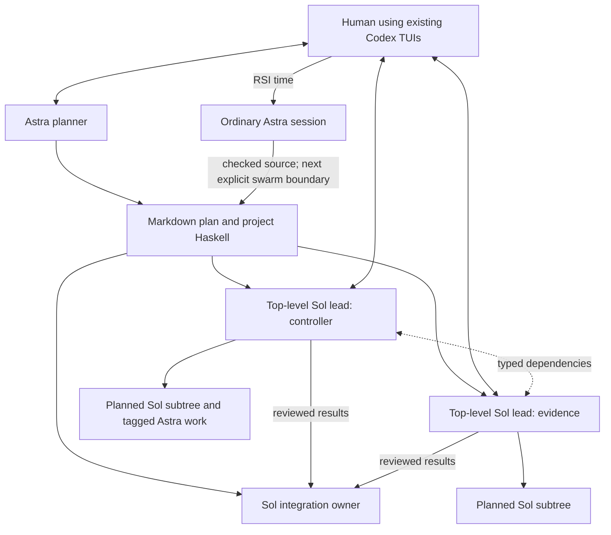

# Workspace Haskell configuration and task context

Implementation boundary: the existing Rust role presets select compatible
prompt overrides. This is transitional: project-defined role names, prompt
selection and worker behavior belong in Haskell compositions.
Adding a reviewer, specialist, or other project role must not require a Rust
enum variant. Rust retains capability enforcement and launch mechanics.

This is the customization and context design for the
[planned swarm vision](planned-swarm.md). Astra plans the work, Sol teams execute
it, and designated Astra specialists handle the difficult tagged obligations.
Fable is out of scope for this phase. A human-requested Astra RSI engagement can
improve the workspace's working definitions directly.

The intended experience resembles an XMonad configuration: import a useful
default, override the pieces that matter here, and gradually grow ordinary
Haskell functions that express how this project works. Edit the Markdown and
Haskell files normally. A swarm uses one fixed configuration; changes take
effect at an explicit swarm teardown/restart boundary. TOML selection, frozen
modules/Markdown prompts, model/context selectors and per-worker behavioral
instructions, independent lifetimes and scoped observation sharing are implemented.
Resolved launch previews remain incomplete. Examples
here are design sketches; use the [shipped guide](../../prompts/shoal/api-guide.md)
for exact implemented exports and [NEXT.md](../../NEXT.md) for current gaps.

## The workspace owns an executable working style

Each workspace root has a `.shoal/config.toml` core configuration alongside
Haskell modules and Markdown prompts. Together they contain reusable operating
knowledge: core prompts, role guidance, context builders, project vocabulary,
model choices, and collaboration recipes. A particular project's plan tree
contains the current deliverable, decomposition, assignments, and decisions.
Runtime-owned state contains live actors, messages, and observations. Give these
different lifetimes; a helper improvement should survive the plan that taught it.

Project-specific improvement is a first-class outcome. A compiler project may
grow helpers that relate an IR change to its owning consumers and fixture checks;
a service project may encode preparation versus native acceptance in its result
types and review flows. Both can use the same Shoal substrate while teaching
their workers different useful concepts. Haskell makes that local expertise
executable and composable. It also supplies concise names and types for the
agents' shared language.

An illustrative layout, with authored files tracked as ordinary repository source:

```text
workspace/
  .shoal/
    config.toml                # Core settings, module/source lists, prompt references
    Project/
      Types.hs                 # Shared project language and typed results
      Context.hs               # Context builders for real responsibilities
      Work.hs                  # Implementation, review/repair, dependency recipes
      Observe.hs               # Useful snapshots and RSI input projections
    prompts/
      core.md                  # Optional replacement of Shoal's authored core
      lead.md                  # Project-specific execution style
      reviewer.md
      rsi.md
  plans/current/
    README.md                  # Architecture, intended task tree, dependencies
    controller/...
    evidence/...
```

The Rust substrate remains responsible for processes, authority, providers,
scheduling, and persistence. This configuration chooses and composes behavior
over those owners. Loading definitions should not itself launch a swarm; the
pilot invokes an entry point with an actual plan when ready.

TOML remains the single core configuration owner; preserve its existing defaults
and CLI override behavior. Haskell defines worker specifications, context builders,
and coordination recipes rather than a second configuration loader. Use ordinary
imports and functions to share useful project behavior. A run selects its workspace and configuration source; an actor working
in a managed checkout should not silently rediscover different policy because
its current directory changed.

**One authoritative directory per swarm:** the `.shoal` at the original workspace
root supplies configuration for every top-level actor and descendant. Managed
checkouts can contain versioned copies, but those are candidate source, never
additional live configuration authorities. Accept customization changes into the
original workspace's directory before the next explicit swarm restart.

The current implementation tracks authored files in the main repository and
excludes private logs, sessions, runtime state and build products. A separate Git
repository inside `.shoal` remains an optional future storage choice; it is not
needed to establish single ownership and is not part of this implementation.
No per-actor configuration discovery or second resolver is introduced.

## Edit normally; activate at a swarm boundary

The easy path is ordinary source development: edit `.shoal` Markdown and Haskell,
inspect the diff, compile/check the relevant modules and examples, and retain the
change in the repository. No live configuration publication API is needed.

At swarm startup, select one coherent configuration, including its prompts,
project modules, and imported defaults. Keep that selection fixed for the whole
swarm: top-level actors, later children, fresh task contexts, and resumed work
all use the same selected definitions. Editing files on disk does not change
what a newly spawned worker in that swarm loads.

The boundary covers the collaborating top-level actors and their descendants
using that configuration. Make that scope explicit; a single root conversation
is not the definition of a swarm. Starting a fresh context or attaching another
view does not create permission to use newer core definitions.

An RSI engagement can prepare and check changes while the current swarm works.
Activation is a separate, explicit lifecycle step: finish or deliberately hand
off outstanding obligations, close the old swarm, and start the next swarm with
the revised configuration. The exact restart/teardown surface belongs to the
existing lifecycle owner. It need not restart unrelated swarms, and editing a
file must never trigger teardown automatically.

Ordinary resident Haskell remains fluent working state: bind values, compose
functions, and define task-local coordination over the loaded interfaces.
Those expressions do not replace the swarm's core primitives, imported modules,
or prompt configuration. A durable `.shoal` customization joins the next swarm.

Task data remains live. A fixed context builder can render new evidence, a fixed
review helper can consume a new candidate, and a lead can receive a plan amendment.
The fixed part is the shared program and behavioral configuration. Normal work
does not require a restart merely because the arguments to those functions change.

Keep active and edited source distinguishable in observations and previews.
Candidate checks can inspect the prospective context without installing it into
the active swarm. If a core defect requires a change immediately, make the swarm
boundary explicit instead of introducing an exceptional mid-wave reload path.

## Core prompts really can be replaced

TOML selects the configured modules and prompt sources. Haskell consumes those
resources in worker specifications and typed context builders. A module such as
`Project.Work` exports useful functions. TOML stays the configuration entry point;
Haskell does not introduce a competing loader.

An illustrative extension of the existing TOML, with field names to align with
the owning implementation:

```toml
[defaults]
model = "gpt-5.6-sol"
effort = "low"

[haskell]
source_roots = ["."]
modules = ["Project.Types", "Project.Context", "Project.Work", "Project.Observe"]

[prompts]
core = "prompts/core.md"
```

These paths are relative to `.shoal/config.toml`. Prompt references and necessary
metadata belong to this same configuration; do not duplicate them in a Haskell
loader. Preserve existing configuration fields and explicit CLI overrides.

A selected custom core replaces Shoal's authored core prose. Role guidance and
task context specialize it. Factual tool signatures and runtime authority remain
accurate and supplied by their owners; prompt text does not create capabilities.
The pilot can inspect the resolved prompt and its selected sources.

Freeze the common prompt and module inputs for the swarm. A later worker gets
the same selected core even after files change. Candidate checks can preview a
future context without modifying active definitions. Shipped defaults remain
useful when no customization is supplied.

## Context builders are the main investment

A good task context supplies the understanding needed for judgment and the
operations needed to act. Treat it as a small authored interface for a real
responsibility. Start with ordinary functions over typed assignments; a complex
selection framework is unnecessary.

Package the exported project interface for the responsibility. An implementer
needs its contract, useful operations, expected result, and the route for a
question. A helper author needs the composition beneath those operations.
A runtime repair owner can inspect the underlying implementation. Keep these
views connected without making every worker read all of them at startup.

The default task context should make the first useful action obvious: its typed
input is present, the relevant definitions are available, one short example
shows the normal composition, and the meaningful failure or question case has
a destination. Supply the relevant rationale alongside the recipe. A compact
eDSL should make independent judgment easier, not turn the assignment into
unexplained commands.

Validate that package on a separate application such as the standalone
`shoal-repl` TUI. Fresh workers receive its plan and source, plus the authored
orchestration guidance; they do not inherit the harness builder's transcript.
If operating Shoal requires knowledge found only in its implementation, improve
the owning prompt, helper or API instead of silently adding implementation lore
to the application assignment. Runtime debugging and target-application work
have different purposes; the acceptance run should establish that the supplied
interface is sufficient for the latter.

The useful package has three parts:

| Part | Contents |
|---|---|
| Shared foundation | Chosen core guidance, common API, relevant project terms and helper signatures |
| Responsibility | Outcome, current source, owning consumers, invariants and rationale, acceptance, recipients, allowed discretion |
| Current evidence | Relevant findings, live dependencies, changed decisions, available handles and their authority |

The text and executable environment must agree. A worker that reads a helper
signature needs the corresponding definition in its Haskell environment. An
evidence reference needs a short explanation of the claim it bears on and a
supported way to inspect it. Starting another top-level actor does not imply
that it inherits a sibling's declarations or owned response handles.

Use one source for a helper's signature and its model-facing reference. Keep
the short explanation and example next to the owning module; check them against
the actual definition when implemented. `.shoal` does not need a separate prose
catalog of every internal operation. Keep the common guide stable within the
swarm and add only the relevant project recipe to each task's context. Focused
inspection can reveal other exported functions without a ritual startup inventory.

For example, consumer implementation deserves its own recipe:

```haskell
consumerContext :: ConsumerTask -> Context
consumerContext task = sections
  [ assignment (component task)
  , sourceAndOwners (baseline task) (owners task)
  , contractWithRationale (contract task)
  , exampleUsing consumerHelpers
  , acceptanceAndRecipients (delivery task)
  , relevantEvidence (evidence task)
  ]
```

`Context` and its sections are illustrative; `ConsumerTask -> Text` can be a
sufficient initial implementation. The valuable part is the deliberate content.
Do not require a universal task schema that erases differences between review,
implementation, architectural decisions, and RSI.

A reviewer receives the exact candidate, contract rationale, claimed checks and
limits, owning source, and repair recipient. It need not inherit the implementer's
debugging transcript. An Astra specialist receives the unresolved question,
plausible alternatives, decisive evidence, and what its answer will unblock.
A Sol lead receives its component's dependency structure and integration duties,
with direct access to deeper evidence when needed.

Provide both enough starting information and a map to further detail. Requiring
a worker to discover its contract through five initial tool calls saves little.
Pasting every sibling document wastes attention. Include the next decision's
necessary facts, then point to the relevant source and focused documents.

Retain the why: for example, an ordering invariant needs its owning boundary and
the failure it prevents. This lets a Sol notice that the plan is wrong. Shared
project terms compress repeated explanation after their meanings are established.
Compact messages then carry new facts, exact identities, uncertainty, and the
needed action; recipients can rely on their common definitions.

Preview is a particularly useful Haskell operation:

```haskell
inspectFull (consumerContext adapterTask)
inspectFull (reviewContext adapterReview)
inspectFull (rsiContext plan observed)
```

These projections do not wake another model. The Astra planner can inspect what
each kind of Sol will receive under the selected definitions, fix omissions once
in the source builder, and reuse that improvement in the next swarm. Inspecting
the resolved launch context should also expose model selection, configuration
and definition identity, and actual authority. A context preview alone does not
prove launch fidelity.

## Multiple top-level actors with the existing Codex TUIs

Keep the current interactive Codex TUI execution path. The human opens a worker's
pane and talks to it normally, using its existing composer, steering, and review
interface. Do not substitute `codex observe`, build another operator UI, or
introduce an operator-input protocol. Backend/controller migration is outside
this implementation.

Several top-level actors can cooperate directly: an Astra planner, Sol technical
leads, and an integration owner, with local execution trees under the leads.
The plan tree organizes responsibilities; it need not mirror context ancestry
or runtime supervision. A separate coordinator is useful only when it owns real
cross-workstream decisions.



Pane presentation does not merge actor identities, histories, or reply authority.
Opening a worker's TUI does not load its transcript into a manager's context.
Hosted-tool failures should preserve the conversation and other available tools;
fix timeout and asynchronous handling defects at their owners. Do not use past
crashes as a reason to replace the interaction model.

## RSI can finish in one Astra engagement

RSI is an ordinary Astra session the human starts, using relevant project
context and observation helpers. It needs no dedicated request type, lifecycle,
or approval/adoption pipeline. Routine RSI is primarily editing
the workspace program. One Astra can read the compact project/configuration
surface, inspect selected execution evidence, change prompts and Haskell helpers
together, run the relevant focused checks, preview the affected task contexts,
and deliver the improvement ready for the next swarm. Design for that to fit in
one focused context window, without making a token-limit guarantee or discarding
work if it takes longer.

A concrete improvement might introduce a clearer partial-delivery constructor,
update the consumer context to explain it, adjust the review routing function,
and change the Sol reviewer prompt's example. Keeping these definitions together
lets the same Astra finish the whole semantic change. There is no mandatory Sol
implementation/review/adoption tree for workspace RSI. Delegate only when the
actual size or uncertainty of the work justifies it; substantial Rust changes
remain ordinary implementation work in their owning subsystem.

The usage is ordinary source editing followed by an explicit lifecycle boundary:

```text
Edit .shoal prompts and modules
  -> inspect the diff, compile/check, preview candidate contexts
  -> retain the checked source change
  -> explicitly finish or hand off work and tear down the current swarm
  -> start the next swarm with the revised configuration
```

Preparing the change and activating it are separate accomplishments. RSI can
finish its source work without starting or stopping any actors. Existing work,
including later spawns in the current swarm, continues with the original
configuration until the explicit boundary. Keep both configuration identities
visible; do not introduce a per-worker adoption protocol or hot-reload primitive.

The working practice grows through use: a useful resident expression becomes a
shared helper, a repeated misunderstanding improves a context builder, and an
effective task boundary becomes a reusable recipe. The workspace configuration
is the durable result of that learning. Prefer deleting redundant prompt text
and consolidating helpers over accumulating rules after every incident.

Keep the path from live exploration to retained project code short. The pilot
should be able to define a function, inspect its type, try it against retained
values, and save it into a project module when it earns reuse. The next swarm's
task contexts expose the useful signature and example without loading the
development history. Generic defaults can learn from mature workspace patterns,
but a local improvement does not need cross-project applicability or promotion
upstream to count as finished.
