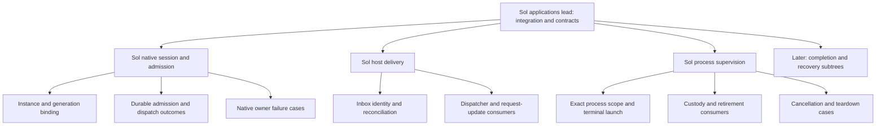

# Applications: grow the remaining implementation tree

Start with [resume.md](resume.md) and its consolidated applications handoff, then
the applications design README. Existing A1–A4 foundations are starting assets;
use numbered mechanism plans for the remaining joins. The tree below is an initial allocation to refine, not a claim
that every branch is ready or requires a separate actor.

## Required starting-source reconciliation

Before implementation children fork, verify that the selected applications head
descends from the **exact main commit selected for this launch**. Use the prepared
continuation supplied in the launch record. Only if preparing a different source,
create a new continuation from its preserved checkpoint and rebase it first. This must include the accepted
supervisor/resource changes and the current plan/prompt updates; do not continue
from the old swarm baseline. Preserve the original recovery refs and dirty
checkouts. Record the resulting head and verify launch main is its ancestor.

Reconcile the external Codex continuation onto the native revision pinned by that
main (`fe15831c` at this writing), preserving command admission, OOM receipts and
workspace writer accounting. Record both repository heads and run the affected
integration checks before publishing the shared source for descendants. Reuse
main's existing supervisor; do not overwrite it with the older candidate version.

Read the [source-based review](../../interactive-applications/current-state-review.md)
for retained producer-seal, input-compaction and recovery work and the known
`Compacted` wire mismatch. The running swarm remains on the checked main package;
reconciled product candidates are tested separately until accepted.

**First shared contract:** select the actual saved A0/native baseline; agree the
live binding identity, input operation shape, readiness/unknown outcomes, fixture
controls and exact file ownership. Reuse current mechanisms. Have native and host
owners establish a minimal real round trip, not a mock-only interface or the
entire admission system before any sibling can work.

Native/session and host/delivery can then develop in parallel against the agreed
contract. Separate native bridge/generation ownership from queue/store transaction
ownership where source permits. The native owner integrates their atomicity and
failure behavior. The host owner separates inbox persistence/reconciliation from
native dispatcher/request consumers after their local types agree. Production
failure tests can be owned alongside implementation; they must drive real owners.

Process/terminal work is independent of completing durable input. Its owner can
split exact process launch/scope from host custody consumers once the scope receipt
and cancellation contract are usable. Keep shared lifecycle-row changes with one
owner; do not treat an entire crate as unavailable to other mechanisms.

**Subsequent joins:** establish the shared accepted-work/process/resource contract
before dependent A5/A6 forks; this is usable owner wiring, not all of custody
implemented serially. Integrate real binding/admission/delivery, then combine
process custody with hosted-completion ownership. Completed-call persistence/fork
release, retirement consumers and adversarial failure cases can form recursive sibling work
with exact native-file reservations. Recovery consumes those checked owners and
engine disposition; its independent status/source-recovery cases need not wait for
unrelated UI work. Matched package acceptance remains the final integration owner.

Astra slots: exact native identity/deduplication/restart uncertainty; completed-call
and cancellation/custody correctness. Commission a concrete design or difficult
repair, then let Sol implement the dependent tree. Do not send every fixture review
through Astra. The lead owns cross-repository integration and complete A0–A8 gates.
