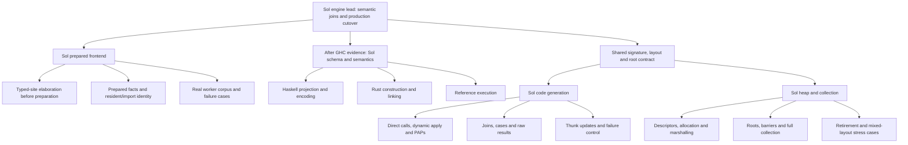

# Engine: recursive implementation around real GHC and ABI contracts

Read [resume.md](resume.md) and its consolidated M1/M2 handoff, then design §1,
§11 and §14. Completed M0 evidence
and reviewed M2 repairs are starting assets. Finish only their documented remaining
joins/checks. Start with M2 review and the final-source consumer matrix, then extend the saved
M3 scaffold; reopen M0/M1 only for concrete integration defects.

## Required starting-source reconciliation

Before implementation children fork, verify that the selected engine head descends
from the **exact main commit selected for this launch**, shared with applications.
Use the prepared continuation in the launch record. Only if preparing another
source, create a new continuation from its preserved checkpoint and rebase it first. Preserve original checkpoint refs, meaningful merges and dirty
checkouts; do not continue implementation from the old swarm baseline.

Retain main's supervisor/resource mechanisms and current prompts/Haskell helpers.
Inventory the separate M2 root and major-collector candidates before incorporating
them; the recovered combined checkpoint is not proof that every candidate landed.
Record the rebased head, verify launch main is its ancestor, and run the first
focused owning check before publishing a completed warm build snapshot for forks.

Keep engine implementation on the product branch and the running swarm on the
checked main package. Coordinate the recovery/session contract with applications;
its A7 candidate must consume checked engine disposition rather than overwrite
engine-owned lifecycle semantics. The coordinator owns shared locks, fingerprints,
generated artifacts and candidate pins. Rebase once for this launch baseline;
subsequent main advances require explicit reconciliation, not mid-wave tool reload.

**Remaining M1:** the frontend owner establishes pass placement and one typed-site/
prepared-output contract. Split site elaboration from independent corpus/process
checks and imported/resident fact handling where their owners are separable. Keep
GHC-pipeline dispatch and shared types with one integration owner. The parent can
implement the central seam while children handle concrete independent obligations.
Do not freeze the public execution schema before real prepared evidence exists.

**M3:** bounded Astra review of actual GHC output settles consequential schema
questions. Establish representative recursive forms, signatures, imports and
malformed-input behavior with the sole Rust construction owner. Projection/encoding,
validation/linking and reference execution then form substantial Sol branches,
each able to split its independent forms/checks. Wire a vertical example early;
round-trip tests alone do not establish execution semantics.

**M4/M5:** the Astra ABI/root/layout engagement should produce usable signatures,
ownership and representative proofs, not become a standing implementation manager.
Codegen and heap leads share that contract and run their own recursive loops. Split
by semantic ownership (calls/apply, joins/results, updates/failure; descriptors/
allocation, roots/collection), not arbitrary files in shared emitters. Authoritative
layout/signature constructors precede dependent forks; exact platform claims remain
bounded by evidence. No native aarch64 runner is available for final native proof.

**M6/M7:** production consumers can migrate in independent branches once the new
engine's relevant contracts work. One owner integrates cutover, invalidation,
retained-session policy and deletion. Cost/simplification work follows actual
production consumers and the saved M0 baseline; the supported-contract and deletion
ledgers prevent an importer-only result from being called complete.

A partial M1/M2 checkpoint does not make the later tree ready automatically. Each
join unlocks a concrete frontier, without making unrelated siblings wait for a
whole numbered milestone. Preserve all semantic, failure and cost obligations.
