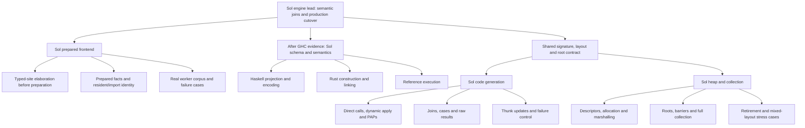

# Engine: recursive implementation around real GHC and ABI contracts

Read the final M1/M2 handoffs, then design §1, §11 and §14. Completed M0 evidence
and reviewed M2 repairs are starting assets. Finish only their documented remaining
joins/checks. The first work is the actual remaining M1 boundary, not replaying M0.

**Remaining M1:** the frontend owner establishes pass placement and one typed-site/
prepared-output contract. Split site elaboration from independent corpus/process
checks and imported/resident fact handling where their owners are separable. Keep
GHC-pipeline dispatch and shared types with one integration owner. The parent can
implement the central seam while children handle concrete independent obligations.
Do not freeze the public execution schema before real prepared evidence exists.

**M3:** bounded Astra review of actual GHC output settles consequential schema
questions. Establish representative recursive forms, signatures, imports and
malformed-input behavior with the sole Rust construction owner. Projection/encoding,
validation/linking and reference execution then form substantial Sol branches,
each able to split its independent forms/checks. Wire a vertical example early;
round-trip tests alone do not establish execution semantics.

**M4/M5:** the Astra ABI/root/layout engagement should produce usable signatures,
ownership and representative proofs, not become a standing implementation manager.
Codegen and heap leads share that contract and run their own recursive loops. Split
by semantic ownership (calls/apply, joins/results, updates/failure; descriptors/
allocation, roots/collection), not arbitrary files in shared emitters. Authoritative
layout/signature constructors precede dependent forks; exact platform claims remain
bounded by evidence. No native aarch64 runner is available for final native proof.

**M6/M7:** production consumers can migrate in independent branches once the new
engine's relevant contracts work. One owner integrates cutover, invalidation,
retained-session policy and deletion. Cost/simplification work follows actual
production consumers and the saved M0 baseline; the supported-contract and deletion
ledgers prevent an importer-only result from being called complete.

A partial M1/M2 checkpoint does not make the later tree ready automatically. Each
join unlocks a concrete frontier, without making unrelated siblings wait for a
whole numbered milestone. Preserve all semantic, failure and cost obligations.
